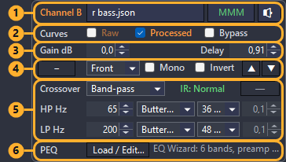

# Professional Car Audio Tuning with Resonalyze

**A complete step-by-step guide**

This guide tracks the repository's `main` branch. Everything in it is in **v0.7.5**.

> **Author's note.** I wrote Resonalyze. It is free and open-source (MIT) — nothing to
> buy, nothing to sign up for. If you go through this guide, successfully or not,
> [say so on the forum](https://www.diymobileaudio.com/): one report from someone who
> is not me is worth more than another guide.

[Resonalyze](https://github.com/DIMOSUS/Resonalyze/releases) does one job: integrating
a multi-way car audio system in time, phase, and frequency.

You measure each driver once from one fixed reference position. The software builds a
virtual model of your car, applies crossovers, delays, polarity, gains and EQ to those
measured impulse responses, and sums them *with phase* — so the system is optimized on
a laptop instead of from the driver's seat. Automatic optimizers search crossover and
delay combinations; everything they propose stays editable by hand. The result exports
as a tuning sheet you enter into your DSP.

**You need** a Windows PC, an audio interface with loopback, and an **analog**
measurement microphone with a calibration file. A USB microphone (UMIK and similar)
will not work — [Section 3](#3-measurement-setup) explains why, and it is a hard
limitation.

**It will not** guess your drivers' thermal and excursion limits, your install, or
your taste. It removes the repetitive part of tuning, not the judgment.

> **Author's note — does the automation actually help?** When I tested my old manual
> settings, which I'd been using for years, I was horrified by how poorly the drivers
> were actually integrated. It became clear why the soundstage kept drifting off at the
> slightest head movement. Only after using this workflow to set up the Rammstein track
> *Eifersucht* was I able to hear the overlays of Till's voice, which I had previously
> only heard through headphones.

**Why not just REW?** REW's alignment tool takes a pair of already-filtered
measurements, offers gain, delay and polarity, and shows the predicted sum. Resonalyze
works on the whole system at once, searches crossover frequencies, slopes and filter
families instead of asking you to pick them, decides delay and polarity per junction
with a confidence report, and exports PEQ already restated in your processor's Q
convention. The equalizer is wired into the model rather than sitting beside it: a
channel goes to the EQ editor and comes back with its filters, so the prediction on
screen is always the tune you are building.

---

## Contents

1. [Introduction](#1-introduction)
2. [What Resonalyze changes](#2-what-resonalyze-changes)
3. [Measurement setup](#3-measurement-setup)
4. [Measuring the drivers](#4-measuring-the-drivers)
5. [Understanding the measurements before touching the DSP](#5-understanding-the-measurements-before-touching-the-dsp)
6. [Building the virtual system](#6-building-the-virtual-system)
7. [Crossover tuning](#7-crossover-tuning)
8. [PEQ / equalization](#8-peq--equalization)
9. [Delay and phase alignment](#9-delay-and-phase-alignment)
10. [Transfer to the real DSP and verification](#10-transfer-to-the-real-dsp-and-verification)

For the reference documentation of every mode, setting and graph gesture, see
[REFERENCE.md](REFERENCE.md).

---

## 1. Introduction

Tuning a multi-way car audio system is harder than it looks. Sensible crossovers,
delays calculated from speaker distances and a well-equalized driver can still leave
serious integration errors, because drivers interact not only in level but in **time
and phase**: two speakers that measure well on their own may partially cancel when
played together. And crossovers and EQ themselves change phase and group delay, so
every change of frequency, slope or EQ can undo an alignment that was correct before.

This guide is a measurement-based workflow for the complete system: from raw driver
measurements to crossovers, EQ, time alignment, subwoofer integration and final
verification.

---

## 2. What Resonalyze changes

The traditional workflow is iterative:

> **change DSP → measure → adjust → measure again → repeat**

Timing makes it painful. Align two bands, change a crossover slope, and their group
delay changes; adjust EQ, and the phase changes again; move a crossover frequency, and
the previous delay may no longer fit. With several bands that is dozens of
measure-and-adjust cycles.

Resonalyze measures every driver once, individually, from the listening position
against a common time reference. Those impulse responses form a **reference-position
linear acoustic model of the car**, and Virtual DSP applies crossovers, gain, delay,
polarity and EQ to them and calculates the acoustic sum — including phase and timing.
That matters because responses cannot be added by magnitude: two drivers at the same
SPL may add constructively, partially cancel, or leave a deep null depending on their
relative phase.

The workflow becomes:

> **measure once → optimize virtually → transfer settings to the real DSP → verify**

The optimizers search crossover, gain and delay combinations far faster than manual
iteration, and every result stays inspectable and editable. What they remove is the
trial-and-error — above all keeping several bands aligned while their filters and EQ
are changing. Your drivers' limits and your installation's constraints remain the
tuner's responsibility.

---

## 3. Measurement setup

The measurements have to preserve not only frequency response but the **absolute
timing between all drivers**. Phase is always relative to a reference, and if that
reference moves between measurements the phase relationship between drivers is no
longer trustworthy. So the microphone and a loopback of the excitation signal must be
recorded synchronously, by the **same audio interface on the same hardware clock**;
Resonalyze will not start a measurement without the loopback.

The hardware is simple:

- an audio interface with a microphone input and loopback;
- an analog measurement microphone with a calibration file;
- a way to feed the measurement signal from the interface into the car DSP.

Optionally, further measurement microphones on further inputs of that same interface —
a [microphone array](#optional-a-spatial-average-for-the-eq), which averages each driver
over the volume a head occupies in the same sweep. It changes nothing below except that
it has to be mounted and configured before the first sweep.

> **Author's note.** I use a **Focusrite Scarlett Solo 4th Gen**. It has built-in
> stereo loopback, so there is no need to physically route an output back into a spare
> input — Resonalyze can use the internal loopback channels directly.

If your interface has no internal loopback, a physical connection from one output to a
second input works just as well.

### Why independently clocked USB microphones are not supported

A USB measurement microphone such as a UMIK has its own ADC and free-running clock, and
your interface has another. Even when both nominally run at 48 or 96 kHz they are not
sample-synchronous and slowly drift relative to each other, so a UMIK cannot be the
microphone for this workflow. Use an analog microphone on the interface that provides
the loopback.

### Microphone position

Adjust the driver's seat to your normal listening position first and do not move it
afterwards. Mount the microphone rigidly with the **capsule approximately between your
ears and pointing straight upward**, and do not hold it by hand or move it between
driver measurements: even a small position change alters path lengths and reflections,
and the measurements stop being parts of one virtual system. Mark the microphone and
seat positions so the geometry can be reproduced for final verification. For this
orientation, use a **90° calibration file**.

> **Author's note.** I use a **Sonarworks SoundID Reference Measurement Microphone**
> because it is relatively inexpensive and comes with individual 0° and 90° calibration
> profiles. Resonalyze supports both; if only a 0° file is available, it can
> approximate a 90° correction, but a real 90° calibration is preferable.

### Sample rate

Two rates are in play and they do not have to agree: the **measurement rate** your
interface records at, and the **processing rate** your DSP builds its filters at, which
you state once in Virtual DSP
([Name the processor you are tuning](#name-the-processor-you-are-tuning)). A 48 kHz
sound card tunes a 96 kHz processor exactly, provided that processor is named;
[REFERENCE.md](REFERENCE.md#dsp-processor) explains why the two are kept apart.

> **Measure at whatever rate your interface offers, from 44.1 kHz upward, keep it the
> same for every driver, and tell Virtual DSP which processor you are tuning.**

**Backend.** **ASIO** is preferred: Resonalyze can request the sample rate directly and
verify that the driver accepted it. WASAPI Exclusive also works, since it bypasses the
Windows mixer; WASAPI Shared may resample and is best avoided.

The measurement chain is then:

> **Resonalyze → audio interface → car DSP → amplifier → driver → microphone → audio
> interface**

with the interface's **loopback recorded alongside the microphone signal**. Once this
is fixed, do not change the microphone position, seat position, sample rate or signal
routing until every driver has been measured.

---

## 4. Measuring the drivers

Open **Record Settings** from the main Resonalyze window.

Its groups, top to bottom:

1. **The sweep** — **Low / High frequency** set its range, **Per octave** its speed; a
   slower sweep buys signal-to-noise. The green line restates the result as band,
   octaves and duration. **HPF** declares a protective high-pass left in the DSP — see
   [Protect the drivers](#-protect-the-drivers).
2. **Averaging** — **Measurements** is how many sweeps are averaged into one result. Two
   is enough for a quick look; four or more gives a usable coherence curve.
3. **Calibration** — has to be right **before** the first sweep: a run freezes the
   chosen curve into its result, and **Save** writes it into the file. **Mic
   calibration 0°** takes the on-axis file, **More calibrations → Manage...** takes the
   others (load your **90°** file here), and **Measure through** picks the one this rig
   records with — the 90° one, since that is how [Section 3](#microphone-position)
   mounts the capsule. SPL calibration is not needed for this workflow. **Array
   microphones** is optional too: it sets up the further microphones for
   [a spatial average](#optional-a-spatial-average-for-the-eq).
4. **Format** — **Sample Rate** is the measurement rate. Anything from 44.1 kHz upward
   will do, since the [DSP processor](#name-the-processor-you-are-tuning) is stated
   separately; prefer the DSP's own rate or a simple sub-multiple of it, because delays
   ride the record's grid, and keep it the same for every driver in the set.
   **Audio backend** — preferably the native ASIO driver.
5. **Routing** — the output feeding the DSP, the microphone input, and the channel
   carrying the **loopback**. Without a loopback the measurement will not start, by
   design. The two lines beneath confirm the driver accepted the rate.
6. **The transport column** — **Start**, **Save**, **Load**, **Compare**, and the
   **Mic** / **Loop** level meters where you check every run for clipping.

Press **Apply settings**, then verify both inputs with **Test ASIO Inputs** or the
level meters in the main window.

### Put the DSP into bypass

**Anything left in the signal path becomes part of the measured impulse response**, and
Virtual DSP would then apply your crossovers, delays and EQ on top of it. Before
recording, disable PEQ and shelves, crossover filters, delays (set them to **0 ms**),
polarity inversion, all-pass filters, per-channel gain corrections, and every
level-dependent process — limiters, loudness, dynamic EQ, bass enhancement. The only
level control to touch is the **global gain common to all channels**.

The rule is **"nothing unaccounted for in the path"**, and the next subsection is the
one exception it allows.

### ⚠ Protect the drivers

Bypassing the DSP removes the filters that protect the speakers. **Never run a
full-range 20 Hz sweep through an unprotected tweeter.** Two safe approaches, which can
be combined:

1. **Restrict the sweep.** Measure at low power and start the sweep where the driver is
   safe — for a tweeter, **800–1000 Hz → 20 kHz** instead of 20 Hz. Frequencies far
   below its useful range add nothing.
2. **Declare a protective high-pass.** If a protection filter must stay in the DSP,
   enter the same **HPF** type (**Butterworth** or **Linkwitz-Riley**), corner and slope
   in Record Settings. Resonalyze removes that filter — magnitude, phase and group
   delay — from the loopback-referenced response. The declared filter must match the
   real one exactly and sit downstream of the loopback. The compensation is capped at
   **40 dB**; deeper into the stop band the signal is buried in noise, and the
   **coherence** trace marks that region.

**Disable HPF compensation when measuring a channel that does not use that filter.** It
is a live Record Settings value: nothing resets it between runs, and loading a saved
measurement does not change it. The saved file does record which filter its own
response was corrected for (an older capture says "unknown", deliberately different
from "none"), but that describes the run behind you, not the one you are about to take.

A permanent passive component, such as a series capacitor, is part of the installed
loudspeaker. Leave it in place and do not compensate for it.

### Set the measurement levels first

Set the levels after bypassing, because bypassing changes every channel's output level.
Start with the **subwoofer**, usually the loudest source, and use it to set the
microphone preamp gain and the global playback level so that neither input clips. The
loopback should peak around **−15 to −3 dBFS**; much quieter and the reference weakens.

From here on, **do not change the microphone gain or the global volume between
measurements**: the relative SPL between drivers must survive.

### Measure and save every driver

Mute every DSP output except the driver being measured. Keep people out of the path
from the drivers to the microphone: run the sweep from the back seat or from outside,
never from the seat the microphone stands in.

Press **Start** on the main panel; the sweeps play and are averaged into one
measurement. Check that neither input clipped, that both levels were healthy, that the
response covers the driver's useful range, and that nothing looks broken. Then
**Save** it as a Resonalyze `.json` impulse-response file.

Repeat for every driver **without moving the microphone or changing the microphone
gain, global playback level, sample rate, or DSP processing**. For a three-way front
stage with a mono subwoofer that is seven files:

> **Subwoofer**
> **Left / Right Woofer**
> **Left / Right Midrange**
> **Left / Right Tweeter**

That is the whole **reference-position acoustic snapshot**, and everything that follows
is built from it: one file per driver, same position, same gains, same rate; the DSP
still bypassed with only the protective high-pass in; nothing tuned yet.
[Section 5](#5-understanding-the-measurements-before-touching-the-dsp) checks the files
one at a time, and [Section 6](#6-building-the-virtual-system) loads them into Virtual
DSP.

The subsection below is **optional**: it improves the EQ stage, and a first tune does
not need it. If you skip it, the measuring ends here — pack up the microphone,
interface and cables, close the car, and continue from a sofa.

### Optional: a spatial average for the EQ

Timing and phase need one fixed microphone position. Equalization is better served by
an average over the volume a head occupies: a single position carries deep, narrow dips
that belong to that spot alone, and equalizing them corrects a location rather than a
loudspeaker, at the cost of amplifier headroom.

*Orange: one position, unsmoothed. Violet: a moving-microphone average of the same
midrange. Green: their difference, down to **−28 dB**.*

**Most of that disappears under smoothing**, because most of it is narrow — exactly
what **psychoacoustic smoothing** discounts, and that is the width
[Section 6](#set-the-display-correctly) reads a single-point tune at anyway.

*The same measurement, smoothed: the difference is a median of **1.3 dB** and stays
inside 3 dB across four fifths of the band.*

So one microphone is enough for a basic tune. An average makes a dip that belongs to
one spot contribute a fraction of the result instead of hiding it behind a smoothing
window, and a microphone array also records the positions' **spread** — where they
agreed and where the average speaks for less than the volume it covers. Either way,
that curve is what the EQ stage in [Section 8](#8-peq--equalization) fits to. There
are two ways to get one.

**With spare inputs and microphones: a [microphone array](REFERENCE.md#microphone-array).**
In **Record Settings → Array microphones** add one row per further microphone — its
input, its calibration, and a note saying where it stands.

- The measurement microphone stays where [Section 3](#microphone-position) mounted it
  and remains the only source of timing. The further ones exist only for the average,
  so spread them around that position through the volume a head occupies; the seven
  these were developed against sat within about 30 cm of it.
- The table lists only the further microphones. The measurement one joins by itself
  when the sweep runs, which is why six rows produced seven positions. One row is the
  minimum.
- A capsule's calibration must already be in Record Settings' own list
  (**More calibrations → Manage... → Add file...**) before it can be assigned.
- **All microphones must be inputs of the same interface** — same clock, same
  loopback, not negotiable. In practice that means **ASIO**; the line under the editor
  says how many inputs it found.

Then measure exactly as above and the average comes with the sweep, the positions'
disagreement stored beside it. A position that clips or goes silent fails the whole
sweep rather than dropping out. One trap: an array belongs to the capture **device** it
was configured on. Select another and none of the microphones are recorded until you
open the list and confirm it with **OK** — [REFERENCE.md](REFERENCE.md#microphone-array)
explains why.

**With one microphone: the moving-microphone method (MMM).** Switch Live Spectrum to
**MMM** mode. It pins every setting the average is only valid under — periodic pink
noise, infinite averaging, band-power dB SPL, noise-slope compensation on, smoothing
off — and needs no SPL calibration. Set **Sequence Length** to the **maximum** (65536):
the longest frame carries the most bass and the finest grid, 0.7 Hz bins at 48 kHz
against 23 Hz at the default. Keep it the same for every capture in a set.

Then, one driver at a time, with the DSP in the same bypassed state and at the same
levels as the sweeps:

- mute every output except the driver being captured;
- sit in the back with nobody in the front seats and hold the microphone into the
  head area from behind — a torso between an A-pillar tweeter and the capsule is a
  shadow, and unlike a reflection it does not average out;
- hold the capsule **pointing up**, the orientation it was mounted in;
- press **Start** and move it in **slow, smooth circles** around the head area, at
  about the radius of a head, for **30 seconds or more**;
- press **Save** and store the capture as its own file.

One capture per driver — left and right separately, one for a mono subwoofer — without
touching the microphone gain or playback level between them. Virtual DSP checks the set
and tells you when the captures disagree.

With the averages saved beside the sweeps, the measuring is over: pack up, close the
car, and continue from a sofa.

---

## 5. Understanding the measurements before touching the DSP

Before opening Virtual DSP, check the raw files one at a time. Nothing is tuned here;
this only confirms the data and shows what each installed driver does. **Load** a
`.json` on the main panel.

Each analysis mode has its own **settings button** with smoothing, impulse gating and
displayed curves. Its **Calibration** selector opens on **Own (as measured)** — the
curve this measurement was recorded through — and every new measurement puts it back
there, so if it says anything else, someone chose it.

In **Frequency Response**, look for the driver's useful range, its natural roll-off,
major resonances or cancellations, whether left and right behave alike, and where the
response becomes unreliable. Raw in-car responses are not smooth: windshield, dashboard,
seats and cabin modes make them surprisingly ugly, and that is normal.

**Coherence** is a measurement-confidence indicator, not an EQ target. Poor coherence
inside the band you intend to use means the measurement should be repeated; far outside
it, it is usually irrelevant. If this channel used protective-HPF compensation, the
region it could not recover is marked in the coherence trace and should sit safely
below the band you intend to use.

### Check the array, if you measured with one

The Frequency Response settings carry three more curves, off by default and empty
unless the file was recorded with a [microphone array](REFERENCE.md#microphone-array):
**Show array average** — the curve the EQ stage will be fitted to; **Show array
microphones** — each position on its own, thin, levelled onto the measurement
microphone; and **Show array spread** — how far apart the positions sat, in dB on the
right-hand axis.

*One midrange. Orange is the microphone at the listening position — the response the
impulse file holds; the thin curves are the seven positions, the thick teal one their
average, and the purple one their spread on the right-hand axis. Below 500 Hz the
positions sit 2 to 5 dB apart and the point response IS the average, to within half a
decibel. Above it they part by some 13 dB, and the point response leaves the average by
3 dB in the median and 19 dB at worst — that difference is where the microphone stood,
not what the driver does.*

Each thin curve is named in the legend by its **Position** note. They are read from
what the file stored and do not follow the impulse gate: a spatial average is a
steady-state curve with no window to move. Read the spread as the confidence of the
average. Positions in a car part by 11 to 12 dB across the band as a matter of course;
past **20 dB** the average is carried by whichever position was loudest, and Auto Tune
places no boost there.

### Check the time domain

Open **Time Alignment** or **Impulse Response** and confirm the detected arrival looks
sensible. A wrong delay, a weak impulse, clipping or a broken loopback reference is far
easier to fix now than after the virtual system is built. Do not correct anything yet;
the only two questions are:

> **Is the measurement trustworthy?**
>
> **What frequency range can this driver realistically be used in?**

---

## 6. Building the virtual system

Open **Tools → Virtual DSP**.

Building the system is five steps, in the order this section takes them:

1. add or remove channel blocks until there is one per **driver band** of the real
   system, arranged from lowest to highest frequency;
2. load each block's `.json` files — the **Left** and **Right** measurements of a
   stereo band, or a single one with **Mono** on for a shared subwoofer;
3. set each block's **Zone**;
4. name the [processor](#name-the-processor-you-are-tuning) the project is for;
5. set the [display](#set-the-display-correctly) — calibration and smoothing.

For a three-way front stage with a subwoofer, the seven files of
[Section 4](#measure-and-save-every-driver) become four blocks:

> **Sub → A Mono**
> **Left / Right Woofer → B L/R**
> **Left / Right Midrange → C L/R**
> **Left / Right Tweeter → D L/R**

Do not normalize or otherwise modify the measurements before loading them: their
relative SPL, phase and absolute timing are exactly what Virtual DSP needs.

The panel is dense, so here are its six regions:

1. **The channel cards** — one per band, top to bottom in frequency order, each with
   its source, gain, delay, polarity, crossover, PEQ and curve toggles. The **L / R**
   selector at the bottom decides which side every card shows.
2. **The acoustic plot** — each channel's processed response, the phase-aware **Sum**,
   and **Sum loss** against the right-hand axis.
3. **What the plot shows** — which curves are drawn, the target and its level, the
   microphone calibration, smoothing, the Hybrid toggle and the magnitude gate.
4. **The actions** — the DSP processor, the two optimizers, the audition render,
   session save/load and the tuning-sheet export.
5. **The junction view** — the chain's own filters, or (as here) the correlation and
   score curves the delay search reads at one junction.
6. **The read-out** — per-junction sum loss, junction phase, per-channel arrivals and
   the L/R level difference. Most of this guide is about making its numbers small.

### One channel card

The same controls repeat on every block:

1. **Source** — the measurement for the side selected below the card list; **MMM /
   Array** attaches or selects its spatial average; the speaker button excludes the
   block from the plots, Sum, metrics and Auto Delay.
2. **Curves** — the raw measurement, the processed result, or the whole chain bypassed.
3. **Level and time** — channel gain, total gain after PEQ preamp, and delay.
4. **Group and order** — **Zone**, **Mono**, polarity inversion, and **▲▼** to move the
   block in the list.
5. **Crossover** — kind, HP/LP corners, family, slope, and ripple where the family has
   one.
6. **PEQ** — hand the channel to the EQ Wizard, load or clear its bank, and read how
   many bands and how much preamp it carries.

### Assign channel groups

Set each block's **Zone** as soon as its source is loaded. A zone changes no filter; it
tells the plot and the two optimizers which part of the installation the block belongs
to:

- **Sub** — every subwoofer block. It has its own display and tuning-sheet section, but
  for Auto Crossover and Auto Delay it is the bottom of the **front crossover chain**,
  not a separate alignment stage.
- **Front** — the woofer/midbass, midrange and tweeter bands of the front stage.
- **Rear** — the rear fill. A multi-way rear is one group: its drivers are crossed and
  aligned with each other, then the whole group is placed against the front.
- **Center** — the centre speaker, every band of it. Picking Center switches **Mono**
  on and locks it, because a centre has no left or right side.

The **Show** selector below the main plot turns zones into views:

| Show | What it draws | What its Sum contains |
| --- | --- | --- |
| **Front + Sub** | front-stage and subwoofer driver curves | all of them |
| **Rear + Sub** | rear-fill and subwoofer driver curves | all of them |
| **Front + Center** | front-stage and centre curves for comparison | front only |
| **Groups** | one summed line per zone, with no driver curves | each zone separately |
| **Everything** | every driver | everything except the centre |

**Front + Sub** is the default and all a front-only install needs. **Rear + Sub**
inspects the rear's own crossover chain, **Front + Center** compares the centre without
inventing a programme-dependent sum, and **Groups** sets the rear's and centre's arrival
and level against the front. Across groups the read-out reports **vs Front** arrival
and level differences instead of calling the inevitable front/rear combing a crossover
loss.

A fuller installation only adds blocks and zones. A front three-way with a subwoofer, a
centre and a stereo rear fill is six blocks from ten files:

| Block | Files | Zone | Mono |
| --- | --- | --- | --- |
| **A — Subwoofer** | one | Sub | on |
| **B — Woofer / Midbass** | left, right | Front | off |
| **C — Midrange** | left, right | Front | off |
| **D — Tweeter** | left, right | Front | off |
| **E — Centre** | one | Center | locked on |
| **F — Rear** | left, right | Rear | off |

Only the order **within a zone** matters: B, C, D form the front chain because that is
the order they stand in, and a two-way rear would be two Rear blocks in the same order.
A full-range centre or rear pair can stand anywhere in the list, since **Show** sorts by
zone. Each automatic step then works on one zone at a time — the front chain with the
subwoofer at its bottom, the rear's own drivers in **Rear + Sub**, and only afterwards
the rear and the centre against the finished front in **Groups**.

### Name the processor you are tuning

Press **DSP processor...** and say which device this project is for.

Pick your **Model** from the catalog — it covers the common car processors from AMP,
HELIX, Audison, Hertz, Mosconi, ESX, miniDSP and JL Audio — and its **processing rate**
and **Q convention** come with it, locked, because both are facts about the device:

If your processor is not listed, pick **Custom** and state both by hand. That makes the
same project a preset would: a catalog entry is those two facts looked up for you (plus,
for some models, the delay range its manual states). The **processing rate** is the
DSP's internal sample rate, stated in its specification — 48 kHz or 96 kHz are the usual
answers. The **Q convention** is how the device reads a PEQ band's Q; it only affects
the Q printed on the tuning sheets, and
[REFERENCE.md](REFERENCE.md#dsp-q-convention) lists which models use which and gives a
two-band measurement that settles it. If you have to choose blind, **RBJ** is the most
common.

The rate list also offers **Follow measurements**: the project states no rate of its
own and the filters are designed at the measurements' rate. Take it only when you do
not know your processor's rate. A new project opens on it, so this is a choice to make,
not one already made for you.

Under the fields the dialog states what the choice buys — the design rate, the rate the
measurements keep, and how high the simulation is trustworthy. The choice travels with
the project into the EQ Wizard and the tuning sheet's Q column;
[REFERENCE.md](REFERENCE.md#dsp-processor) has the details.

### Set the display correctly

Both selectors sit directly below the main graph.

Set **Mic cal** to **Own (as measured)**: every channel is read through the calibration
it was recorded with in [Record Settings](#4-measuring-the-drivers), rather than one
curve applied to all. Pick a single calibration only to see the whole set through one
microphone on purpose.

Select **Psychoacoustic smoothing**. As in REW, it de-emphasizes narrow high-Q peaks and
dips and keeps the broader, perceptually relevant features, which also keeps you from
chasing narrow, position-dependent cancellations with EQ.

Both choices travel with a channel into the EQ Wizard in
[Section 8](#8-peq--equalization), so setting them here sets them there.

### What Virtual DSP is actually simulating

Each channel's virtual chain applies gain, delay, polarity, HPF and LPF, and PEQ —
bells, shelves and the phase-only **all-pass** bands, which live in the bank as band
types — to the **actual measured impulse response** of the installed driver, so its
real magnitude, phase and timing are preserved. It models the linear behaviour only:
distortion, excursion limits, power compression and voice-coil heating must be checked
in the real system.

The processed drivers are then combined by **complex summation**, and
**80 dB + 80 dB does not necessarily equal 86 dB**: depending on their relative phase,
two drivers may gain about **6 dB**, gain only a few, partially cancel, or leave a deep
null. That is exactly what happens in crossover regions, so every change to a
crossover, delay, polarity or EQ recomputes the **predicted acoustic sum of the whole
system**, with its phase and group delay.

Before tuning, confirm that every measurement is in the right channel and side, that
the block layout matches the real processor, that the **DSP processor** is named, and
that **Own (as measured)** and **Psychoacoustic smoothing** are selected. Then the
first real tuning step: crossover design.

---

## 7. Crossover tuning

**Auto Crossover** can set every crossover point in a couple of clicks, and as a
starting point that is enough. To get the most out of it, know what it is after. A good
crossover keeps both drivers in a safe operating range, overlaps their **acoustic
slopes** sensibly, lets them sum with minimal cancellation after phase alignment, and
stays stable over small moves of the listening position — the last is verified later in
the real car.

### Start with the drivers, not textbook frequencies

Use the raw measurements to see where each driver actually works well; a driver still
producing some SPL somewhere is not a reason to cross it there.

This matters most for tweeters. Resonalyze sees their acoustic response but not their
**Fs, excursion, thermal limits or the manufacturer's recommended crossover**. Check
the manufacturer's minimum first, and distortion or excursion data if you have them.
**Fs alone does not define a safe crossover**; as a fallback, a high-pass around
**2–3× Fs** is a conservative start, and going lower with a steep filter should be a
deliberate decision, not one accepted blindly from an optimizer.

Hearing is most sensitive around **2–4 kHz**, so given two equally good regions, keep
the hardest junction out of it. That is a preference, not a rule — a well-integrated
2.5 kHz crossover is perfectly valid.

### Electrical slope is not acoustic slope

> **Acoustic response = natural driver response × electrical filter**

A driver already rolling off acoustically ends up with a steeper slope than the DSP
shows. For active systems **Linkwitz–Riley 24 dB/oct** is a good general-purpose start;
**LR48** helps when a driver needs more protection, less overlap, or isolation from a
breakup region. Steeper is not automatically better: each slope has its own phase and
group delay, which become part of the acoustic crossover that has to be aligned.

### Using Auto Crossover

Press **Auto crossover...**.

Resonalyze estimates each channel's usable bandwidth and assigns a likely driver type;
check the classifications and correct them where needed.

The channels are listed under their group — front stage with its subwoofers, rear fill,
centre — because only a group is a crossover chain, and each is fitted separately.
**Inside a group the rows must run from the lowest driver to the highest**: row 1 hands
over to row 2, row 2 to row 3. Two channels may hold the same driver type (a pair of
subwoofers splitting the bottom), so the row order, not the type, decides. Resonalyze
fills it in from what each channel measured, narrowed by any crossover corner it
already has; the **▲▼** arrows move a row when the measurement cannot decide or you
know better.

Two colours flag an order worth a second look: **amber** means the two channels measure
too alike to be ordered, so you have to say which is which; **red** means a channel
measures *lower* than the one above it — usually a row moved one step too far, or a
wrong driver type. Apply names both before writing anything.

A group holding a single driver has nothing to cross: it gets a protective high-pass
under its usable band and is levelled onto the front stage. Treat that level as a
starting point; how far a rear fill sits under the front is for your ears.

Then select the filter families your real DSP supports, the crossover search range,
whether HPF and LPF may differ in slope, whether the panel's blocks should be put into
the same order, and the desired bass level relative to the mid/high range.

Leave the reordering on: a panel whose blocks read down the spectrum is far easier to
work in. Blocks are lettered by position, so the ones that move are re-lettered and
take a new plot colour, with their sources and settings travelling along; a tuning
sheet printed earlier names channels by the OLD letters. The **▲▼** buttons on each
block do the same one step at a time.

The optimizer then searches combinations of frequencies, slopes and families on the
**actual measured acoustic responses**, weighing bandwidth, overlap, leakage and filter
group delay, and prints its proposal at the bottom of the dialog. Press **Apply** if the
result makes physical sense. Auto Crossover does not know your drivers' limits: always
check the proposal against the datasheets and your own knowledge of the system.

### Manual tuning is always available

Every channel card exposes its HPF, LPF, family and slope, so any crossover can be
tuned by hand **before or after** Auto Crossover. Running Auto Crossover again
overwrites what you edited, and once the next section has fitted a channel's EQ against
its crossover, changing that crossover means re-checking its PEQ. The practical loop is:

> **Auto Crossover → inspect the result → manually refine anything that does not make
> sense**

### What ultimately defines a good crossover?

Not where two magnitude curves cross, but how well adjacent drivers **sum
acoustically** after EQ and time alignment. Virtual DSP reports **Sum Loss** per
junction in the read-out: the difference between the phase-aware complex sum and the
ideal magnitude-only sum. 0 dB is ideal addition at the measurement position;
increasingly negative values mean cancellation. It does not by itself prove the
crossover holds when the listener moves.

Do not chase Sum Loss yet. EQ also changes phase, so the final alignment comes **after
equalization**; for now the goal is crossovers that are **safe, acoustically sensible
and physically realistic**.

---

## 8. PEQ / equalization

Equalize before aligning delays: PEQ changes phase as well as magnitude, so aligning
first would mean redoing it after EQ.

### Optional: equalize the spatial average

If you arranged a spatial average in
[Section 4](#optional-a-spatial-average-for-the-eq), bring it in before setting the
target.

**Measured with a microphone array?** Nothing to attach — the average came with the
measurement. Each card's button reads **Array**, and its menu picks which average the
whole project reads: the arrays the measurements carry, MMM captures attached by hand,
or none. A channel measured with a single microphone in an array project is drawn from
its point measurement, and the panel says how many channels that is; below the cabin's
first mode a point and an average are the same, so a subwoofer loses little. Keep
**Mic cal** on **Own (as measured)** — with an array each position is a different
capsule with its own file.

**Took MMM captures?** On each card press **MMM** and select that driver's capture —
both sides for a stereo band, once for a mono channel. The button reads **MMM** for
none, **MMM ✓** when one is attached, **MMM ⚠** when the session refers to one it cannot
read. When every playing channel has a capture, the **Hybrid** toggle under the graph
becomes available. Tick it.

With Hybrid on, each channel's magnitude is drawn from its spatial average with that
channel's own DSP chain added analytically — exact, since a filter does not depend on
where the microphone was — so the curve you equalize stops carrying the dips of one
position. The set is lifted onto the impulse responses' axis by one common offset, so
the target level reads on the same scale as before.

**Set smoothing to Off in this mode.** Smoothing exists to hide narrow,
position-dependent wiggles, and the average has already averaged those down over the
volume; what is left is mostly broad and real. Off also keeps the reading honest near a
crossover, where a fractional-octave window straddling a steep skirt pulls the level up
toward the passband. Where the Auto Tune notes below suggest psychoacoustic smoothing,
that is for the single-point curve.

What does not change: **timing, polarity, the junction analyses, Auto delay, Sum Loss
and the phase view keep reading the impulse responses** — an average holds no phase.
Both sums follow the hybrid channels as phasors with the measured phase; read them as a
guide to where the junctions land, not as a measured spatial average of the system.

The handoff below carries the capture with it, so **Auto Tune fits the hybrid** — the
whole reason for taking the captures. If the panel warns in amber that the averages
disagree, one capture was taken differently — a changed input gain, another analyzer
setting, another session — and the message names each channel's figure.

### Set the target once, in Virtual DSP

The EQ target is one curve shared by Virtual DSP and the EQ Wizard, edited from either
through the same **Target...** menu, so every channel tuned afterwards aims at the same
thing.

Tick **Target** under the main graph, open **Target... → Parametric shape…** and pick a
Car preset; they differ mainly in bass lift, so this is where the system's tonal balance
begins. A house curve of your own goes in through **Target... → Import from file…** — a
text file of `frequency level` pairs, read as relative dB.

Then set the dB box beside the checkbox: the level the system is equalized around. For
headroom, **cut peaks rather than boost dips**, so put the target near the quietest
useful part of the response — but not at a deep narrow null, which is interference
that EQ cannot fill; do not lower the whole system to reach one.

> **Author's note.** In my own car the responses suggested a target around **−41 dB on
> the measurement scale**, the value the screenshots in this guide are taken at.

### Hand a channel to the EQ Wizard

On the channel card, press **Load / Edit…** on the **PEQ** row and choose **Edit in EQ
Wizard**.

Resonalyze switches to the wizard with the channel loaded and everything the tune
depends on carried across: **the curve** — the channel through its own chain with the
PEQ bypassed, windowed as the Virtual DSP plot windows it, so you equalize what the
channel contributes to the sum, crossover included; **the microphone calibration**
and **the processor's** rate and Q convention, shown locked; **smoothing** as a
starting point you may change; **Auto Tune From / To** set from the channel's
crossover corners; **Target Level** verbatim; and the channel's **existing PEQ** as the
starting bank. Ctrl+Z is the handoff's cancel. Nothing is typed or matched by hand, and
no file changes hands.

1. **The receipt.** **Ch C · R (DSP, MMM)** means channel C, right side, the curve
   through the **DSP** chain, off its **MMM** average — an array channel reads
   **Array**, one with no average just **DSP**. Read it before touching anything.
2. **What came across.** Calibration, target level, smoothing, rate and the bank's
   preamp. **Calibration**, **Rate** and **DSP Q** are greyed: they belong to the
   project. The rest are yours to change.
3. **The way back.** **Return PEQ to Virtual DSP** writes the bank onto the channel;
   **Back without applying** leaves the channel alone and keeps your edits here.
4. **What the fit may do.** **Max / Min Gain** should match your real DSP, **Max EQ
   Filters** its number of bands, and **Cuts only** should stay ticked — it stops the
   optimizer spending headroom on acoustic nulls. **Max Q** (6.0 by default) caps how
   narrow a filter may be, favouring broad trends that hold across the listening area
   over notching a peak that may belong to where the microphone stood. **Shelves** is
   worth ticking when the target is shelved or a whole end of the response runs hot or
   shy: one shelf replaces three or four bells and frees the slots for real resonances.
   With **Cuts only** on it is safe to leave ticked — a shelf is kept only where it
   lands closer to the target; with **Cuts only** off a boosting shelf can push the
   total boost past **Max Gain**, so read **Headroom** before accepting. **From** and
   **To** arrived from the crossover corners.
5. **Auto Tune** — run it once these are set.
6. **The scoreboard.** RMS and max error against the target, filters spent, and the
   headroom the bank costs — before the fit the raw disagreement, after it what is left.

Psychoacoustic smoothing helps here too, except in Hybrid mode, where it is **Off**.

Press **Auto Tune**. If it asks whether to tune anyway, the target level is the
problem: it sits so far above the curve that the fit would boost the whole band, or so
far below that it would cut the whole band. Answer *No*, move **Target Level** toward
the curve, and press again.

### Read the band edges as the filter, not the driver

Equalizing through the chain means the crossover is part of the curve: the response
falls away toward **From** and **To** because the filter puts it there. That is the
crossover working, not a defect.

Correct the driver's own irregularities inside the band instead. Broad, minimum-phase
bumps and dips are worth attention, especially near a crossover: flattening them also
improves the phase, which makes the alignment stage easier. Do not chase every narrow
notch. A dip made by delayed energy or cancellation is not something PEQ can repair —
the filter changes the magnitude, not the cause. **Group Delay** mode helps tell such a
dip from a driver's own, as evidence rather than proof and only where level and
coherence are worth reading; see [REFERENCE.md](REFERENCE.md#phase-and-group-delay).

### Preamp and manual cleanup

If the whole useful response sits several dB above the target, use **Preamp** rather
than several bands cutting the same amount everywhere. The preamp is part of the bank:
it returns to Virtual DSP with the filters and appears on the tuning sheet.

Auto Tune is a starting point. Remove bands by drag-and-drop, adjust them, or add them
with the **+** buttons: **PK**, the two shelves, and **AP1 / AP2**, the first- and
second-order all-pass bands [Section 9](#9-delay-and-phase-alignment) uses to bend
phase without touching magnitude.

### Do not over-equalize

A flatter magnitude is not automatically a better result. Every minimum-phase PEQ band
moves phase and group delay with it. A few broad corrections are harmless, and
correcting a genuine minimum-phase resonance improves both at once; the problem is
excess — many narrow, high-Q filters leave a phase and group-delay response that makes
adjacent drivers harder to integrate.

This matters most on the **subwoofer and midbass**, whose crossover already carries
substantial phase rotation, often with a steep protective or subsonic filter on top.
Add many narrow corrections and the relative phase changes rapidly through the
crossover, at which point no single delay sums the pair over a useful bandwidth — which
is exactly what [Section 9](#9-delay-and-phase-alignment) is about to ask. The same
happens at the mid-to-tweeter junction; it is simply easier to see in the bass, where
the added group delay is measured in milliseconds.

So: prefer broad, moderate corrections; cut resonant peaks that are repeatable and
belong to the driver or the installation; never fill cancellation nulls with boost
(what **Cuts only** prevents); do not spend filters on every ripple; and watch narrow
filters near a crossover, whose phase feeds straight into the integration. There is no
rule of the form "five PEQs are safe and ten are too many" — a filter should exist
because it solves a real problem.

After equalizing, look at the result in the context of the whole crossover: the phase
and group-delay views, and **Sum Loss** at the junction. If removing a band smooths the
phase and broadens the summation with the neighbour, the simpler EQ is the better tune.

### Return the result

Press **Return PEQ to Virtual DSP**: the bank — filters and preamp — lands on the
channel it came from, the target level goes back with it, and Virtual DSP redraws the
prediction. **Back without applying** writes nothing and keeps your edits in the
wizard, where they can still be exported.

### Repeat for every channel, then for the other side

The handoff takes **the side Virtual DSP is currently showing** — the **L / R**
selector. Left and right are separate measurements and need separate EQ: select **L**,
hand off each channel in turn and return; then select **R** and repeat. There is no
filename to check any more, so make sure the side selector says what you think before
you start.

### If the return is refused

A bank belongs to the curve it was fitted against. Change that curve in Virtual DSP
while the wizard is open — a different measurement on that side, an edited crossover,
delay or gain, a moved gate, a different calibration, target level or DSP processor,
the pair switched between stereo and mono — and the return is refused, naming the kind
of change it saw. The filters stay in the wizard: undo the change, or start a fresh
handoff and tune against what the channel shows now.

### Raw instead of the chain

The same menu offers **Edit raw in EQ Wizard**: the raw measurement, the driver before
any of the chain, with the Auto Tune band left alone. Use it to examine or correct the
driver irrespective of the crossover. For this workflow, **Edit in EQ Wizard** is the
one you want. If a block is bypassed the item reads *Edit in EQ Wizard (chain — block
is bypassed)* and still opens on the chain, because that is where the PEQ will live
once bypass comes off.

### Working with files instead

**Load / Edit… → Save to file…** writes a channel's bank as an EQ profile — Resonalyze
exchanges PEQ profiles with **Equalizer APO, REW, miniDSP biquads, Audiotec Fischer,
CamillaDSP, EasyEffects, GraphicEQ, and Generic CSV** — or as a tuning-sheet PDF.
**Load from file…** reads one back, **Clear** empties the bank. Use this to equalize in
external software, or when your processor loads its settings from a file.

Once every channel has its EQ, the virtual system holds both the crossovers and the
equalization the real DSP will run. Now the most important integration step: **delay
and phase alignment**.

---

## 9. Delay and phase alignment

This is one of the hardest parts of a manual car-audio tune, and the part Resonalyze
mostly does for you. Crossovers and PEQ are already in place, and both affect phase and
group delay, so **final time alignment is performed on the processed system, not on the
raw drivers**.

Press **Auto delay...** in Virtual DSP and select **LHD** or **RHD** for the
steering-wheel position.

### How Auto Delay uses the groups

Auto Delay works in stages rather than treating the car as one chain:

1. it aligns **Front + Sub** first, walking each real junction from the lowest
   subwoofer to the highest front driver;
2. it aligns the drivers inside a multi-way **Rear** or **Center** group with each
   other;
3. it places each rear side against the front stage on that side, and the mono centre
   between the two front sums, without retuning the settled front chain.

With a Rear block in the project the dialog enables **Rear fill ms**: how far *behind*
the front stage the rear should arrive, on top of the delay that merely makes the
nearer rear speakers co-arrive. Start at the 15 ms default; roughly 10–20 ms lets the
rear add space while the precedence effect keeps the image on the dashboard. Use
**0 ms** when co-arrival for second-row listeners matters more.

After Apply, choose **Show → Groups** and read **vs Front**: the rear's `Δt` should
reflect the offset you asked for, and its `ΔdB` is where you set level by ear — start
6–12 dB below the front, raise it until it becomes audible as a separate source, then
back off 2–3 dB. The centre is compared the same way, but its level depends on how the
processor derives centre content, so the measurement cannot choose it for you.

### Stereo-image positioning

Two ways to place the phantom centre after the basic L/R alignment:

**1. Level only (ICLD).** Leave **Offset = 0 ms**, run Auto Delay, then steer the image
with the relative gain of the two sides. You sit far off-centre, so the near side
arrives earlier and louder and the image collapses onto the driver's door; with level
doing all the work, expect to attenuate the near side by around **5 to 8 dB**, more in a
wide cabin. This keeps the alignment's L/R timing untouched and pays in headroom and
tonal balance on the near side.

**2. Time and level (ICTD).** Set **Offset** before running Auto Delay. A positive
offset makes the far side arrive slightly earlier and shifts the image toward the
centre of the dashboard; for a typical sedan **0.2–0.3 ms** is a reasonable start.
Because the time cue carries part of the steering, the near side typically needs only
**2 to 4 dB** of attenuation — the same image for roughly half the level imbalance.

**The spread between cars is large.** Treat these as the magnitude to expect, not as
settings to copy: what decides the number is how far off the centreline you sit and how
far apart the two sides are installed. Set the offset, run Auto Delay, then trim L/R
gain by ear until the centre sits where you want it — or judge it in headphones with a
rendered track, see
[Hear it before you go back to the car](#hear-it-before-you-go-back-to-the-car). Both
mechanisms are established, and Resonalyze forces neither.

Then press **Run**.

### What happens under the hood

For every crossover junction Resonalyze has to find the arrival relationship between
two signals whose phase has already been altered by the drivers, the crossover filters,
the PEQ, the path length and the cabin's reflections. It first estimates each processed
channel's arrival, then searches much finer inside each crossover region, evaluating
**complex summation loss, delay and polarity together** for the combination where the
bands add most coherently. The techniques — cross-correlation, PHAT processing,
band-limited arrival analysis, phase-aware optimization — are the ones used for
time-delay estimation in **sonar, radar, acoustics and seismology**. This is why every
driver was measured against the same loopback clock: without a common time reference,
reliable alignment would be much harder.

### Review the proposal

After several seconds — tens on a larger system — Resonalyze produces a report. **Most
of the time you can read the summary, press Apply and move on.** The report is there
for the rows it is not sure about, and it says which those are.

1. **The run's settings** — steering-wheel side, the scene **Offset**, the optional
   gain balancing. **Run** recomputes; nothing is written until Apply.
2. **The summary** — how many delays and polarities change, the predicted sum loss per
   side, and on the last line the rows it is not confident about.
3. **The table** — one row per channel and side with the proposed **delay**,
   **polarity** and **gain**; `->` marks a change, `(kept)` a value left alone. The
   outlined last column is the **confidence** of the delay decision.
4. **The notes** — how each decision was reached: which neighbour a channel was timed
   against, by what margin, whether the scene offset or a wide seed had a say. **Every
   `LOW` in the confidence column has its reasoning here, under that channel's name.**
5. **The key** — what `->` and `(kept)` mean; the report scrolls past the bottom.

Low confidence does not mean wrong; it means the data did not strongly favour one
solution, so those rows are worth reading the notes for and checking by ear. Press
**Apply** to write the proposal into Virtual DSP, or **Discard**. The optional
**Balance channel gains** mode does cut-only level balancing — a useful start, not
required for alignment.

Once applied, inspect **Sum Loss** again: each junction should now be close to 0 dB.

All-pass filters are optional. They are bands of the channel's PEQ bank — **AP1** and
**AP2** in the EQ Wizard — so they travel with the bank and appear on the tuning sheet.
Use one only when the magnitude is already right but delay and polarity alone cannot
hold the phase across the crossover, and judge it by better summation across the
junction, not by a prettier phase value at one frequency. Because an all-pass changes
phase and group delay, run **Auto delay...** again after adding or changing one.

### Fine tuning and export

The **virtual tune is complete**; what remains is transferring it and verifying it.
Every setting stays editable — delays, polarity, crossovers, gains — with the
prediction redrawn immediately, in the **Magnitude**, **Phase**, **Group Delay**,
**Impulse** and **Correlation** views. Change a parameter, look, and keep it only if the
system actually improves. **Load / Edit… → Edit in EQ Wizard** reopens any channel
against its current chain. After changing a crossover, re-check that channel's PEQ;
after changing a crossover or a bank — an all-pass included — run **Auto delay...**
again.

When satisfied, press **Export...** for the **PDF tuning sheet**: crossovers, gains,
delays, polarities and PEQ, as they go into the real DSP. On a multi-zone install the
sheet prints by group in entry order — Sub, Front, Rear, Center — each on its own page
under a graph of its filters; the front group's graph shows the subwoofers' summed
filter shape in a pale tone, so the bass handover is visible where you dial it in.
Blocks keep their panel letters.

If the project names a **Custom** processor, Resonalyze first asks which Q convention
the PEQ columns should be stated in:

The same frequency, gain and Q describe a noticeably different filter depending on how
a processor defines Q, so the sheet is written in the convention your DSP reads; the
chooser shows what each does to a band's width and which processors use it. A catalog
model from [Section 6](#name-the-processor-you-are-tuning) has already answered, and
the question is not asked.

### Save the session, not just the sheet

The PDF is what you carry to the car; the session is what lets you come back. **Save
session...** writes the whole virtual setup — channels, crossovers, gains, delays,
polarities, PEQ, the DSP processor and the links to the measurements — to one JSON
file; **Load session...** restores it. Do it before leaving the sofa: after listening
you will want to nudge the offset, revisit a crossover or re-check a polarity, and
reopening the session takes seconds.

The session stores the *paths* to the measurements, relative to the session file, so a
folder holding the session and its measurements can be copied to another machine or
sent to someone else. Resonalyze also autosaves its state; the session file is for
archiving a finished tune and for sharing.

### Optional: a second opinion from a chat assistant

Press **AI assistant... → Copy for AI**, paste the clipboard into whichever assistant
you use, and answer its questions about the drivers and the car (the **Notes for AI**
field in the **DSP processor...** dialog saves retyping them). It reads the same
read-outs you have — sum loss, junction phase, the delay lobes, the L/R deltas — and
should send you back to **Auto delay** or **Auto crossover** with settings rather than
numbers. **Import AI proposal…** shows every change against the current value and
applies only what you tick, with **Undo AI import** one click away; a reply can also ask
to open **Auto crossover** or to switch the tune onto its spatial averages with
**Hybrid**, and those arrive as rows you tick like any other. It cannot hear the car or
know your drivers unless you tell it — treat its advice as a colleague's, not as a
measurement. [REFERENCE.md](REFERENCE.md#ai-assistant-bridge) describes the bridge.

### Hear it before you go back to the car

Press **Audition track...**, choose a music file and a destination, and Resonalyze
convolves it with both sides' summed responses — the sums the graph draws — into a
stereo file.

It is a rough preview, not the car, but enough for what a curve does not tell you:
where the phantom centre sits, whether the stage is wide or collapsed onto one door,
whether the balance is sane. Changing **Offset** or the L/R trim and re-rendering costs
a minute and no fuel.

**Listen in headphones only.** Each side already carries that side's acoustics, and
headphones keep them separate; loudspeakers add a second room and a second crosstalk on
top, which destroys exactly the inter-side cues the render exists to show.

- **Mic calibration** — opens on Virtual DSP's setting, baked into both side kernels as
  one linear-phase filter, so magnitude matches the screen and inter-side timing is
  untouched. On *Own (as measured)* it uses the measurements' own curve, and says so if
  they were not all recorded through the same one;
- **Subtract cabin** — the raw render carries the car's full bass rise, roughly **+15 to
  +27 dB at 20 Hz** by body style. In the car that is not boom; in headphones it is.
  Subtracting a typical cabin transfer function for your body style makes the result
  listenable;
- **Magnitudes** — if every playing channel carries a spatial average, leave *from the
  spatial averages* ticked: the render then has the tonal balance the captures measured
  instead of one position's dips. Timing and polarity are the same either way.

Judge the stage and the balance, not the last decibel of tonality; the real
verification is Section 10.

---

## 10. Transfer to the real DSP and verification

Take the PDF to the car and enter the crossovers, gains, delays, polarities and PEQ
into the real DSP. Copy carefully: one wrong polarity, delay or slope can ruin an
otherwise correct tune.

Make sure the real DSP is the device named in Virtual DSP and runs the processing rate
its entry states. The PEQ columns are already in your processor's Q convention, so enter
the numbers as printed; if you tuned against a **Custom** profile and are unsure which
convention the DSP uses, check its documentation or Resonalyze's processor guidance
first — the same frequency and gain mean noticeably different bandwidths under
different conventions.

This time the DSP is *not* in bypass: everything disabled in
[Section 4](#put-the-dsp-into-bypass) goes back in, as the sheet states it.

### Verify the prediction

Measure each side from the listening position — the complete **Left** system including
a shared subwoofer, then the complete **Right** — and compare each with its Virtual DSP
prediction; then both sides together as a final check. Small differences are normal
(parameter rounding, microphone repositioning, temperature). Large ones are not, so
first look for a transfer error:

- wrong L/R channel, polarity or delay;
- a missing or duplicated PEQ filter;
- the wrong crossover family or slope;
- a different Q convention from the sheet's;
- the wrong **DSP processor** named, or the device running at another rate;
- protective-HPF compensation left on for a channel that does not use it.

This closes the loop: the **real system is checked against the prediction** at the
reference position instead of the simulation being trusted.

### Check spatial robustness

The model represents one position. Once it agrees there, take a few more measurements
with the microphone moved slightly around the head position; they will differ, and the
point is that the crossover integration stays reasonably stable. If a
[microphone array](#optional-a-spatial-average-for-the-eq) is still mounted, one
verification sweep answers this by itself, and **Show array spread** is how far apart
the positions came out. A tune that is excellent at one point and cancels severely a
few centimetres away is not robust.

### Check at realistic listening level

Virtual DSP models the linear behaviour of the original measurements, not excursion
distortion, power compression or voice-coil heating. Repeat the measurement at a
realistic but safe level: the response should stay stable apart from the level. If your
setup measures distortion, check it too; compression or rapidly rising distortion means
a driver is approaching its limits.

### Final listening adjustments

If the real system matches the model, holds around the listening position and behaves
cleanly at level, the technical part is finished. Listen to familiar music and make the
final subjective adjustments — overall bass, treble balance, image position. They
should be small: crossover integration, phase alignment and timing have already been
solved objectively.

The complete workflow:

> **measure every driver once → build the virtual car → design crossovers → EQ → align
> time and phase → export → verify the model → check spatial robustness → check at
> realistic level**

> **Author's note.** If you made it to the end of this guide — thank you for reading. I
> hope it helps you get a little more out of your system.
