# Professional Car Audio Tuning with Resonalyze

**A complete step-by-step guide**

This guide tracks the repository's `main` branch. Everything in it is in **v0.7.3**.

> **Author's note.** I wrote Resonalyze. It is free and open-source (MIT) — nothing to
> buy, nothing to sign up for. If you go through this guide, successfully or not,
> [say so on the forum](https://www.diymobileaudio.com/): one report from someone who
> is not me is worth more than another guide.

[Resonalyze](https://github.com/DIMOSUS/Resonalyze/releases) does one job: integrating
a multi-way car audio system in time, phase, and frequency.

You measure each driver from one fixed reference position. The software builds a
virtual model of your car, applies crossovers, delays, polarity, gains, and EQ to
those measured impulse responses, and sums them *with phase* — so the system gets
optimized on a laptop instead of from the driver's seat. Automatic optimizers search
crossover and delay combinations; everything they propose stays editable by hand. The
result exports as a tuning sheet you enter into your DSP.

**You need** a Windows PC, an audio interface with loopback, and an **analog**
measurement microphone with a calibration file. A USB microphone (UMIK and similar)
will not work here — [Section 3](#3-measurement-setup) explains why, and it is a hard
limitation.

**It will not** guess your drivers' thermal and excursion limits, your install, or
your taste. It removes the repetitive part of tuning, not the judgment.

> **Author's note — does the automation actually help?** When I tested my old manual
> settings, which I'd been using for years, I was horrified by how poorly the drivers
> were actually integrated. It became clear why the soundstage kept drifting off at the
> slightest head movement. Only after using this workflow to set up the Rammstein track
> *Eifersucht* was I able to hear the overlays of Till's voice, which I had previously
> only heard through headphones.

**Why not just REW?** REW's alignment tool takes a pair of already-filtered
measurements, offers gain, delay and polarity, and shows the predicted sum.
Resonalyze works on the whole system at once,
searches crossover frequencies, slopes, and filter families instead of asking you to
pick them, decides delay and polarity per junction with a confidence report, and
exports PEQ already restated in your processor's Q convention. The equalizer is also
wired into the model rather than sitting beside it: a channel goes to the EQ editor
and comes back with its filters, so the prediction on screen is always the tune you
are building.

---

## Contents

1. [Introduction](#1-introduction)
2. [What Resonalyze changes](#2-what-resonalyze-changes)
3. [Measurement setup](#3-measurement-setup)
4. [Measuring the drivers](#4-measuring-the-drivers)
5. [Understanding the measurements before touching the DSP](#5-understanding-the-measurements-before-touching-the-dsp)
6. [Building the virtual system](#6-building-the-virtual-system)
7. [Crossover tuning](#7-crossover-tuning)
8. [PEQ / equalization](#8-peq--equalization)
9. [Delay and phase alignment](#9-delay-and-phase-alignment)
10. [Transfer to the real DSP and verification](#10-transfer-to-the-real-dsp-and-verification)

For the reference documentation of every mode, setting and graph gesture, see
[REFERENCE.md](REFERENCE.md).

---

## 1. Introduction

Tuning a multi-way car audio system is harder than it looks.

Choosing sensible crossovers, calculating delays from speaker distances, and
equalizing each driver can still leave serious integration errors. Drivers interact
not only in level, but also in **time and phase**. Two speakers that measure well
individually may partially cancel each other when played together.

Timing is especially important. Correct relative timing and phase help adjacent
frequency bands combine predictably through their overlap regions and support stable
imaging. But crossovers and EQ also change phase and group delay, so every change in
frequency, slope, or EQ can affect an alignment that was previously correct.

This guide presents a measurement-based workflow for tuning the complete system: from
raw driver measurements to crossovers, EQ, time alignment, subwoofer integration, and
final verification.

---

## 2. What Resonalyze changes

The traditional workflow is iterative:

> **change DSP → measure → adjust → measure again → repeat**

This becomes especially painful when tuning timing. Align two bands, change a
crossover slope, and their group delay changes. Adjust EQ, and phase changes again.
Move the crossover frequency, and the previous delay may no longer be optimal. With
several bands, these dependencies quickly turn manual tuning into dozens of
measurement-and-adjustment cycles.

Resonalyze takes a different approach.

First, every driver is measured individually from the listening position using a
common time reference. These impulse responses form a **reference-position linear
acoustic model of the car**.

Virtual DSP can then apply crossovers, gain, delay, polarity, and EQ directly to those
measurements and calculate the resulting acoustic sum — including phase and timing.

This matters because frequency responses cannot simply be added by magnitude. Two
drivers producing the same SPL may add constructively, partially cancel, or create a
deep null depending on their relative phase.

The workflow therefore becomes:

> **measure once → optimize virtually → transfer settings to the real DSP → verify**

Automatic optimizers can search crossover, gain, and delay combinations far faster
than practical manual iteration, while every result can still be inspected and refined
by hand.

It is not a magic one-click tune: Resonalyze does not know your drivers' thermal or
excursion limits, safe tweeter crossover frequency, or other installation constraints.
Those remain the tuner's responsibility.

What it removes is much of the repetitive trial-and-error — especially the difficult
task of keeping multiple frequency bands correctly aligned while their filters and EQ
are changing.

---

## 3. Measurement setup

Before touching the DSP, we need measurements that preserve not only frequency
response, but also **absolute timing between all drivers**. For that, the microphone
signal and loopback reference must be recorded synchronously from the same hardware
clock.

Phase is always relative to a reference. If that reference moves between measurements,
the phase relationship between drivers is no longer trustworthy.

The required hardware is simple:

- an audio interface with a microphone input and loopback;
- an analog measurement microphone with a calibration file;
- a way to feed the measurement signal from the interface into the car DSP.

Optionally, further measurement microphones on further inputs of that same interface —
a [microphone array](#optional-a-spatial-average-for-the-eq), which averages each driver
over the volume a head occupies in the same sweep. It changes nothing about the workflow
below except that it has to be mounted and configured before the first sweep.

> **Author's note.** I use a **Focusrite Scarlett Solo 4th Gen**. It has built-in
> stereo loopback, so there is no need to physically route an output back into a spare
> input — Resonalyze can use the internal loopback channels directly.

If your interface has no internal loopback, a physical connection from one output to a
second input works just as well. What matters is that the microphone and loopback are
captured by the **same audio interface and the same hardware clock**. Resonalyze
requires a loopback reference for IR measurements.

### Why independently clocked USB microphones are not supported

A USB measurement microphone such as a UMIK has its own ADC and free-running clock.
Your audio interface has another. Even if both nominally run at 48 or 96 kHz, they are
not sample-synchronous and slowly drift relative to each other.

Resonalyze requires the microphone and loopback reference to share the **same hardware
clock**. Independently clocked USB microphones such as UMIK therefore cannot be used
for this workflow.

Use an analog measurement microphone connected to the same interface that provides the
loopback.

### Microphone position

Adjust the driver's seat to your normal listening position first and do not move it
afterwards.

Mount the microphone rigidly with the **capsule approximately between your ears and
pointing straight upward**. Do not hold it by hand or move it between driver
measurements. Even a small position change alters path lengths and reflections, making
the measurements less useful as parts of one virtual system. Mark or record the exact
microphone position and seat position so the reference geometry can be reproduced
during final verification.

For this orientation, use a **90° calibration file**.

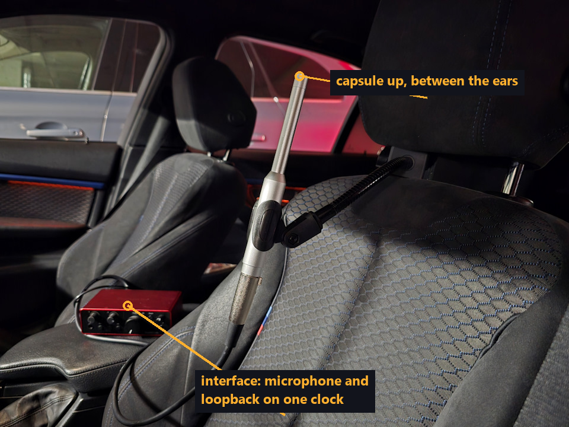

> **Author's note.** I use a **Sonarworks SoundID Reference Measurement Microphone**
> because it is relatively inexpensive and comes with individual 0° and 90° calibration
> profiles. Resonalyze supports both; if only a 0° file is available, it can
> approximate a 90° correction, but a real 90° calibration is preferable.

### Sample rate

Two rates are in play and they do not have to agree: the **measurement rate** your
interface records at, and the **processing rate** your DSP builds its filters at, which
you state once in Virtual DSP (see
[Name the processor you are tuning](#name-the-processor-you-are-tuning)). A 48 kHz sound
card tunes a 96 kHz processor exactly, provided that processor is named — why the two
are kept apart, and what a chain designed at the wrong one costs, is in
[REFERENCE.md](REFERENCE.md#dsp-processor).

> **Measure at whatever rate your interface offers, from 44.1 kHz upward, keep it the
> same for every driver, and tell Virtual DSP which processor you are tuning.**

**Backend.** With a Focusrite interface, **ASIO** is the preferred backend: Resonalyze
can request the desired sample rate directly and verify that the driver supports it.
WASAPI Exclusive is also suitable because it bypasses the Windows mixer; WASAPI Shared
may involve Windows resampling and is best avoided for this job.

At this point, the measurement chain should look roughly like this:

> **Resonalyze → audio interface → car DSP → amplifier → driver → microphone → audio
> interface**

with the interface's **loopback recorded alongside the microphone signal**.

Once this setup is fixed, do not change the microphone position, seat position, sample
rate, or signal routing until all individual drivers have been measured.

---

## 4. Measuring the drivers

Open **Record Settings** from the main Resonalyze window.

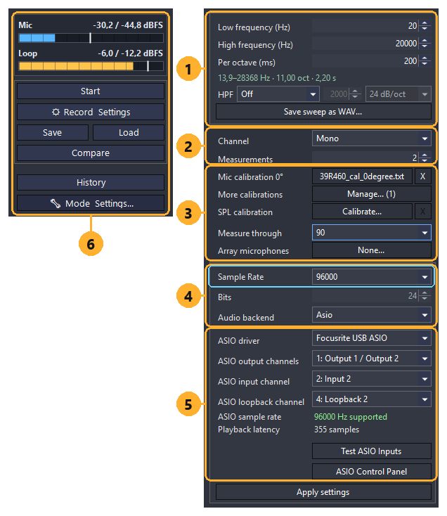

The panel is grouped the way the decisions are:

1. **The sweep** — **Low / High frequency** set its range and **Per octave** its speed;
   a slower sweep buys signal-to-noise. The green line underneath restates what you have
   asked for as a real sweep: band, octaves, and duration. **HPF** is the protective
   high-pass you may declare here rather than remove from the DSP — see
   [Protect the drivers](#-protect-the-drivers).
2. **Averaging** — **Measurements** is how many sweeps are averaged into one result. Two
   is enough for a quick look; four or more is preferable, and it is what produces a
   usable coherence curve.
3. **Calibration** — where the microphone is declared, and it has to be right **before**
   the first sweep: a run freezes the chosen curve into its result, and **Save** writes
   that frozen curve into the file. **Mic
   calibration 0°** takes the microphone's on-axis file, **More calibrations →
   Manage...** takes any others (load your **90°** file here), and **Measure through**
   selects the one this rig records with — the 90° one, because that is the orientation
   [Section 3](#microphone-position) mounts the capsule in. SPL calibration is optional
   and not needed for this workflow. **Array microphones**, the last row, is optional
   too: it configures the further microphones described under
   [a spatial average for the EQ](#optional-a-spatial-average-for-the-eq), and its
   button reads *None...* until you set some up.
4. **Format** — **Sample Rate** (outlined) is the measurement rate, and since the
   [DSP processor](#name-the-processor-you-are-tuning) is stated separately, anything
   from 44.1 kHz upward will do. Prefer your DSP's own rate or a simple sub-multiple of
   it if the interface offers one — delays ride the record's own grid, so that is the
   choice that reproduces them exactly — and keep it the same for every driver in the
   set.
   **Audio backend** — preferably the native ASIO driver.
5. **Routing** — which output feeds the DSP, which input carries the microphone, and
   which channel carries the **loopback**. Without a loopback the measurement will not
   start, by design. The two lines beneath confirm that the driver actually accepted
   the rate you asked for.
6. **The transport column** — **Start**, **Save**, **Load** and **Compare**, with the
   **Mic** and **Loop** level meters above them. Those meters are where you check, on
   every single run, that neither input clipped.

Press **Apply settings**, then use **Test ASIO Inputs** or the level meters in the main
window to verify both inputs.

### Put the DSP into bypass

This is critical, and the reason is worth stating plainly, because the next section
relaxes it in exactly one place.

**Anything left in the signal path becomes part of the measured impulse response.**
Virtual DSP will then apply your crossovers, delays, and EQ on top of processing that
is already baked into the measurement, and the simulation stops describing the real
system.

So before recording, disable:

- PEQ and shelves;
- crossover filters;
- delays;
- polarity inversion;
- all-pass filters;
- individual channel gain corrections;
- limiters, loudness, dynamic EQ, bass enhancement, or other level-dependent
  processing;
- any other phase or frequency-response processing.

Set all delays to **0 ms** and channel gains to their neutral values.

The only level control you should change is the **global gain common to all channels**.

The rule is not "nothing in the path" but **"nothing unaccounted for in the path"**.
That distinction is what makes the next section possible.

### ⚠ Protect the drivers

Bypassing the DSP also removes the filters that normally protect the speakers, which is
especially dangerous for **tweeters**. Never run a full-range 20 Hz sweep through an
unprotected tweeter.

There are two safe approaches, and they can be combined.

**1. Restrict the sweep itself.**

Measure at low power and set the sweep range to something the driver can safely
reproduce — for example **800–1000 Hz → 20 kHz** for a tweeter instead of
**20 Hz → 20 kHz**. There is no benefit in exciting frequencies far below the driver's
useful range.

**2. Declare a protective high-pass to Resonalyze.**

If a protection filter must remain enabled in the external DSP, enter the same **HPF**
type (**Butterworth** or **Linkwitz-Riley**), corner frequency, and slope in Record
Settings. Resonalyze removes that known filter from the loopback-referenced response,
including its **magnitude, phase, and group delay**.

This compensation is valid for a protection filter downstream of the loopback
reference. It is capped at **40 dB**; deeper into the stop band the signal may already
be buried in noise, so use the **coherence** trace to identify the region that is no
longer trustworthy. The declared filter must match the real DSP filter exactly.

**Disable HPF compensation when measuring a channel that does not use that filter.**
It is a live Record Settings value: nothing resets it between runs, and loading a
saved measurement does not change it either. The saved file *does* record which
filter its own response was corrected for — a capture written before that was
tracked says "unknown", which is deliberately a different answer from "none" — so a
measurement's provenance is preserved. But that stamp describes the run behind you,
not the one you are about to take.

A permanent passive protection component, such as a series capacitor, is part of the
installed loudspeaker. Leave it in place and do *not* compensate for it.

### Set the measurement levels first

With the DSP bypassed and the sweep range chosen, set the levels — in that order,
because bypassing changes the output level of every channel.

The microphone and loopback must **never clip**, but they should not be unnecessarily
quiet either.

A good approach is to start with the **subwoofer**, which is usually the loudest source
in the system, and use it to set the microphone preamp gain and global playback level.

Once the loudest driver can be measured safely without clipping, **do not change the
microphone gain or global system volume between measurements**. The relative SPL
between drivers must remain intact.

The loopback should preferably peak around **−15 to −3 dBFS** during the sweep. If it
is much quieter, the reference signal becomes unnecessarily weak and measurement
accuracy may suffer.

### Measure and save every driver

Mute every DSP output except the driver being measured. Keep people and anything else
that is not part of the car out of the path from the drivers to the microphone: run the
sweep from the back seat or from outside, never from the driver's seat the microphone
is standing in.

When everything is ready, press **Start** on the main Resonalyze panel. The sweep will
play several times according to the **Measurements** setting, and Resonalyze will
average the runs into a single measurement.

When the measurement is complete, check that:

- the microphone and loopback did not clip;
- both signals had healthy levels;
- the response covers the driver's useful range;
- there are no obvious measurement errors.

Then press **Save** and store the measurement as a Resonalyze `.json` impulse-response
file.

Repeat this for every driver **without moving the microphone or changing the microphone
gain, global playback level, sample rate, or DSP processing**.

For a three-way front stage with a mono subwoofer, the result is typically seven files:

> **Subwoofer**
> **Left / Right Woofer**
> **Left / Right Midrange**
> **Left / Right Tweeter**

Once all files are saved, the **reference-position linear acoustic snapshot is
complete**.

### Optional: a spatial average for the EQ

Everything above was measured from one fixed point, and it has to be: timing and phase
are only meaningful against a reference that does not move.

That same fixed point is a weaker basis for **equalization**. One microphone position
carries deep, narrow dips that belong to that spot — move the microphone a few
centimetres and they move with it. Equalizing them corrects a location rather than a
loudspeaker, and spends amplifier headroom doing it. Your head is not a point, and it
does not stay still.

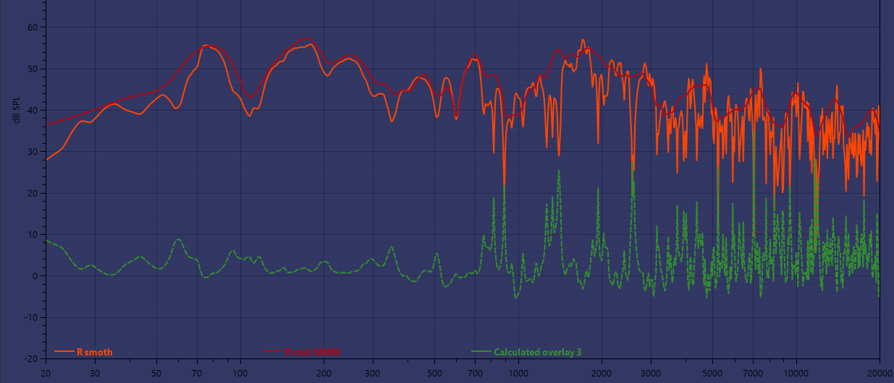

*Orange: one position, unsmoothed. Violet: a moving-microphone average of the same
midrange. Green: their difference, down to **−28 dB**.*

**Most of that disappears under smoothing**, because most of it is narrow — which is
exactly what **psychoacoustic smoothing** discounts, and that is the width
[Section 6](#set-the-display-correctly) has you read a single-point tune at anyway.

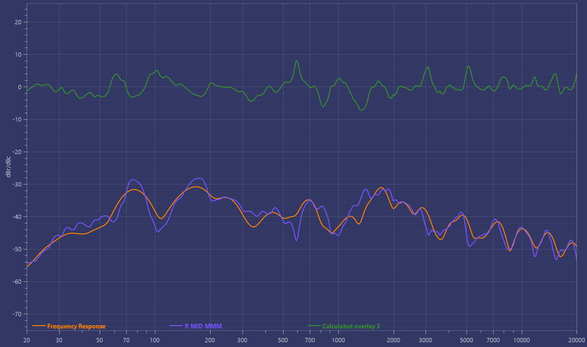

*The same measurement, smoothed: the difference is a median of **1.3 dB** and stays
inside 3 dB across four fifths of the band.*

So one microphone is enough for a basic tune, and everything in this guide works from
one. An average makes the basis more representative: a dip that belongs to one spot
contributes a fraction of the result rather than all of it, instead of being hidden
behind a smoothing window. A microphone array adds what a moving microphone cannot —
the positions' own **spread**, which says where they agreed and where the average
speaks for less than the volume it covers. Either way, that curve is what the EQ stage
in [Section 8](#8-peq--equalization) is fitted to.

There are two ways to get one.

**If you have spare inputs and spare microphones**, set up a
[microphone array](REFERENCE.md#microphone-array) before you measure: **Record
Settings → Array microphones**, one row per further microphone — its input, its
calibration, and a note saying where it stands.

The measurement microphone does not move: it stays where
[Section 3](#microphone-position) mounted it, at the listening position, and it remains
the only source of timing — the impulse responses, the arrivals and every delay
come from it alone. The further ones exist for the average the EQ stage reads and for
nothing else, so their placement is free: spread them around that position, through the
volume a head occupies. The seven these were developed against sat within about 30 cm
of it, left and right of it and forward of it.

**The table lists only the further microphones.** The measurement one is not a row in
it and cannot be made one — the dialog does not offer the input it is on — it joins the
set by itself when the sweep runs, which is why six rows produced those seven
positions. One row is the least an average can be built from.

A capsule's calibration has to be in Record Settings' own list before it can be
assigned — **More calibrations → Manage... → Add file...** — because the array chooses
from that list and nowhere else. It is the panel's working copy, so one added there can
be given to a microphone straight away.

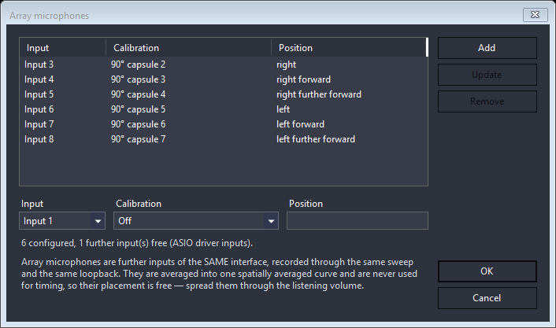

**The microphones must be inputs of the same interface as the measurement one** — that
is what keeps them on the same clock and the same loopback, and it is not negotiable.
In practice it also means **ASIO**: the line under the editor says how many inputs it
found and where it looked, and on the other backends the answer is usually two.

Then measure exactly as described above and the average comes with the sweep: nothing
to capture twice, nothing to keep at the same gain afterwards, and the positions' own
disagreement is stored beside the average. A position that clips or goes silent fails
the whole sweep rather than quietly dropping out of it, so what you get is either the
array you set up or an error naming the input.

One trap worth knowing: an array belongs to the capture **device** it was configured
on. Select a different one and the button says which device the microphones are for,
and none of them are recorded until you open the list and confirm it with **OK** — see
[REFERENCE.md](REFERENCE.md#microphone-array) for why an input number cannot travel.

**If you have one microphone**, take a second pass over the same drivers using the
**moving-microphone method** (MMM), which averages the response over the volume
your head actually occupies.

Switch Live Spectrum to **MMM** mode. It pins the settings such an average is only
valid under — periodic pink noise, infinite averaging, band-power dB SPL, noise-slope
compensation on, smoothing off, and with periodic noise the window and overlap follow —
so most of that panel stops being a decision. An SPL calibration is **not** required.

**Sequence Length** is the one setting it leaves open: put it at the **maximum**
(65536). The excitation is one frame-length period of pink noise, so the longest frame
carries the most bass and lands the average on the finest grid — 0.7 Hz bins at 48 kHz
against 23 Hz at the default. Its frame lasts 1.4 s, which makes the thirty seconds
below about twenty of them. Keep the same length for every capture in a set.

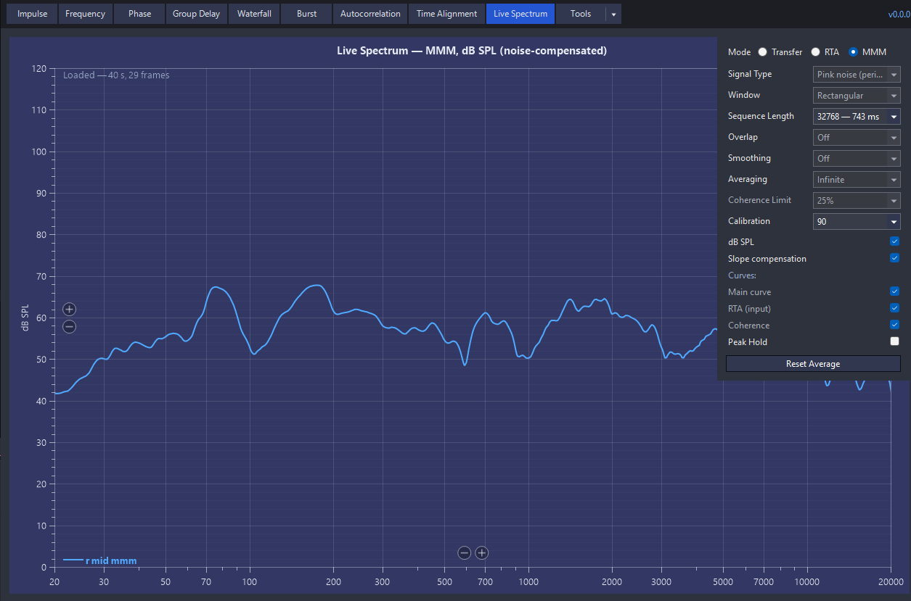

Then, one driver at a time, **with the DSP still in the same bypassed state you
measured in** (only the protective high-pass left in place) and at **the same levels**:

- mute every output except the driver being captured;
- **sit in the back and keep yourself out of the path** from every driver to the
  capsule, with nobody in the front seats. Hold the microphone into the driver's head
  area from behind: a torso between an A-pillar tweeter and the capsule is a shadow,
  and unlike a reflection it does not average out — every position you walk the
  microphone through has the same body in front of it;
- take the microphone off its stand and hold it with the **capsule pointing up**, the
  same orientation it was mounted in;
- press **Start**, and move it in **slow, smooth circles around the driver's head
  area**, roughly at the radius of a head — slowly and evenly, so the volume is
  sampled evenly;
- let it integrate for **30 seconds or more** — the read-out shows how long it has been
  accumulating;
- press **Save** and store the capture as its own file.

One capture per driver, exactly as with the sweeps: left and right separately, and a
single capture for a mono subwoofer.

Do not touch the microphone gain or the playback level between captures. Every capture
in one set has to be taken the same way, or their levels cannot be compared with each
other afterwards — Virtual DSP checks this and tells you when they disagree.

At this point, pack up the microphone, audio interface, and cables, close the car, and
go somewhere comfortable. From now on, most of the tuning can be done offline in
Virtual DSP — preferably from a sofa rather than from the driver's seat.

---

## 5. Understanding the measurements before touching the DSP

Before opening Virtual DSP, spend a few minutes checking the RAW measurements. We are
**not tuning anything yet** — only verifying the data and learning what each installed
driver actually does.

Load a saved measurement with the **Load** button on the main panel and select its
`.json` file.

Each analysis mode also has its own **settings button**, which opens an additional
panel with mode-specific controls. Depending on the view, this includes smoothing,
impulse-response gating, displayed curves, and other analysis parameters.

Its **Calibration** selector opens on **Own (as measured)**: the curve the measurement
in front of you was recorded through. Every new measurement puts it back there — a
finished sweep, an opened file, a history entry stepped back to — so if it says anything
else, someone chose it, and you are reading this response through a microphone that did
not take it.

Start with **Frequency Response** and check:

- the driver's useful frequency range;
- natural acoustic roll-off;
- major resonances or cancellations;
- whether left and right drivers behave reasonably similarly;
- where the response becomes unreliable outside the useful band.

Do not expect RAW in-car measurements to look smooth. Reflections from the windshield,
dashboard, seats, and doors, together with cabin modes, can make them surprisingly
ugly.

Also watch **Coherence**. Poor coherence inside the frequency range you actually intend
to use usually means the measurement should be repeated. Poor coherence far outside
that range is usually irrelevant. Treat coherence primarily as a
measurement-confidence indicator, not as an EQ target or a direct measure of
reflections.

If you used protective-HPF compensation on this channel, this is also where you check
it: the region the compensation could not recover is marked in the coherence trace, and
it should sit safely below the band you intend to use.

### Check the array, if you measured with one

The Frequency Response settings panel carries three more curves, all off by default and
all empty unless the measurement was recorded with a
[microphone array](REFERENCE.md#microphone-array): **Show array average** — the spatial
average itself, which is the curve the EQ stage will be fitted to; **Show array
microphones** — each position on its own, thin, levelled onto the measurement
microphone; and **Show array spread**, how far apart the positions sat at each
frequency, on its own right-hand axis in dB.

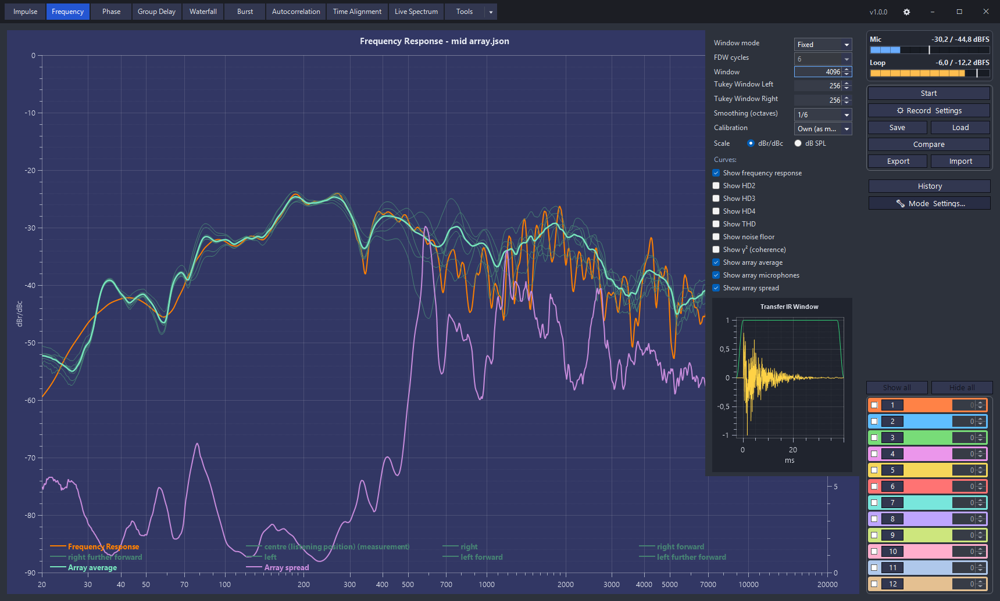

*One midrange. Orange is the microphone at the listening position — the response the
impulse file holds; the thin curves are the seven positions, the thick teal one their
average, and the purple one their spread on the right-hand axis. Below 500 Hz the
positions sit 2 to 5 dB apart and the point response IS the average, to within half a
decibel. Above it they part by some 13 dB, and the point response leaves the average by
3 dB in the median and 19 dB at worst — that difference is where the microphone stood,
not what the driver does.*

This is where you see that the set is what you set up: as many thin curves as you had
positions, each named in the legend by its **Position** note — which is what that field
was for — and agreeing where they should. They are read from what the file stored, so
they do not follow the impulse gate: a spatial average is a steady-state curve and has
no window to move.

Read the spread as the confidence of the average. Near zero the positions agreed and one
microphone would have said the same thing. Positions in a car part by 11 to 12 dB across
the band as a matter of course, so that is ordinary rather than alarming; past **20 dB**
the average is carried by whichever position happened to be loudest, and Auto Tune
places no boost there later — a dip that belongs to one seat centimetre is not worth
anyone's headroom.

### Check the time domain

Open **Time Alignment** or **Impulse Response** and make sure the detected arrival looks
sensible. A wildly incorrect delay, weak impulse, clipping, or a broken loopback
reference is much easier to fix now than after the complete virtual system has been
built.

For now, do not correct anything. At this stage, we only need to answer two questions:

> **Is the measurement trustworthy?**
>
> **What frequency range can this driver realistically be used in?**

Once every measurement passes this sanity check, we can start building the actual
system in Virtual DSP.

---

## 6. Building the virtual system

Now we can turn the saved measurements into a virtual copy of the system.

Open **Tools → Virtual DSP**.

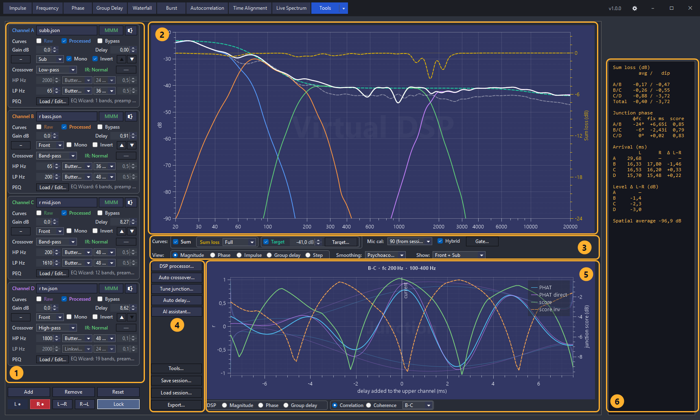

The panel is dense, so it is worth naming its six regions once:

1. **The channel cards** — one per band, top to bottom in frequency order. Each carries
   that channel's source, gain, delay, polarity, crossover, PEQ and curve toggles. The
   **L / R** selector at the bottom decides which side every card is showing.
2. **The acoustic plot** — each channel's processed response, the phase-aware **Sum**,
   and the **Sum loss** trace against the right-hand axis.
3. **What the plot shows** — which curves are drawn, the target and its level, the
   microphone calibration, smoothing, the Hybrid toggle, and the magnitude gate.
4. **The actions** — the DSP processor, the two optimizers, the audition render, session
   save/load, and the tuning-sheet export.
5. **The junction view** — the chain's own filters, or (as here) the correlation and
   score curves the delay search reads at one junction.
6. **The read-out** — per-junction sum loss, junction phase, per-channel arrivals and
   the L/R level difference. This is the panel's scoreboard, and most of this guide is
   about making its numbers small.

Each Virtual DSP channel represents one frequency band. Add or remove channels until
the layout matches the real system, and arrange them from lowest to highest frequency.

For a three-way front stage with a subwoofer:

- **A — Subwoofer**
- **B — Woofer / Midbass**
- **C — Midrange**
- **D — Tweeter**

Load the saved `.json` measurements for the **Left** and **Right** sides of each stereo
band. For a shared subwoofer, enable **Mono** and load its single measurement.

Set each block's **Zone** while you are there — **Front** for the stereo bands of the
front stage, **Sub** for the subwoofer, and **Rear** or **Center** for the blocks a
larger install adds. Picking **Center** switches **Mono** on and locks it, because a
centre channel plays a signal derived from L and R and has no side of its own.

The zone is what the **Show** selector under the plot sorts by, so on a front-only car
you can set every block to Front and Sub and forget it — that is the default view and
what this chapter's four-way looks like throughout. On a larger install the zone is how
you look at one part at a time: the front stage with its subwoofers, then the rear fill,
then the centre. **Auto delay** reads the zone as well: it settles the front chain first
and then places the rear fill and the centre against it, so on a larger install the zones
are what make its proposal mean anything.

So seven RAW measurements become four Virtual DSP channels:

> **Sub → A Mono**
> **Left / Right Woofer → B L/R**
> **Left / Right Midrange → C L/R**
> **Left / Right Tweeter → D L/R**

Do not normalize or otherwise modify the measurements before loading them. Their
relative SPL, phase, and absolute timing are exactly what Virtual DSP needs.

### Name the processor you are tuning

Press **DSP processor...** and say which device this project is for.

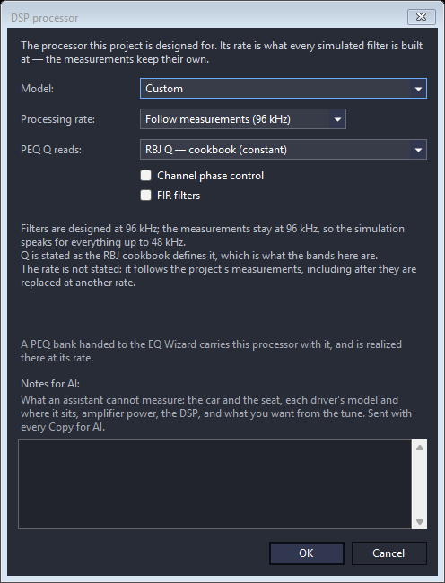

Pick your **Model** from the catalog — it covers the common car processors from AMP,
HELIX, Audison, Hertz, Mosconi, ESX, miniDSP and JL Audio — and its **processing rate**
and **Q convention** come with it, locked, because both are facts about the device:

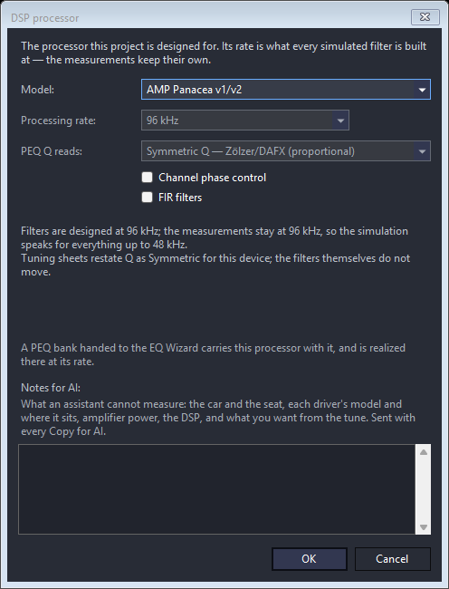

If your processor is not in the list, pick **Custom** and state both by hand. The rate
list also offers **Follow measurements**, which means the project states no rate of its
own and the filters are designed at whatever the measurements were recorded at — take
it only when you do not know your processor's rate. A new project opens on it, so this
is a choice you have to make rather than one already made for you.

Under the fields the dialog states what the choice buys: the rate the filters are
designed at, the rate the measurements keep, and how high the simulation is
trustworthy. It then travels with the project — into the EQ Wizard, and into the
tuning sheet's Q column — which
[REFERENCE.md](REFERENCE.md#dsp-processor) describes in full.

### Set the display correctly

Set **Mic cal** to **Own (as measured)**. Each measurement carries the calibration it
was recorded through — the one you set in
[Record Settings](#4-measuring-the-drivers) before the sweeps — and this reads every
channel through its own rather than applying one curve to all of them. Pick a single
calibration from the list only when you want to see the whole set through one
microphone on purpose.

For most tuning work, also select **Psychoacoustic smoothing**. As in REW, it visually
de-emphasizes narrow high-Q peaks and dips while preserving broader features that are
more perceptually relevant. This makes the graph easier to read and helps prevent
over-correcting narrow, position-dependent cancellations that are usually not worth
chasing with EQ.

Both **Smoothing** and microphone calibration are selected directly below the main
graph.

These two choices matter beyond this graph: they travel with a channel when you hand it
to the EQ Wizard in [Section 8](#8-peq--equalization), so setting them here sets them
there.

### What Virtual DSP is actually simulating

Each channel has a virtual processing chain where Resonalyze can apply:

- gain;
- delay;
- polarity;
- HPF and LPF;
- PEQ — bells, shelves, and the phase-only **all-pass** bands, which live in the bank
  as band types rather than as a stage of their own.

These operations are applied to the **actual measured impulse response** of the
installed driver, not to an idealized response curve. This preserves its real
magnitude, phase, and timing behavior.

Virtual DSP primarily models the linear behavior captured by that measurement. It does
not predict level-dependent effects such as distortion, excursion limits, power
compression, or voice-coil heating. These must be checked separately in the real
system.

After processing, the drivers are combined using **complex summation**.

This matters because two drivers producing the same SPL do not necessarily add
constructively. For example:

> **80 dB + 80 dB does not necessarily equal 86 dB.**

Depending on their relative phase:

- they may sum almost perfectly and gain about **6 dB**;
- they may gain only a few dB;
- they may partially cancel;
- near opposite phase, they may create a deep null.

This is exactly what happens in real crossover regions.

So when you change crossover frequency, slope, delay, polarity, or EQ, Resonalyze
recalculates not only the individual driver responses, but the **predicted acoustic sum
of the whole system**, including the resulting phase and group delay.

At this stage, do not start tuning yet. First verify that every measurement is loaded
into the correct channel and side, that the Virtual DSP structure matches the real
processor, that the right **DSP processor** is named, and that **Mic cal: Own (as
measured)** and **Psychoacoustic smoothing** are selected.

Once the virtual system is assembled correctly, we can move on to the first real tuning
step: crossover design.

---

## 7. Crossover tuning

You can let **Auto Crossover** configure all crossover points in a couple of clicks. If
you simply want a good starting point, that is enough. If you want to squeeze the
maximum performance out of the system, it helps to understand what the optimizer is
trying to achieve.

A good crossover must satisfy four things:

1. both drivers remain within a safe operating range;
2. their **acoustic slopes** overlap sensibly;
3. after phase alignment, they can sum with minimal cancellation;
4. the handoff remains reasonably stable over small changes in listening position —
   this will be verified later in the real car.

### Start with the drivers, not textbook frequencies

Use the RAW measurements to determine where each driver actually works well. Do not
choose a crossover simply because a driver still produces some SPL there.

This is especially important for tweeters. Resonalyze can see their acoustic response,
but it does not know their **Fs, excursion limits, thermal limits, or manufacturer's
recommended crossover**.

Always check the manufacturer's recommended minimum crossover first. If distortion or
excursion data are available, use them as well. **Fs alone does not define a safe
crossover frequency.** As a fallback rule of thumb, a tweeter high-pass around
**2–3× Fs** can be a conservative starting point. With a sufficiently steep filter it
may sometimes be possible to go lower, but this should be a deliberate decision — not
something accepted blindly from an optimizer.

Also consider where the crossover lands. Human hearing is particularly sensitive around
roughly **2–4 kHz**, so if two equally good crossover regions are available, it can be
advantageous to avoid placing the most difficult junction there. This is a preference,
not a prohibition — a properly integrated 2.5 kHz crossover is perfectly valid.

### Electrical slope is not acoustic slope

The filter selected in the DSP is only part of the result:

> **Acoustic response = natural driver response × electrical filter**

A driver already rolling off acoustically may therefore produce a much steeper final
slope than the number shown in the DSP.

For active systems, **Linkwitz–Riley 24 dB/oct** is a very good general-purpose
starting point. **LR48** is also useful when stronger driver protection, reduced
overlap, or better isolation from a breakup region is required.

Steeper filters are not automatically better, however. They produce different phase and
group-delay behavior, which becomes part of the acoustic crossover that must be
aligned.

### Using Auto Crossover

Press **Auto crossover...**.

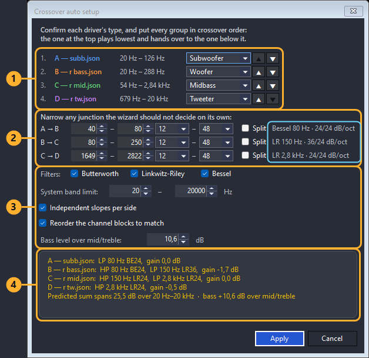

Resonalyze analyzes the measurements, estimates the usable bandwidth of each channel,
and assigns a likely driver type. Check these classifications and correct them if
necessary.

The channels are listed under their group — the front stage with its subwoofers, the
rear fill, the centre — because only a group is a crossover chain; nothing hands a band
from the front stage to a rear fill, so each group is fitted separately.

**Inside a group the rows are the chain, and they must run from the lowest driver to the
highest.** The rows are numbered for that reason: number 1 plays lowest and hands over
to number 2, which hands over to number 3. Two channels may hold the same driver type —
a pair of subwoofers splitting the bottom is an ordinary install — so the type cannot
put them in order and the row order is what does. Resonalyze fills it in from what each
channel measured, narrowed by any crossover corner it already has: set a 50 Hz corner on
either sub and that alone says which of the two plays lower. The **▲▼** arrows move a
row when the measurement cannot decide, or when you know better than it does.

Two colours flag an order worth a second look. A band in **amber** means the two
channels measure too much alike for anything to have ordered them — you have to say
which is which. A band in **red** means the channel measures *lower* than the one above
it, so the chain runs backwards there; that is usually a row moved one step too far, or
a driver type set to something the channel does not actually play. Apply names both
before it writes anything, and you can go ahead if the order shown is the one you want.

A group holding a single driver has nothing to cross, so it gets a protective high-pass
under its usable band and is levelled onto the front stage. Treat that level as a
starting point: how far a rear fill sits under the front is a decision for your ears,
not for the measurement.

Then select:

- the filter families supported by your real DSP;
- the overall crossover search range;
- whether HPF and LPF may use different slopes;
- whether the channel blocks in the panel should be put into the same order;
- the desired bass level relative to the mid/high range.

That reordering is on by default, and it is worth leaving on: a panel whose blocks
read down the spectrum is far easier to work in than one in the order you happened
to load the files. Blocks are lettered by position, so the ones that move are
re-lettered and take a new plot colour — everything else about them, sources and
settings and measurements alike, travels with the block. If you have already
printed a tuning sheet, note that it names the channels by the OLD letters. The
**▲▼** buttons on each block do the same thing one step at a time, whenever you
want it and without the wizard.

The optimizer then searches many combinations of crossover frequencies, slopes, and
filter families using the **actual measured acoustic responses**, while also
considering bandwidth, overlap, unwanted leakage, and filter group delay. The proposal
it lands on is printed at the bottom of the dialog before you commit to it.

When it finishes, press **Apply** if the result makes physical sense.

The important limitation is that Auto Crossover does not know everything about your
installation. Always sanity-check the proposed result against the driver datasheets and
your own knowledge of the system.

### Manual tuning is always available

You are not limited to the automatic result.

Every channel card in Virtual DSP exposes its HPF, LPF, filter family, and slope
directly, so you can tune any crossover manually **before or after** running Auto
Crossover.

Just remember that running Auto Crossover again will overwrite the crossover settings
you edited previously — and that, once you reach the next section, a channel's EQ will
have been fitted against its crossover. Changing a crossover afterwards means that
channel's PEQ should be re-checked.

A practical workflow is therefore:

> **Auto Crossover → inspect the result → manually refine anything that does not make
> sense**

rather than trying to find every crossover from scratch.

### What ultimately defines a good crossover?

Not where two magnitude curves happen to cross.

The final criterion is how well adjacent drivers **sum acoustically** after EQ and time
alignment.

Virtual DSP can show **Sum Loss** — the difference between the real phase-aware complex
sum and the ideal magnitude-only sum. It appears per junction in the read-out on the
right of the panel.

0 dB means essentially ideal phase-related addition relative to the magnitude-only sum
at that measurement position. Increasingly negative values mean increasing
cancellation. It does not by itself prove that the crossover remains well behaved when
the listener moves.

We will use this later, once PEQ and delays are in place. For now, do not chase perfect
Sum Loss numbers: EQ also changes phase, so final time alignment should be performed
**after equalization**.

At this stage, the goal is simply to establish crossover frequencies and slopes that
are **safe, acoustically sensible, and physically realistic**.

---

## 8. PEQ / equalization

Before aligning delays, we should equalize the individual channels. PEQ changes not
only magnitude but also phase, so performing final time alignment first would mean
partially undoing it again after EQ.

### Optional: equalize the spatial average

If you arranged a spatial average in
[Section 4](#optional-a-spatial-average-for-the-eq), bring it in before setting the
target.

**Measured with a microphone array?** There is nothing to attach — the average came
with the measurement. The button on each channel card reads **Array**, and its menu
picks which average the whole project reads: the arrays the measurements carry, MMM
captures attached by hand, or none. A channel measured with a single microphone in an
array project is drawn from that point measurement instead and the panel says how many
channels that is; below the cabin's first mode a point and an average are the same
measurement, so a subwoofer loses little by it.

**Mic cal** should be on **Own (as measured)**, as
[Section 6](#set-the-display-correctly) set it — with an array it matters doubly, since
each position is a different capsule with its own file and no single curve of yours
describes the set.

**Took MMM captures instead?** On each channel card, press the **MMM** button and
select that driver's capture. Do it for both sides — left and right have their own —
and once for a mono channel, which shares its single capture. The button says where
each channel stands: **MMM** for none, **MMM ✓** when one is attached, **MMM ⚠** when
the session refers to one it cannot read.

When every channel that plays has a capture, the **Hybrid** toggle under the graph
becomes available. Tick it.

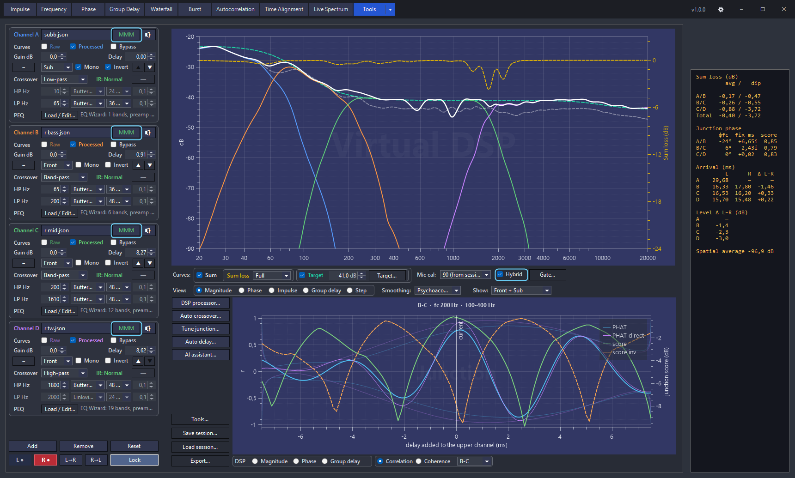

What changes: each channel's magnitude is now drawn from its stored spatial average
with that channel's own DSP chain added on top analytically. That substitution is exact
rather than convenient — a filter does not depend on where the microphone was, so it
factors straight out of the average — and the curve you equalize stops carrying the
dips of one microphone position. The whole set is lifted onto the impulse responses'
own axis by a single common offset, so the target level you are about to set reads on
the same scale as before.

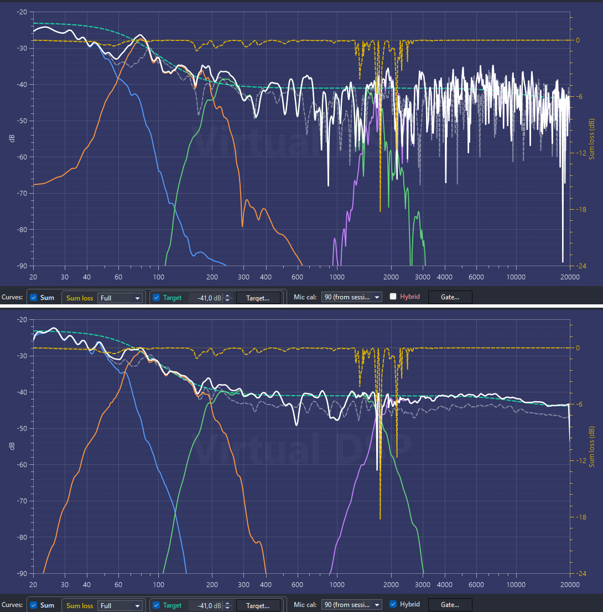

**Turn smoothing off while you are in this mode.** Smoothing exists to keep you from
chasing narrow, position-dependent wiggles — and a spatial average has already averaged
those down, over the volume, instead of hiding them behind a wide window. What is left
in an MMM curve is mostly broad and real, and worth seeing at full resolution. It also
keeps the reading honest near a crossover: a fractional-octave
window straddling a steep skirt pulls that channel's level up toward its own passband,
which is exactly where you are judging the fit.

So where the Auto Tune notes below suggest psychoacoustic smoothing, that advice is for
the single-point curve. With Hybrid on, set smoothing to **Off** instead.

What does not change: **timing, polarity, the junction analyses, Auto delay, the
sum-loss read-out and the phase view all keep reading the impulse responses**. A
spatial average holds no phase; the impulse responses do, and that is what they are
kept for. Both sums follow the hybrid channels, added as phasors with the phase the
impulse responses measure — read them as a guide to where the junctions land, not as a
measured spatial average of the whole system.

From here the workflow below is unchanged. The handoff carries the capture with it, so
**Auto Tune fits the hybrid** — which is the entire reason for taking the captures.

If the panel warns in amber that the spatial averages disagree, one of them was taken
differently from the rest: a changed input gain, a different analyzer setting, or a
capture from another session. The message names each channel's figure so you can see
which one is the odd one out.

### Set the target once, in Virtual DSP

The EQ target is shared between Virtual DSP and the EQ Wizard. It is one curve, edited
from either place through the same **Target...** menu, so setting it here means every
channel you tune afterwards aims at the same thing.

Tick **Target** under the main graph, open **Target... → Parametric shape…**, and
select one of the Car presets. The Car presets mainly differ in bass lift, so this is
where the overall tonal balance of the system begins to take shape.

If you already tune to a house curve of your own, **Target... → Import from file…**
takes it instead — a text file of `frequency level` pairs, read as relative dB and hung
at the level you set below. Everything after this point works the same way.

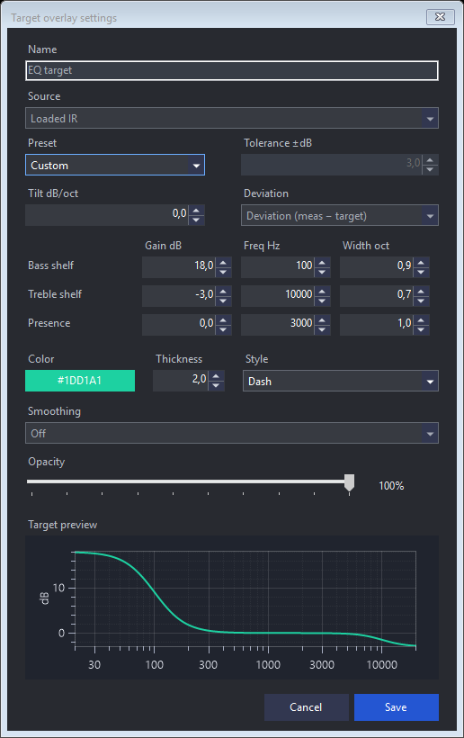

Then set the dB box beside the checkbox: the level around which the system will be
equalized.

For maximum headroom, it is generally better to **cut peaks rather than boost dips**,
so the target should be close to the quietest useful part of the response.

Do not take this too literally. A very deep, narrow dip may be caused by destructive
interference and cannot be corrected sensibly with EQ. Do not lower the entire system
just to reach such a null.

> **Author's note.** In my own car, the responses suggested a target around **−41 dB on
> the measurement scale** — the value the screenshots in this guide are taken at.

### Hand a channel to the EQ Wizard

On the channel card, press **Load / Edit…** on the **PEQ** row and choose **Edit in EQ
Wizard**.

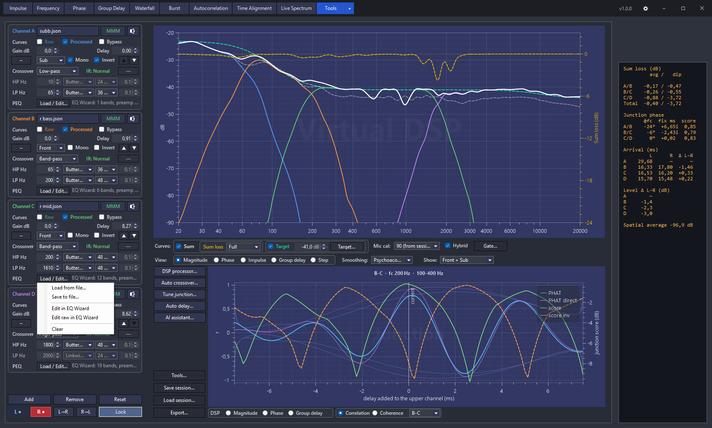

Resonalyze switches to the wizard with that channel already loaded, and brings
everything the tune depends on with it:

- **the curve** — the channel's measurement through its own DSP chain with the PEQ
  itself bypassed, windowed exactly as the Virtual DSP plot windows it. What you
  equalize is what that channel actually contributes to the sum, crossover included —
  not the bare driver;
- **the microphone calibration** — the one selected in Virtual DSP. The wizard's own
  selector is disabled for the session and shows what applies;
- **smoothing** — the panel's setting as a starting point. You are free to change it
  here: it is a reading width, not part of the tune;
- **the processor** — the project's rate and Q convention, shown locked;
- **Auto Tune From / To** — set from this channel's crossover corners, so the fit stays
  inside the band the driver is actually used in;
- **Target Level** — the value you set in Virtual DSP, verbatim. The curve hangs exactly
  where you just saw it hang;
- **the channel's existing PEQ**, if it has one, as the starting bank. Ctrl+Z is the
  handoff's cancel: one undo restores whatever the wizard held before.

Nothing has to be selected, typed, or matched by hand, and no file changes hands.

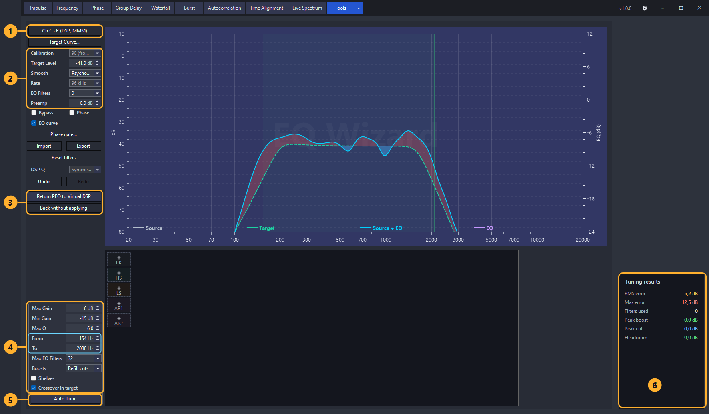

1. **The receipt.** **Ch C · R (DSP, MMM)** means channel C, right side, the curve
   taken through the **DSP** chain, off that channel's **MMM** spatial average — a
   channel measured with a microphone array reads **Array** in that place, and one with
   no average at all says just **DSP**. Read this before you touch anything: it is the
   one place that says what you are about to equalize.
2. **What came across.** Calibration, target level, smoothing, the processor's rate
   and the bank's preamp. **Calibration** and **Rate** are greyed — with **DSP Q**
   further down they belong to the project rather than to the wizard, and are shown so
   you can see what applies. The rest arrived as a starting point and stay yours to
   change, smoothing especially: it is a reading width, not part of the tune.
3. **The way back.** **Return PEQ to Virtual DSP** writes the bank onto the channel it
   came from; **Back without applying** leaves the channel alone and keeps your edits
   here.
4. **What the fit is allowed to do.** **Max / Min Gain** should match what your real DSP
   supports, **Max EQ Filters** the number of bands it has, and **Cuts only** should
   stay ticked — it stops the optimizer from spending amplifier headroom filling
   acoustic nulls. **Max Q** caps how narrow a filter it may place (6.0 by default):
   below that ceiling the fit favours broader trends, the ones likelier to hold across
   the listening area, over notching a peak that may belong to where the microphone
   stood. **Shelves** is worth ticking when the target is shelved — a bass lift, a
   downward tilt — or when a whole end of the measurement runs hot or shy: one shelf
   then does what three or four bells were doing badly, and the slots it frees go to
   real resonances. With **Cuts only** ticked it is safe to leave on: a shelf is kept
   only where finishing the fit with it lands closer to the target than finishing it
   without, so a response made of resonances alone gets none. With **Cuts only** off, a
   boosting shelf lifts a whole end of the range and the total boost can pass **Max
   Gain** — read **Headroom** on the scoreboard afterwards before you accept the tune.
   **From** and **To**
   (outlined) arrived already filled in from this channel's crossover corners, so the
   fit stays inside the band the driver is actually used in.
5. **Auto Tune** — run it once these are set.
6. **The scoreboard.** RMS and max error against the target, how many filters were
   spent, and the headroom the bank costs. Before the fit it reads the raw disagreement
   with the target; after it, how much of that is left.

Psychoacoustic smoothing helps here too, by de-emphasizing narrow, position-dependent
irregularities that are usually not worth correcting — unless you are working in Hybrid
mode, where smoothing should be **Off** for the reasons given above.

Press **Auto Tune** and let Resonalyze fit the response to the target.

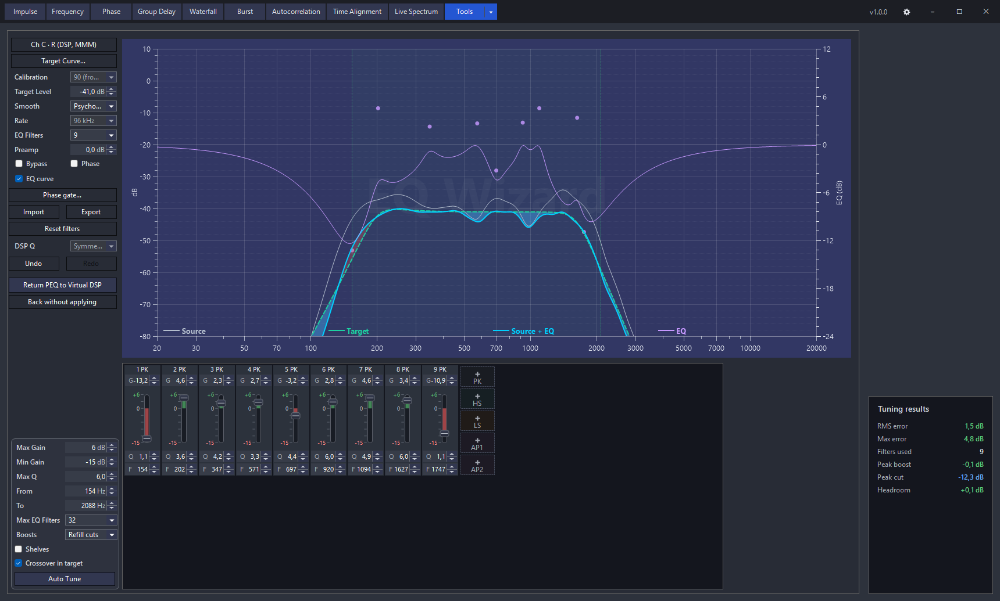

### Read the band edges as the filter, not the driver

One thing changes when you equalize through the chain instead of the raw driver: the
crossover is part of the curve you see. The response falls away toward **From** and
**To** because the filter puts it there — that is the crossover working, not a defect to
correct.

Correct the driver's own irregularities inside the band instead. Broad, minimum-phase
bumps and dips are worth attention, especially near a crossover region: flattening them
does more than tidy the magnitude response — it also improves the associated phase
behavior, which can make the following alignment stage considerably easier.

Do not chase every narrow notch. A dip made by delayed energy or plain cancellation is
not something PEQ can repair: the filter changes the magnitude, not what caused the
dip. (**Group Delay** mode can help tell such a dip apart from a driver's own — as
evidence rather than proof, and only where the level and the coherence there are worth
reading; see [REFERENCE.md](REFERENCE.md#phase-and-group-delay).)

### Preamp and manual cleanup

If the entire useful response sits several dB above the target, use **Preamp** to bring
it closer before spending multiple PEQ bands cutting the same amount everywhere. The
preamp is part of the bank: it travels back to Virtual DSP with the filters and appears
on the tuning sheet.

Auto Tune is only a starting point. You can remove unnecessary PEQ bands by
drag-and-drop, adjust them manually, or add bands with the **+** buttons: **PK** and
the two shelves, and **AP1 / AP2**, the first- and second-order all-pass bands
[Section 9](#9-delay-and-phase-alignment) uses to bend phase without touching
magnitude.

### Do not over-equalize

A flatter magnitude response is not automatically a better result.

Every ordinary minimum-phase PEQ band moves phase and group delay along with
magnitude. A few broad corrections are usually harmless, and correcting a genuine
minimum-phase resonance improves both at once — which is why
[the band edges above](#read-the-band-edges-as-the-filter-not-the-driver) single out
broad, minimum-phase bumps and dips. The problem is excess: many narrow, high-Q
filters can leave a complicated phase and group-delay response that makes adjacent
drivers harder to integrate.

This is especially important on the **subwoofer and midbass**. Their crossover already
contains substantial phase rotation, and the subwoofer may carry a steep protective
high-pass or subsonic filter on top of it. Add many narrow corrections to that and the
relative phase changes rapidly through the crossover region — at which point no single
delay value sums the pair well over a useful bandwidth, which is exactly what
[Section 9](#9-delay-and-phase-alignment) is about to ask of it. The same mechanism is
at work at the mid-to-tweeter junction, where a high-Q filter sitting right on the
crossover does the same thing; it is simply easier to see in the bass, where the group
delay it adds is measured in milliseconds.

Use PEQ on the response that is actually correctable:

- prefer broad, moderate corrections over many narrow ones;
- cut significant resonant peaks when they are repeatable and clearly belong to the
  driver or the installation;
- do not try to fill deep cancellation nulls with boost — this is what **Cuts only**
  keeps Auto Tune from attempting;
- do not spend filters on every small ripple simply to make the graph look flat;
- watch narrow filters near a crossover frequency in particular, where their phase
  contribution feeds straight into the integration with the adjacent driver.

There is no useful rule of the form "five PEQs are safe and ten are too many." A filter
should exist because it solves a real problem, not because another small deviation from
the target is still visible.

After equalizing, look at the result in the context of the complete crossover — the
phase and group-delay views, and **Sum Loss** at the junction. If removing an
unnecessary band makes the phase or group-delay behavior smoother and broadens the
summation with the adjacent driver, the simpler EQ is the better tune.

### Return the result

Press **Return PEQ to Virtual DSP**. The bank — filters and preamp — lands on the
channel it came from, the target level goes back with it, and Resonalyze switches back
to Virtual DSP with the prediction already redrawn.

If you would rather keep what the channel had, press **Back without applying**. Nothing
is written anywhere, and the wizard keeps your edits, so you can still export them or
come back to them later.

### Repeat for every channel, then for the other side

The handoff always takes **the side Virtual DSP is currently showing** — the **L** / **R**
selector at the top of the panel.

Left and right drivers are separate measurements and need separate EQ, so the loop is:
select **L**, hand off each channel in turn and return; then select **R** and do it
again.

This is the one place where the file-free workflow can still catch you out. There is no
filename to check any more, so make sure the side selector says what you think it says
before you start tuning.

### If the return is refused

A bank belongs to the curve it was fitted against. If you go back to Virtual DSP while
the wizard is open and change what that curve was — a different measurement on that
side, an edited crossover, delay or gain, a moved gate, a different microphone
calibration or target level, a different DSP processor, the pair switched between
stereo and mono — the return is refused, and Resonalyze says which kind of change it
saw.

The filters are not lost: they stay in the wizard and can still be exported. Either
undo the change in Virtual DSP, or start a fresh handoff from the channel's PEQ menu
and tune against what the channel shows now.

### Raw instead of the chain

The same menu also offers **Edit raw in EQ Wizard**. That hands over the raw
measurement — the driver before any of the chain, exactly as the panel's Raw curve
draws it — and leaves the Auto Tune band alone.

Use it when you want to examine or correct the driver itself irrespective of the
crossover. For the workflow in this guide, **Edit in EQ Wizard** is the one you want: a
bank fitted against the chain is a bank fitted against what the channel really
contributes.

One exception the menu names for you: if a block is bypassed, Virtual DSP is drawing
its raw response, so the item reads *Edit in EQ Wizard (chain — block is bypassed)*. It
still opens on the chain, because that is what the PEQ will live in once bypass comes
off.

### Working with files instead

The whole tune can now be built without an intermediate file, but files are still there
when you want them.

**Load / Edit… → Save to file…** writes that channel's bank out as an EQ profile —
Resonalyze exchanges PEQ profiles with **Equalizer APO, REW, miniDSP biquads, Audiotec
Fischer, CamillaDSP, EasyEffects, GraphicEQ, and Generic CSV** — or as a tuning-sheet
PDF. **Load from file…** reads one back in, and **Clear** empties the channel's bank.

Use this if you prefer to equalize in external software, or if your processor is loaded
from a file rather than typed into by hand.

Once every channel has its EQ, the virtual system contains both the crossover filters
and the equalization that will eventually be used in the real DSP.

Only now are we ready for the most important integration step: **delay and phase
alignment**.

---

## 9. Delay and phase alignment

Now comes one of the hardest parts of a manual car-audio tune — and fortunately, the
part Resonalyze can mostly do for us.

At this point, the crossovers and PEQ are already in place. This matters because both
affect phase and group delay. **Final time alignment should therefore be performed on
the processed system, not on the RAW drivers.**

Press **Auto delay...** in Virtual DSP.

Select **LHD** or **RHD** according to the steering-wheel position.

### Stereo-image positioning

There are two common approaches to positioning the phantom center after the basic L/R
alignment has been established.

**1. Interchannel Level Difference (ICLD)**

In this approach, delay is used only for time alignment.

Leave **Offset = 0 ms**, run Auto Delay, and then move the phantom center toward the
desired position by adjusting the relative gain of the left and right sides.

You sit far off-centre, so the near side arrives earlier and louder and the image
collapses onto the driver's door. With level as the only steering mechanism, it has to
do all the work: expect to attenuate the near side substantially — commonly **somewhere
around 5 to 8 dB**, and more in a wide cabin with a far off-centre seat — before the
phantom center reaches the middle of the dashboard.

This keeps the L/R timing relationship found by the alignment algorithm unchanged. What
it costs is headroom and tonal balance on the near side, which is the trade this
approach makes.

**2. Interchannel Time Difference (ICTD), usually combined with level adjustment**

Another approach uses a small intentional time difference between the left and right
sides in addition to level adjustment.

In this case, set **Offset** before running Auto Delay. A positive offset makes the far
side arrive slightly earlier, shifting the phantom image toward the center of the
dashboard. For a typical sedan, values around **0.2–0.3 ms** are a reasonable starting
point. This is not a fixed target: the appropriate value depends on the vehicle
geometry, listening position, and desired image placement, so the final offset should
be fine-tuned by listening.

Because the time cue now carries part of the steering, far less level trim is left to
do: the near side typically needs only **2 to 4 dB** of attenuation instead of the 5 to
8 dB that level-only steering asks for. That is the practical argument for this
approach — the same image for roughly half the level imbalance, which leaves more
headroom and less tonal damage on the near side.

**The spread between cars is large.** Treat these as the magnitude to expect, not as
settings to copy: what decides the number is how far off the centreline you sit and how
far apart the install puts the two sides. A narrow cabin with the seat close to the
middle needs noticeably less than the figures above; a wide one with the drivers low in
the doors can need more. Set the offset, run Auto Delay, then trim L/R gain by ear until
the center sits where you want it.

You do not have to settle this from the driver's seat. Once the tune is finished you can
render a track through it and judge the phantom center in headphones — see
[Hear it before you go back to the car](#hear-it-before-you-go-back-to-the-car) at the
end of this section.

Both ICLD and ICTD are established mechanisms of phantom-source localization. Different
tuning methods place different emphasis on them, so Resonalyze does not force either
approach. If you prefer level-only steering, use **Offset = 0 ms**; if you prefer
combined time-and-level steering, use the desired **Offset** and fine-tune the final
image with L/R gain.

Then press **Run**.

### What happens under the hood

This is where Resonalyze does considerably more than simply calculate speaker
distances.

For every crossover junction, it must find the correct arrival relationship between two
signals whose phase has already been altered by:

- the drivers themselves;
- crossover filters;
- PEQ;
- acoustic path length;
- reflections inside the cabin.

The algorithm first estimates the arrival timing of each processed channel, then
performs a much finer search within each crossover region. It evaluates **complex
summation loss, delay, and polarity together**, looking for the combination where
adjacent bands add most coherently.

The underlying techniques belong to the same family of signal-processing methods used
for time-delay estimation and source localization in **sonar, radar, acoustics, and
seismology** — cross-correlation, PHAT processing, band-limited arrival analysis, and
phase-aware optimization.

This is also why measuring every driver against the same loopback clock was so
important: without a common absolute time reference, reliable alignment would be much
harder.

### Review the proposal

After several seconds — or tens of seconds on a larger system — Resonalyze produces a
report.

**Most of the time you can read the summary, press Apply and move on.** The report is
there for the rows it is not sure about, and it says which those are. What follows is
how to read it when you want to.

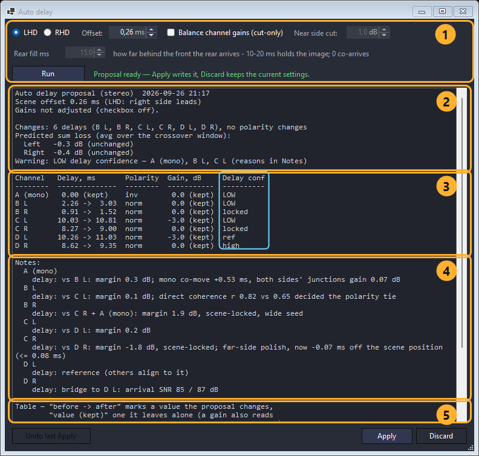

1. **The run's settings** — the steering-wheel side, the scene **Offset** from the
   section above, and the optional gain balancing. **Run** recomputes; nothing is
   written to the project until you press Apply.
2. **The summary** — what the run decided overall: how many delays and polarities
   change, the predicted sum loss per side, and, on the last line, which rows it is not
   confident about.
3. **The table** — one row per channel and side, with the proposed **delay**,
   **polarity** and **gain**. `->` marks a value the proposal changes; `(kept)` one it
   leaves alone. The outlined last column is the **confidence** of the delay decision.
4. **The notes** — how each decision was reached: which neighbour a channel was timed
   against, by what margin, and whether the scene offset or a wide seed had a say.
   This is the block the outlined column sends you to: **every `LOW` in the confidence
   column has its reasoning spelled out here, under that channel's name.**
5. **The key** — how to read `->` and `(kept)`, restated by the dialog itself. It runs
   past the bottom of the box; the report scrolls.

Low confidence does not necessarily mean the result is wrong, but it does indicate that
the acoustic data did not strongly favor one solution over the alternatives — those are
the rows worth reading the notes for, and worth checking by ear afterwards.

Nothing is changed yet. Press **Apply** to write the proposal into Virtual DSP, or
**Discard** to keep the current settings.

There is also an optional **Balance channel gains** mode. It performs cut-only level
balancing and can provide a useful starting point, but it is not required for time
alignment itself.

Once the proposal is applied, inspect **Sum Loss** again. Ideally, the values at each
junction should now be close to 0 dB — meaning the drivers are adding constructively
instead of cancelling each other.

All-pass filters are optional. They are bands of the channel's PEQ bank — **AP1** and
**AP2** in the EQ Wizard — not a separate stage, so they travel with the bank and
appear on the tuning sheet among the filters. Use one only when the magnitude response
is already satisfactory but delay and polarity alone cannot maintain good phase
matching across the crossover region. Judge the result by improved acoustic summation
across the junction, not by a prettier phase value at a single frequency. Because an
all-pass changes phase and group delay, run **Auto delay...** again after adding or
changing one.

### Fine tuning and export

At this point, the **virtual tune is complete**. The remaining step is to transfer it to
the real DSP and verify that the actual system behaves as predicted.

If you want to squeeze out the last bit of performance, all settings remain fully
editable. You can manually adjust delays, polarity, crossovers, or gains and
immediately see how the predicted system changes.

Virtual DSP lets you inspect the result in several ways:

- **Magnitude** — overall frequency response and crossover summation;
- **Phase** — phase relationship between processed channels;
- **Group Delay** — timing behavior across frequency;
- **Impulse** — time-domain response;
- **Correlation** — for advanced users who want to inspect the timing relationship
  between channels more directly.

This makes manual refinement much faster than the traditional measure-adjust-measure
cycle: change a parameter, inspect the result, and keep it only if the system actually
improves.

Revisiting EQ is cheap now as well: **Load / Edit… → Edit in EQ Wizard** on any channel
reopens it against its current chain. If you change a crossover, re-check that
channel's PEQ. After changing a crossover or a bank — an all-pass band included — run
**Auto delay...** again, because the processed phase relationship has changed.

When you are satisfied, press **Export...** and generate the final **PDF tuning sheet**.
It lists the crossover settings, gains, delays, polarities, and PEQ needed to reproduce
the virtual system in the real DSP. On an install that spans several zones the sheet
prints by group, in the order you would enter it — Sub, then Front, then Rear, then
Center — each group under its own heading with a graph of its filters, and the front
group's graph shows the subwoofers' summed filter shape in a pale tone, so the bass
handover is visible where you dial it in. Blocks keep their panel letters; only the
order of the sections changes.

If the project names a **Custom** processor, Resonalyze first asks which Q convention
the PEQ columns should be stated in:

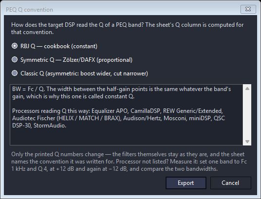

This is not a formality: the same frequency, gain, and Q describe a noticeably
different filter depending on how a processor defines Q, so the sheet is generated in
the convention your DSP actually reads. The chooser shows what each convention does to
a band's width and which processors are known to use it.

If you named a model from the catalog back in
[Section 6](#name-the-processor-you-are-tuning), this question is not asked at all — the
device already answered it, and the sheet is written in its convention.

### Save the session, not just the sheet

The PDF is what you carry to the car; the session is what lets you come back. **Save
session...** writes the complete virtual setup — channels, crossovers, gains, delays,
polarities, PEQ, the DSP processor, and the links to your measurements — to a single
JSON file, and **Load session...** restores it.

This is worth doing before you leave the sofa. After listening in the car you will
usually want to nudge the image offset, revisit a crossover, or re-check a polarity
decision, and reopening the saved session takes seconds instead of rebuilding the
virtual car from seven files.

The session stores the *paths* to the measurements, not the impulse responses
themselves — those files are large. Paths are written relative to the session file, so
if you keep the session and its measurements in the same folder, the whole set can be
copied to another machine or sent to someone else and still open correctly.

(Resonalyze also autosaves its current state, so closing the program does not lose your
work. The explicit session file is for archiving a finished tune and for sharing.)

The sofa part of the tuning is now finished. The only thing left is to return to the
car, enter the settings into the processor, and verify that the real system behaves like
the prediction.

### Hear it before you go back to the car

Virtual DSP can play an arbitrary track through the tune you have just built. Press
**Audition track...**, choose a music file and a destination, and Resonalyze convolves
it with both sides' summed responses — the same sums the graph is drawing — and writes a
stereo file.

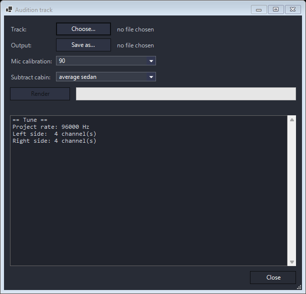

It is a rough preview, not a simulation of sitting in the car. But it is enough for the
things a curve does not tell you: where the phantom center sits, whether the stage is
wide or collapsed onto one door, and whether the overall balance is sane. Changing the
**Offset** or the L/R trim and re-rendering costs a minute and no fuel, which makes it a
far cheaper way to explore stage placement than driving out to the car for every
attempt.

**Listen to the result in headphones only.** Each side of the render already carries
that side's acoustics, and headphones keep the two sides separate. Play it through
loudspeakers and you add a second room and a second set of crosstalk on top of it, which
destroys exactly the inter-side timing and level cues the render exists to show.

Two settings in the dialog are worth attention:

- **Mic calibration** — opens on whatever Virtual DSP is set to, so it is already the
  one you tune with. It is baked into both side kernels as a single linear-phase
  filter, so the magnitude matches your on-screen curves while the inter-side timing
  shifts by the same constant on both channels. On *Own (as measured)* it uses the
  curve your measurements recorded — and says so if they were not all recorded
  through the same one, since one render cannot carry two;
- **Subtract cabin** — the raw render carries the car's full in-car bass rise, roughly
  **+15 to +27 dB at 20 Hz** depending on the body style. Sitting in the car you do not
  perceive that as boom; through headphones you certainly will. Subtracting a typical
  cabin transfer function for your body style is what makes the result listenable;
- **Magnitudes** — if every channel that plays carries a spatial average (an MMM pass or
  a microphone array), leave *from the spatial averages* ticked. The render then has the
  tonal balance those captures measured instead of the dips of the one microphone
  position the impulse responses come from — the hybrid view made audible, and the more
  honest of the two previews. The stage cues are the same either way: an average carries
  no phase, so timing and polarity are untouched.

Judge the stage and the balance, not the last decibel of tonality — the render is a
preview, and the real verification still happens in Section 10.

---

## 10. Transfer to the real DSP and verification

Take the exported PDF back to the car and enter the settings into the real DSP:

- crossover frequencies, types, and slopes;
- channel gains;
- delays;
- polarity;
- PEQ filters.

Be careful when copying the values. A single wrong polarity, delay, or crossover slope
can completely ruin an otherwise correct tune.

Also make sure the real DSP is the device you named in Virtual DSP, and that it is
running the processing rate that device's entry states. The Q convention is already
handled — the PEQ columns in the sheet are stated in your processor's convention, so the
numbers can be entered as printed. If you tuned against a **Custom** profile and are not
sure which Q convention your DSP uses, check its documentation or the processor guidance
shown by Resonalyze before entering the filters. Do not guess: the same frequency and
gain can correspond to noticeably different bandwidths under different Q conventions.

And this time, the DSP is *not* in bypass: everything you disabled back in
[Section 4](#put-the-dsp-into-bypass) now goes back in, as the tuning sheet states it.

### Verify the prediction

Once everything is entered, first verify each side separately from the listening
position: measure the complete **Left** system (including the shared mono subwoofer, if
present), then the complete **Right** system, and compare each measurement with the
corresponding Virtual DSP prediction.

Each side should be reasonably close to the response predicted by Virtual DSP. After
that, both sides can be measured together as an additional final check.

Do not expect pixel-perfect agreement. Small differences are normal due to DSP parameter
rounding, microphone repositioning, temperature, and normal measurement variation.

Large differences are not.

If the measured system differs significantly from the prediction, first check for simple
transfer errors:

- wrong L/R channel;
- incorrect polarity;
- wrong delay;
- missing or duplicated PEQ filter;
- incorrect crossover family or slope;
- a different Q convention from the one the sheet was written in;
- the wrong **DSP processor** named in Virtual DSP, or the real device running at a
  different processing rate than its catalog entry states;
- protective-HPF compensation left enabled on a channel that does not use it.

This verification step closes the loop: we are no longer trusting the simulation — we
are checking that the **real acoustic system actually behaves as predicted** at the
reference listening position.

### Check spatial robustness

The primary Resonalyze model represents one fixed listening position. Once the
reference-point measurement agrees with the prediction, make a few additional
measurements with the microphone moved slightly around the normal head position.

Do not expect these measurements to be identical. The goal is to make sure that the
crossover integration remains reasonably stable when the listener moves a little.

If you measured with a [microphone array](#optional-a-spatial-average-for-the-eq) and it
is still mounted, one verification sweep answers this by itself: the positions are the
moved microphone, and **Show array spread** is how far apart they came out.

A result that is excellent at one exact point but develops severe cancellation a few
centimeters away is not a robust tune.

### Check at realistic listening level

Virtual DSP primarily models the linear behavior captured by the original
impulse-response measurements. It cannot predict level-dependent effects such as
excursion-related distortion, power compression, voice-coil heating, or other nonlinear
behavior.

After verifying the model at the original measurement level, repeat the measurement at a
realistic but safe playback level. The response should remain reasonably stable apart
from the expected increase in level.

If your measurement setup supports distortion analysis, check it as well. Unexpected
response compression, rapidly increasing distortion, or other level-dependent changes
indicate that one or more drivers may be approaching their useful operating limits.

### Final listening adjustments

If the real system matches the virtual model at the reference position, remains
reasonably stable around the listening position, and behaves cleanly at realistic
playback level, the technical part of the tune is finished.

Now listen to familiar music and make the final subjective adjustments: overall bass
level, treble balance, and stereo-image position.

These should usually be relatively small changes. The difficult work — crossover
integration, phase alignment, and timing — has already been solved objectively, so there
should be little reason to disturb it.

And that is the complete workflow:

> **measure every driver once → build the virtual car → design crossovers → EQ → align
> time and phase → export → verify the model → check spatial robustness → check at
> realistic level**

If the real system agrees with the prediction, remains robust around the listening
position, behaves cleanly at realistic level, and sounds right to you, the job is done.

> **Author's note.** And if you made it all the way to the end of this rather long
> guide — thank you for reading. I hope it helps you get a little more out of your
> system.
