<p align="center">
  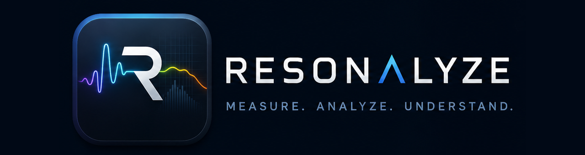
</p>

<h1 align="center">Resonalyze</h1>

<p align="center">
  <strong>Engineering Acoustic Measurements for Loudspeakers and Rooms</strong>
</p>

<p align="center">
  A Windows desktop analyzer for impulse response, frequency response,
  loopback-referenced timing, live transfer functions, overlays, and practical
  loudspeaker alignment.
</p>

<p align="center">
  <em><strong>Measure each driver once, then virtually align, combine, and optimize your
  loudspeaker system before applying a single change to the DSP.</strong></em>
</p>

<p align="center">
  <a href="https://github.com/DIMOSUS/Resonalyze/releases/latest"><strong>Download latest release</strong></a>
  ·
  <a href="#quick-start"><strong>Build from source</strong></a>
  ·
  <a href="#measurement-workflow"><strong>Measurement workflow</strong></a>
</p>

[](https://dotnet.microsoft.com/)
[](https://www.microsoft.com/windows)
[](https://learn.microsoft.com/dotnet/desktop/winforms/)
[](License.md)
[](https://github.com/DIMOSUS/Resonalyze/actions/workflows/build.yml)
[](https://github.com/DIMOSUS/Resonalyze/releases/latest)

**Resonalyze** is an open-source desktop application for measuring and
visualizing the acoustic behavior of audio systems, rooms, loudspeakers,
headphones, microphones, and complete signal paths. It generates test signals,
records the response through a Windows audio device, processes the captured
data, and presents the result as engineering-focused plots.

> Resonalyze is under active development. Treat its results as diagnostic
> measurements, not as certified laboratory data.

## Project Showcase

Resonalyze is built around a practical loudspeaker workflow: measure real
drivers, inspect timing, design EQ and DSP settings virtually, then apply the
result with fewer blind tuning passes.

<p align="center">
  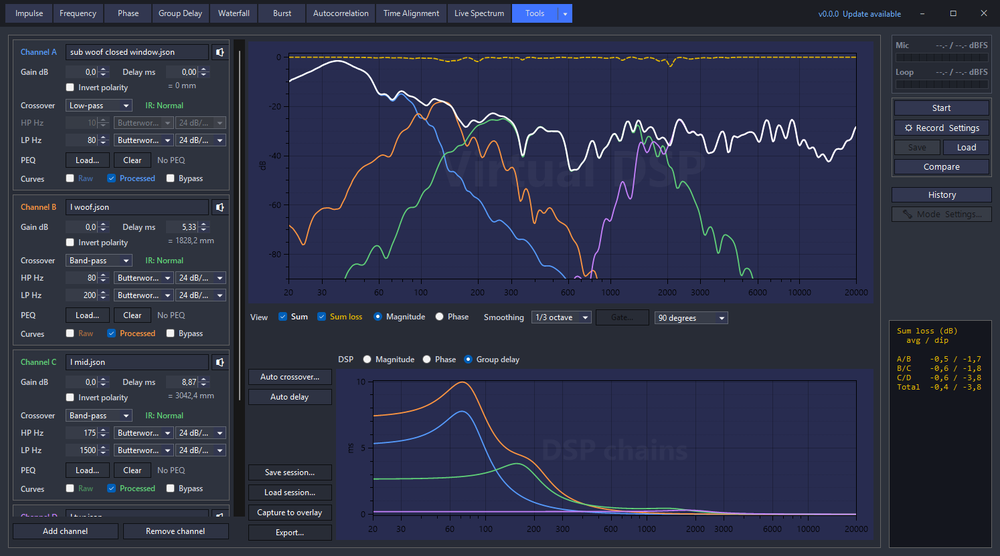
</p>

<p align="center">
  <strong>Virtual DSP</strong> — combine measured drivers through gain, delay,
  polarity, crossover filters, and PEQ before touching the hardware DSP.
</p>

<table>
  <tr>
    <td width="50%">
      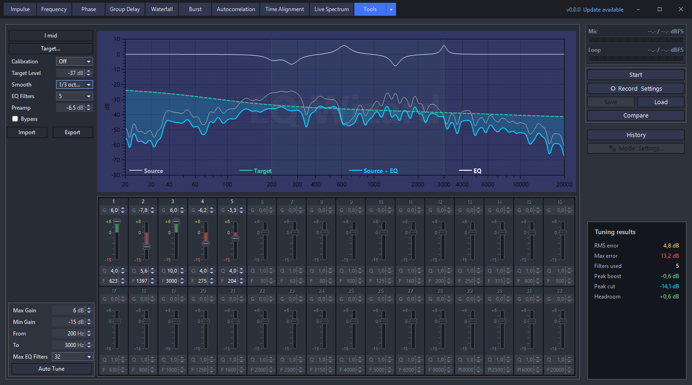
      <p><strong>EQ Wizard</strong> designs an up-to-32-band PEQ against a
      target, with Auto Tune, per-band editing, import/export, and printable
      tuning sheets.</p>
    </td>
    <td width="50%">
      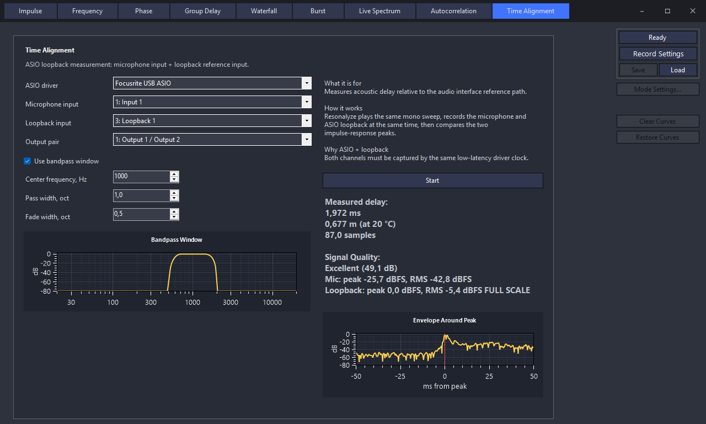
      <p><strong>Time Alignment</strong> estimates loopback-referenced delay
      from the transfer impulse response and shows confidence, levels, distance,
      and the arrival envelope.</p>
    </td>
  </tr>
</table>

## Demo

A one-minute tour of the main features:

<p align="center">
  
</p>

## Download

Download the latest ready-to-run build from
[GitHub Releases](https://github.com/DIMOSUS/Resonalyze/releases/latest):

- `Resonalyze-Setup-vX.Y.Z-win-x64.exe` — the recommended installed build
- `Resonalyze-vX.Y.Z-win-x64.zip` — for most Windows computers
- `Resonalyze-vX.Y.Z-win-arm64.zip` — for Windows on ARM

The `.zip` builds are self-contained portable packages and do not require a
separate .NET installation. The installer adds shortcuts, uninstall support,
and automatic in-app updates for the installed x64 build. A SHA-256 checksum
file is provided with every release.

## Highlights

- Exponential sine sweep measurement with impulse-response JSON save/load
- Mandatory loopback-referenced sweep processing: every measurement captures a
  loopback reference, and all analysis is derived from the resulting transfer
  function (harmonics and THD+N stay on the sweep deconvolution)
- Multi-sweep averaging (1–64 runs) combined as a cross-spectrum transfer
  estimate to lift the signal-to-noise ratio, with a per-frequency **coherence**
  (γ²) curve in the Frequency Response, Phase, and Group Delay views and an
  optional confirm-between-runs pause for spatial averaging
- Noise-robust **reliability-anchored phase unwrapping**: deep nulls and
  low-coherence bands are bridged by a slope prediction instead of anchoring
  the unwrap, so one noisy bin can no longer throw the whole phase tail off by
  a multiple of 360°
- Selectable microphone calibration profiles (**0°** / **90°**) applied per view,
  with lenient parsing of common `.txt` / `.cal` / `.frd` / `.csv` correction files
- Time Alignment with sub-sample delay estimation from the transfer IR, refined
  by a GCC-PHAT cross-correlation
- Crossover summation prediction: the true **complex (vector) sum** of two
  measurements (`Main ⊕ Compare`) with Compare delay/polarity controls, plus a
  **sum-loss** curve — accounts for delay, polarity, and phase the way dB-curve
  math cannot
- **Virtual DSP** tool: run up to eight measured L/R driver pairs (with mono
  channels for a shared subwoofer) through virtual DSP chains — gain, delay,
  polarity, Butterworth / Linkwitz-Riley / Bessel crossovers, and imported
  PEQ — and see their complex sum, sum loss, the opposite side's sum, phase
  tracking, per-pair Δ L−R timing, auto crossover proposals, a stereo-aware
  auto delay with a scene offset, gated phase view, overlay capture, sessions,
  and tuning-sheet export
- Live Spectrum: real-time loopback transfer function with selectable excitation
  (leakage-free periodic pink, pink, brown/red, white noise) and coherence
- Frequency response, phase, group delay, waterfall, Burst Decay, and
  autocorrelation
- Compare a second measurement (from a file or History) against the current one
  across Time Alignment, Phase, Group Delay, Frequency Response, and Impulse
  Response, with matching analysis settings and per-metric deltas
- Minimum-phase / excess-phase decomposition with a millisecond gate, gate
  offset, and a τ (delay) detrend for cross-measurement phase comparison
- Per-curve visibility toggles in every analysis view; curves redraw on the fly
  with no separate draw/clear step
- Harmonic distortion, THD, and THD+N analysis
- Persistent comparison overlays with labels, styling, curve math over captured
  or live plot curves, targets, import/export, and saved per-mode state
- Live overlay preview: captured, calculated, and target overlay dialogs redraw
  the candidate curve on the plot as you edit, and revert on Cancel
- EQ Wizard: design an up-to-32-band parametric EQ against a target, with Auto
  Tune, a live results read-out, cross-tool PEQ import/export, and a printable
  tuning-sheet PDF
- Signal Generator: play pink (periodic and continuous), brown/red, white noise,
  or a sine tone through the configured playback device for level setting and
  channel checks
- Measurement History with in-memory snapshots, saved-file recall, FR previews,
  per-entry working state (mode, settings, active overlays), and a one-click
  new-session reset
- Windows Wave and ASIO backends with device-aware sample-rate selection and
  backend-specific channel routing
- Compact Mic/Loop input level meter with Peak, RMS, Peak Hold, and stored
  measurement levels
- Docked, non-modal settings panels with live previews and instant graph
  updates
- Auto-update support for installed builds through a signed NetSparkle appcast

## Why Resonalyze?

If you already use tools like REW, OpenSoundMeter, or Smaart, the obvious
question is: why install another analyzer?

Resonalyze is built around a focused engineering workflow:

- **Loopback-referenced timing**
  Measurements can use a recorded loopback channel as the time reference, so
  delay and transfer-function analysis are tied to the actual playback path
  instead of to guesswork.
- **Repeatable, confidence-scored measurements**
  Average up to 64 sweeps into one cross-spectrum transfer estimate to pull the
  response out of the noise, and read a per-frequency **coherence** (γ²) curve
  that flags exactly which bands are trustworthy. An optional
  confirm-between-runs pause turns the same path into spatial averaging across
  microphone positions.
- **Crossover summation prediction**
  Measure each driver once, then virtually align, combine, and optimize your
  loudspeaker system before applying a single change to the DSP.
  Because every measurement carries a loopback transfer IR, Resonalyze can
  compute the true **complex (vector) sum** of two measurements — `Main ⊕
  Compare` — summing their impulse responses sample-by-sample so relative delay,
  polarity, and phase are all accounted for. That predicts how two drivers (or
  the two sides of a crossover) actually combine, which arithmetic on dB curves
  cannot. Compare-side **delay** and **polarity** controls let you tune the
  alignment live, and a companion **sum-loss** curve shows exactly how many dB
  the real phase-aware sum falls short of a phase-blind magnitude addition — a
  direct read-out of the summation loss you are dialing out. The **Virtual
  DSP** tool takes this to its conclusion: complete virtual DSP chains
  (gain, delay, polarity, crossover filters, PEQ) per driver, tuned against the
  live predicted sum before a single setting is applied to the hardware. Two
  auto-fit modes do the tedious part: an **Auto crossover** optimizer searches
  the crossover frequencies, filter families, slopes, and cut-only gains that
  flatten the summed magnitude (favoring tight, minimally overlapping splits),
  and **Auto delay** aligns each junction's delay and polarity against the
  phase-aware sum — across both stereo sides in one run, holding a
  configurable L/R scene offset between the sides.
- **Practical loudspeaker alignment**
  Time Alignment reports first arrival and strongest peak, each refined to
  sub-sample precision by a GCC-PHAT cross-correlation, plus distance at 20 °C,
  confidence, signal levels, and a visible envelope around the detected arrival.
- **Fast compare-and-adjust work**
  Persistent overlays, calculated overlays, target curves, and on-plot labels
  make it quick to compare measurements, tuning passes, channels, listening
  positions, or before/after changes.
- **Live transfer-function analysis**
  Live Spectrum drives the system with a selectable excitation signal — including
  a leakage-free periodic pink noise — and uses a loopback reference, coherence,
  overlap, averaging, peak hold, and overload detection to show the driven
  response rather than only the raw microphone spectrum.
- **Measurement history as a working shelf**
  Recent captures stay available in memory, saved files are remembered across
  launches, and each entry has a frequency-response preview. Entries also
  remember their full working state — active mode, per-mode settings, and shown
  overlays — so switching between measurements restores the whole context, and a
  one-click reset starts a fresh session from defaults.
- **Developer-friendly, inspectable data**
  IR files, overlays, settings, and history metadata are stored as readable
  JSON where practical, making measurements easy to archive, diff, and debug.

Resonalyze does not try to be every acoustic tool at once. Its sweet spot is
measurement-driven speaker and room work, where timing, repeatability, quick
comparison, and transparent data matter more than a large legacy feature set.

## Gallery

<table>
  <tr>
    <td width="50%">
      <h3>Virtual DSP</h3>
      
      <p>Measure each driver once, then design gain, delay, polarity,
      crossover filters, PEQ, and the complex acoustic sum before applying
      settings to the real DSP.</p>
    </td>
    <td width="50%">
      <h3>EQ Wizard</h3>
      
      <p>Design a parametric EQ against a target with Auto Tune, per-band curves,
      a live results read-out, cross-tool import/export, and a tuning-sheet PDF.</p>
    </td>
  </tr>
  <tr>
    <td width="50%">
      <h3>Time Alignment</h3>
      
      <p>Sub-sample delay estimation from a loopback-referenced transfer
      impulse response, with confidence, levels, distance, and envelope view.</p>
    </td>
    <td width="50%">
      <h3>Frequency Response</h3>
      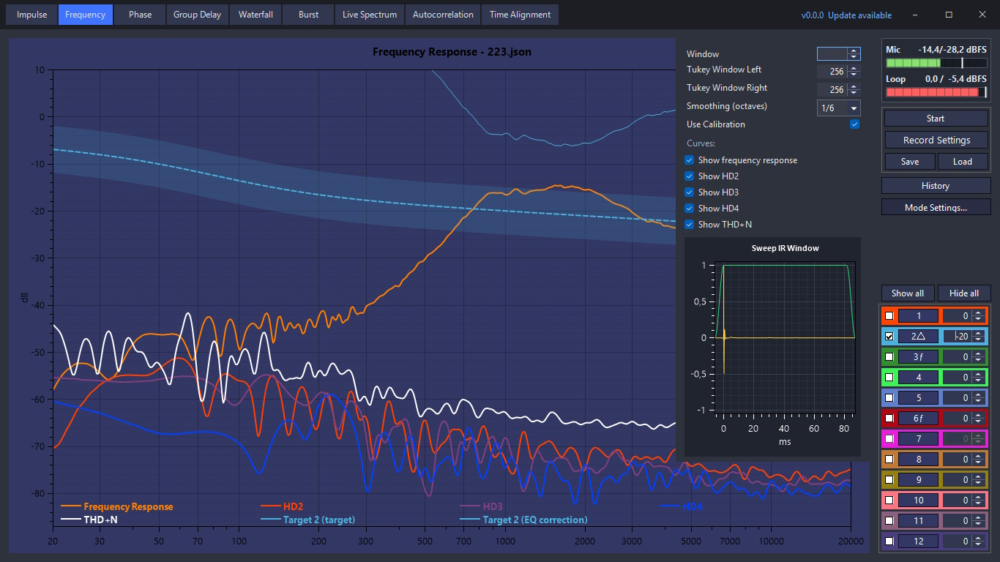
      <p>One-click loudspeaker response measurement with smoothing,
      calibration, distortion curves, overlays, target comparison, and an
      optional coherence curve from averaged sweeps.</p>
    </td>
  </tr>
  <tr>
    <td width="50%">
      <h3>Live Spectrum</h3>
      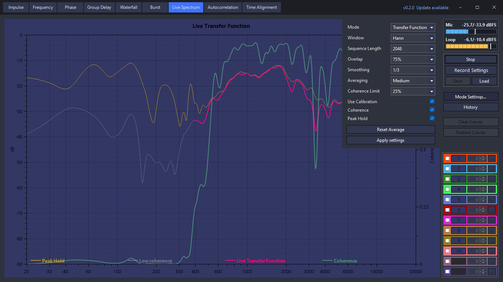
      <p>Real-time loopback transfer-function analyzer with selectable excitation
      noise, coherence, averaging, overlap, peak hold, and unreliable-band
      marking.</p>
    </td>
    <td width="50%">
      <h3>Impulse Response</h3>
      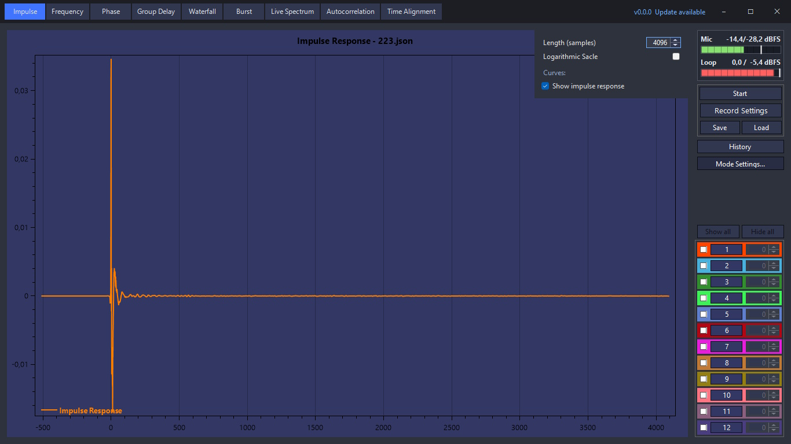
      <p>Inspect the measured impulse response, save it as readable JSON, load
      it later, and reuse it across analysis modes without re-measuring.</p>
    </td>
  </tr>
  <tr>
    <td width="50%">
      <h3>Group Delay</h3>
      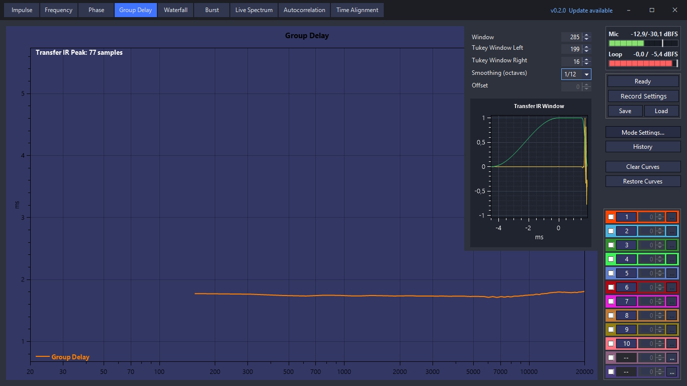
      <p>Analyze timing behavior from the loopback-referenced transfer IR, with a
      millisecond gate, gate offset, and a live impulse-window preview.</p>
    </td>
    <td width="50%">
      <h3>Waterfall and Burst Decay</h3>
      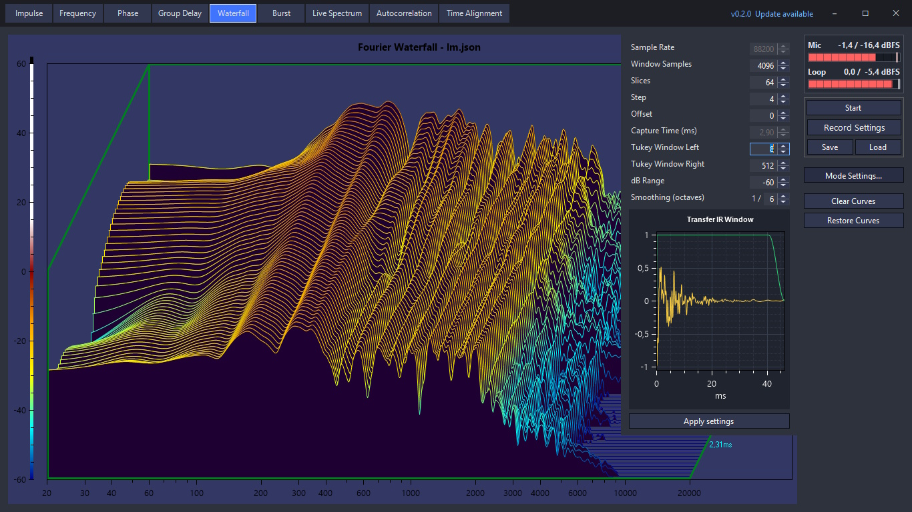
      <p>Visualize frequency decay and stored energy with the Fourier waterfall
      and Burst Decay views.</p>
    </td>
  </tr>
</table>

<details>
<summary><strong>More plots</strong></summary>

### Phase response

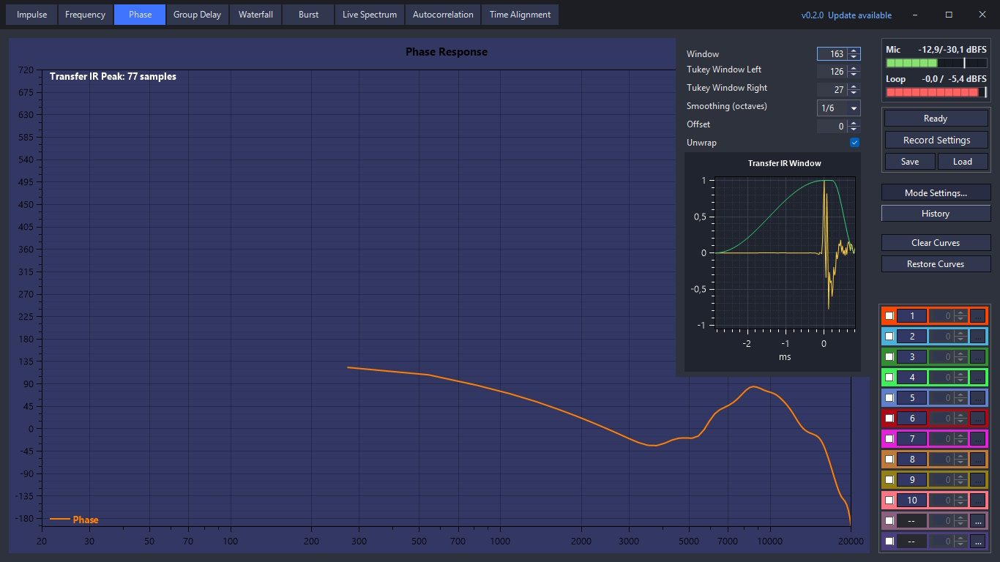

### Burst Decay

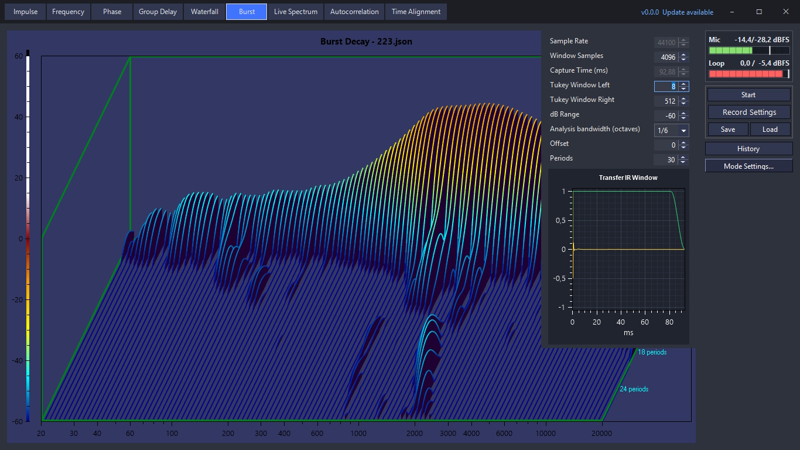

### Overlays

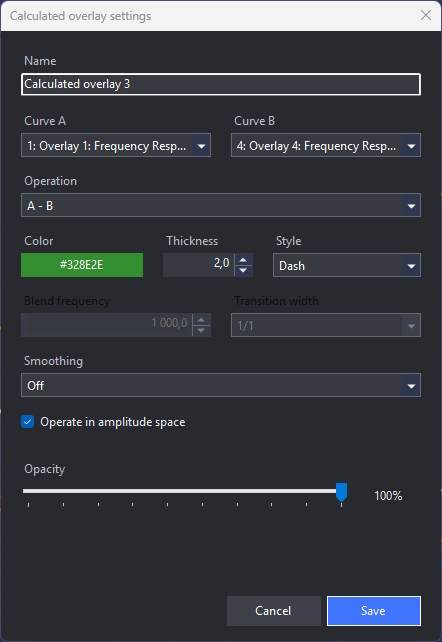

</details>

## Requirements

To run a release build:

- Windows 10 or later
- Working Windows playback and recording devices
- An optional ASIO driver for low-latency audio interfaces
- A suitable loopback, microphone, or other measurement connection

The self-contained release archives include the required .NET runtime.

To build Resonalyze from source:

- Windows 10 or later
- [.NET 10 SDK](https://dotnet.microsoft.com/download/dotnet/10.0)
- Visual Studio 2026 with the **.NET desktop development** workload, or the
  .NET CLI

Use conservative playback levels when connecting physical equipment. Start with
the output turned down and verify the signal path before running a measurement.

## Quick Start

Clone the repository together with the measurement-data submodule
([Resonalyze-test-data](https://github.com/DIMOSUS/Resonalyze-test-data),
~230 MB of real transfer IRs that back the regression tests):

```powershell
git clone --recurse-submodules https://github.com/DIMOSUS/Resonalyze.git
# or, in an existing clone:
git submodule update --init assets/test_data
```

The app builds and runs without the submodule — only the real-data tests in
`Resonalyze.Dsp.Tests` need it. Then open:

```text
source/Resonalyze.sln
```

Or build and run it from the command line:

```powershell
dotnet restore source/Resonalyze.sln
dotnet build source/Resonalyze.sln --configuration Release
dotnet run --project source/Resonalyze.csproj
```

Run all application and deterministic DSP tests with:

```powershell
dotnet test source/Resonalyze.sln -c Release
```

For local performance profiling, build the dedicated Tracy configuration:

```powershell
dotnet run --project source/Resonalyze.csproj -c Tracy
```

This configuration defines `TRACY_ENABLE` and references `Tracy-CSharp`; normal
Debug and Release builds do not load Tracy. Add instrumentation through
`AppProfiler.Zone(...)`, `AppProfiler.FrameMark(...)`, and
`AppProfiler.SetThreadName(...)` so profiling code stays isolated behind the
build flag.

The Release executable is produced at:

```text
source/bin/Release/net10.0-windows/Resonalyze.exe
```

Tagged GitHub releases also produce:

- portable self-contained `.zip` packages for `win-x64` and `win-arm64`
- an x64 `Setup.exe` installer with uninstall support
- NetSparkle appcast files that the installed build uses for automatic updates

The `build.yml` workflow runs both the application test project and the DSP
test project on every push to `main` and on every pull request.

## Measurement Workflow

This workflow covers impulse-response (IR) based analysis: a swept-sine
measurement is captured once and then inspected across the frequency-response,
phase, group-delay, impulse, waterfall, and burst-decay views. For continuous,
real-time analysis without capturing an IR, use the additional
[Live Spectrum](#live-spectrum) mode instead.

1. Connect the output of the device under test to the selected input, either
   directly or through a microphone and a suitable interface.
2. Start Resonalyze and open the measurement settings.
3. Select the audio backend, sample rate, devices or backend-specific input and
   loopback channels, sweep duration, playback channel, and analysis
   parameters. A **loopback reference channel is required** — all analysis is
   derived from the transfer IR it produces, so the settings panel flags an
   unset loopback and the measurement will not start without one. To average
   several sweeps, set **Measurements** above `1`; enable **Confirm each run** to
   pause before each sweep so you can reposition the microphone for spatial
   averaging.
4. Start a recording to generate and capture the exponential sine sweep. With
   averaging enabled the runs are combined into one transfer IR and a coherence
   (γ²) curve, debiased by the number of runs: the raw estimate over K averages
   reads 1/K even for pure noise (0.5 at two runs — estimator bias, not
   information), so the stored figure maps that null expectation to 0 and stays
   comparable across run counts.
5. Watch the compact input level meter to confirm microphone level, loopback
   presence, and headroom before trusting the measurement.
6. Select the analysis view you need.
7. Adjust smoothing, windows, offsets, and display options as needed. Mode
   settings open in a docked, non-modal panel attached to the plot, so the main
   window stays usable while the settings are visible. Changes apply on the fly
   and update the active graph without closing the panel or resetting the
   current zoom/pan.
8. Capture and compare with [overlays](#plot-overlays): store the current curve
   in an overlay slot, import a reference from text, or combine slots with curve
   math. When tuning home or car systems, add a **target curve** overlay (a
   parametric house/Harman-style target with presets) and switch its deviation
   readout to **EQ correction** to see how much to dial into an equalizer.
9. Pin a second measurement with [**Compare**](#compare) to overlay a reference
   from a file or a History entry across Time Alignment, Phase, Group Delay,
   Frequency Response, and Impulse Response.
10. Use **Save** to keep the captured impulse response for later analysis or
    comparison.
11. Use **History** to review recent measurements, preview their frequency
    response, reload an older snapshot, or save an in-memory capture to disk.

For acoustic measurements, microphone placement and room conditions strongly
affect the result. For electrical loopback measurements, make sure the signal
levels and impedances are safe for both devices.

## Mode Settings

The **Mode Settings...** button opens the settings for the current analysis
mode in a docked panel aligned to the plot area. The panel has no title bar, can
stay open while the main window has focus, and switches automatically to the
matching panel when you change modes.

Settings apply on the fly: changing a value immediately redraws the current
analysis while preserving the visible plot range. This makes it easier to tune
smoothing, FFT windows, Tukey fades, offsets, and display options without losing
the area you were inspecting.

Each curve-based view groups its plotted curves under a **Curves:** heading with
one checkbox per curve — for example Primary / HD2–HD4 / THD+N in Frequency
Response, or measured / minimum / excess in Phase. Toggling a curve redraws
immediately; there is no separate draw or clear step. Numeric and dropdown
settings carry a small **R** button that resets them to the built-in default,
and double-clicking a plot axis restores its default scale.

The Frequency Response, Phase, Group Delay, Waterfall, and Burst settings
include a compact impulse-window preview where applicable. The preview shows the
impulse response used by that mode together with the selected Tukey window. Phase
and Group Delay analyze the loopback transfer IR and are only drawn when the
active record provides one; their preview marks the gate position used for the
analysis.

Live Spectrum has its own docked settings panel. It lets you choose the
**Signal Type** (excitation noise), pick a microphone **calibration** profile
(Off / 0° / 90°), and select a **Sequence Length** from a power-of-two list. The sequence length is the FFT
block size used by the live analyzer and is preserved between sessions.

## Phase and Group Delay

Phase and group-delay analysis run on the **loopback transfer impulse response**:
both views need the common timing reference it provides, so they are only drawn
when the active record contains a transfer IR. Without one, the plot says that
loopback is required instead of showing a misleading curve.

Both modes share a millisecond-based gate built from a left Tukey fade, a flat
plateau, and a right Tukey fade. A **Gate offset** positions the end of the left
fade inside the fixed analysis frame, and **Fit** snaps it to the transfer-IR
peak. The docked preview draws the impulse response, the gate window, and a
marker at the gate offset. A read-only readout shows the lowest reliable
frequency (≈ 1 / gate length), so it is clear where the gated curve stops being
trustworthy.

The Phase view can show three independently toggled curves:

- **Measured phase** — the raw response, including delay and reflections.
- **Minimum phase** — the part tied to the magnitude (correctable with EQ),
  reconstructed with a real-cepstrum method.
- **Excess phase** — measured minus minimum: the all-pass part (pure delay and
  reflections) that an equalizer cannot fix.

A **τ** (delay) value detrends the linear-phase slope so the excess phase becomes
readable. **Find τ** estimates it either from the first prominent arrival of the
excess energy (peak — found with the same first-arrival detector Time Alignment
uses, so a room mode ringing louder than the direct sound does not capture the
reference) or from the energy-weighted average group delay (slope). Entering the
same τ on two measurements lines up their phase for a direct comparison — for
example, a midrange and a tweeter on the same axis.

Unwrapped phase uses a **reliability-anchored** algorithm instead of naive
bin-to-bin accumulation: each bin takes the 360° branch closest to a phase
predicted from the last trustworthy bin and the running phase slope. Bins well
below the local magnitude envelope (so one tall resonance cannot disqualify a
quieter but repeatable band) — or with low **coherence**, when the measurement
carries a γ² estimate from averaged runs — are still displayed but never
trusted as anchors, so deep nulls, reflection notches, and masked bands are
bridged cleanly and a single bad bin can no longer shift the entire remaining
curve by a multiple of 360°. A dead stretch too long to bridge honestly (the
turn count inside it is genuinely unknowable) is blanked instead of guessed,
and the curve restarts as a fresh segment after it. On clean data the result
is identical to the classic unwrap.

Group Delay reads absolute delay referenced to the start of the transfer IR, so a
peak well into the impulse response reports its true arrival time. The curve is
computed energy-weighted: the numerator and the energy of the per-bin group-delay
ratio are smoothed separately and divided afterwards, so near-null bins — where
the raw ratio legitimately spikes to tens of milliseconds while carrying almost
no energy — follow the delay of the dominant energy instead of the singularity.
The smoothing window never narrows below the gate's own spectral resolution
(features finer than 1/T cannot be resolved by a gate of duration T anyway), so
interference-null spikes stay suppressed even with display smoothing off.

## Audio Backends

Resonalyze can run measurements through the standard Windows Wave backend or
through an ASIO driver.

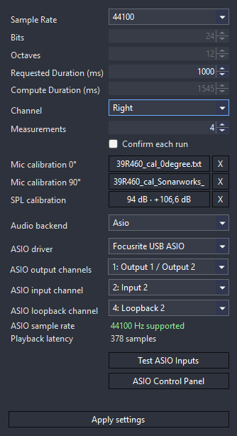

The microphone input is the primary measurement channel, and a loopback
reference channel is **required** for every measurement. Resonalyze records both
channels simultaneously and derives the main impulse response as a transfer
function from the loopback reference to the microphone response, which removes
the playback path (DAC, amplifier, output routing) from the analysis. All
IR-based views — frequency response, phase, group delay, impulse response,
waterfall, Burst Decay, and autocorrelation — are computed from this transfer
IR. Harmonic distortion, THD, and THD+N curves use the ordinary
sweep-deconvolution response instead, because the harmonic separation belongs to
the sweep analysis itself. The HD2–HD4 curves draw at the **excitation**
frequency (a second-harmonic hump caused by a 1 kHz drive appears at 1 kHz,
not at its 2 kHz product; microphone calibration is applied at the product
frequency first), so each curve ends at Nyquist/n. Note the harmonic curves
are on the sweep-deconvolution scale while the primary curve is
loopback-normalized — their vertical distance is not yet a calibrated
distortion percentage.

The group-delay reference is the start of the transfer IR, so reported delay is
absolute rather than relative to a response peak.

Because the loopback is mandatory, a measurement will not start until a loopback
channel is selected for the active backend; the settings panel flags an unset
loopback in place. Records loaded from older files that were captured without a
transfer IR still open, but their transfer-IR views show a "requires loopback
transfer IR" note instead of a misleading curve.

### Wave

Use **Wave** for ordinary Windows playback and recording devices. The
measurement settings dialog lets you choose:

- playback device
- recording device (microphone)
- sample rate from the values supported by the current configuration
- playback channel
- microphone input channel (`Left` or `Right`)
- loopback input channel (`Left` or `Right`) — required

The loopback is captured from a second channel of the **same** recording device
as the microphone, so both signals share one hardware clock and stay
sample-accurate — the timing every phase, group-delay and time-alignment result
relies on. This is deliberate: capturing the loopback from a second input
device would put the two streams on independent clocks with an unknown,
run-to-run start offset plus drift, silently degrading every timing-sensitive
result. Resonalyze therefore does not offer a separate loopback device at all;
loopback is mandatory, so the recording device must expose a stereo input (or
use ASIO).

### ASIO

Use **ASIO** for audio interfaces that provide a native ASIO driver. The
measurement settings dialog lets you choose:

- ASIO driver
- sample rate from the values supported by the selected driver
- ASIO input channel used for the microphone
- ASIO loopback input channel — required
- ASIO output channel pair used for playback
- playback routing within the selected output pair

ASIO output routing works as follows:

- `Mono` sends the same signal to both channels of the selected output pair
- `Left` sends the signal only to the first channel of the pair
- `Right` sends the signal only to the second channel of the pair
- `Stereo` sends the signal to both channels of the pair

Before applying ASIO settings, Resonalyze checks whether the selected driver
supports the current sample rate. The dialog also shows available driver
diagnostics such as playback latency and, when the driver exposes it, frames
per buffer.

Click **ASIO Control Panel** to open the driver's native control panel. Use it
to configure driver-level settings such as buffer size, clock source, or sample
rate when the driver requires those to be set outside the application.

Click **Test ASIO Inputs** to capture a short diagnostic snapshot of the
available ASIO inputs. This helps verify that the microphone and loopback
channels are truly separate and are not being mono-summed by the driver or the
audio-interface control software.

ASIO support depends on the installed driver. If a driver is already in use by
another application or refuses the selected sample rate, Resonalyze reports the
driver error before starting the measurement.

## Input Level Meter

The right-side control column includes a compact two-channel input meter for
`Mic` and `Loop`. It is designed to stay useful — while routing, checking
loopback, or validating a completed measurement — without opening extra dialogs.

- the bar shows a filtered RMS level
- the bright vertical marker shows Peak Hold
- the text shows `Peak / RMS` in `dBFS`
- after a sweep or time-alignment measurement completes, the meter retains the
  final levels from the last valid capture instead of dropping back to idle

This makes it easy to spot missing loopback, a weak microphone level, overload,
or an unexpectedly hot reference path before you start analyzing the curves.

## Live Spectrum

The **Live Spectrum** mode is a live, dual-FFT **transfer-function** analyzer. It
plays a continuous excitation signal, uses the configured loopback channel as a
reference, and shows the real-time frequency-domain relationship from loopback to
microphone. Because the estimate is referenced to loopback rather than to the
microphone alone, it suppresses noise and other input-side content that is not
correlated with the playback signal.

Alongside the transfer function, Resonalyze draws a **coherence** curve (γ²) on a
secondary right-hand axis scaled from 0 to 1. Coherence shows how much of the
measured response is linearly correlated with the loopback reference: values
near 1 mark frequencies where the transfer-function estimate is trustworthy,
while low values flag bands dominated by noise, reflections, or non-linear
behavior.

The live estimate averages in the power domain, which avoids the downward bias
that magnitude averaging introduces on noise-like signals. The level is
calibrated for tones rather than as a power spectral density. On-screen smoothing
is referenced to wall-clock time, so the response stays consistent regardless of
the chosen overlap and sequence length, and the display refreshes at roughly 30
frames per second.

Live Spectrum requires a configured loopback input in **Record Settings**. It
works with either Wave or ASIO, as long as the microphone and loopback are routed
to separate channels. If loopback is not configured, Resonalyze blocks the start
and explains what needs to be fixed.

In practice, referencing to loopback is far more stable than viewing the raw
microphone spectrum when the room or measurement chain contains unrelated noise.
It is not a magic denoiser, but it lets you focus on the driven response rather
than on whatever the microphone happens to hear.

**Signal Type** selects the excitation noise, ordered by usefulness:

- **Pink noise (periodic)** — the default. One FFT-length period of exactly pink
  noise, synthesised in the frequency domain and looped. Because it is periodic
  with the analysis block, every frame captures a whole period, so it is measured
  **leakage-free** with a rectangular window and perfect bin resolution, and the
  average converges almost instantly. When it is selected, **Window** is forced to
  `Rectangular` and **Overlap** to `Off` (both would only add correlated frames
  that do not improve the estimate); your own picks are restored for other signals.
- **Pink noise** — continuous random pink noise, −3 dB/octave.
- **Brown / red noise** — −6 dB/octave, with more low-frequency drive for
  subwoofer and room-mode work.
- **White noise** — flat energy per hertz.

The Live Spectrum settings panel also exposes **Sequence Length**, the FFT block
size used by the live analyzer. Only power-of-two values are offered, to keep the
live FFT path efficient and predictable.

It also exposes **Overlap** (`Off`, `50%`, or `75%`), which slides the analysis
window by a fraction of its size instead of advancing in non-overlapping blocks.
With a tapering window (the usual case) overlap reclaims the samples the window
attenuates at the block edges, giving faster, smoother averaging and a more
responsive display at the cost of more FFTs per second. It is disabled for
periodic pink noise, where overlapped frames are correlated and add no averaging.

**Smoothing** applies fractional-octave smoothing (`Off`, `1/1` … `1/48`) to the
displayed curve, using the same presets as the Frequency Response mode.

**Window** selects the analysis window applied before the FFT: `Hann` (a good
general default), `Flat Top` (maximum amplitude accuracy for tones),
`Blackman-Harris` (strong spectral-leakage suppression), or `Rectangular`
(unwindowed). It is forced to `Rectangular` for periodic pink noise, which is
already leakage-free.

**Averaging** sets how quickly the trace responds: `Fast`, `Medium`, and `Slow`
select exponential time constants (referenced to wall-clock time, so they are
independent of overlap and sequence length), while `Infinite` integrates a
cumulative average indefinitely. **Reset Average** clears the running average and
peak-hold envelope without restarting the measurement.

**Main curve** (on by default) shows the primary live trace itself; turning it
off leaves only the optional RTA, peak-hold, and coherence curves.

**RTA (input)** (off by default) overlays a reference-free real-time analyzer
curve: the plain magnitude spectrum of the microphone input **alone**, with no
division by the loopback reference. It is what a classic RTA shows — the actual
spectral content the microphone hears — and is drawn on the same dB axis as the
transfer function. Because it is a single-channel level rather than a ratio, its
vertical position is uncalibrated (it floats with input gain), and coherence does
not apply to it, so it is never dimmed by the **Coherence Limit**. Its level is
normalized by the analysis window's coherent gain, so switching windows does not
shift it.

**Peak Hold** overlays a second curve that retains the maximum level seen on the
trace until it is reset. **Coherence** (on by default) toggles the γ² curve
shown on a secondary 0-to-1 axis.

**Coherence Limit** marks unreliable parts of the transfer-function curve: any
frequency whose coherence falls below the chosen percentage (default `25%`) is
drawn dimmed and dashed, so it is immediately clear which portions of the trace
should not be trusted. Set it to `Off` to draw the whole curve uniformly.

If the CPU cannot keep up with the chosen settings, captured blocks are dropped
rather than allowed to stall the measurement, and a **processing overload**
warning appears at the top of the plot, making the cause of a stuttering display
clear.

Switching to another analysis mode and back restores the last Live Spectrum
curve, its peak-hold envelope, and any active overlays, so a captured trace is
not lost when you step away to inspect a different view. Press **Start** to
resume live capture; starting a new capture replaces the remembered trace
automatically.

## Measurement History

The **History** button opens a docked measurement-history panel with:

- a list of recent measurement snapshots
- a compact frequency-response preview for the selected row
- row tooltips with capture metadata such as time, mode, sample rate, duration,
  channel, peak index, and stored mic/loopback meter levels

History entries come in two kinds:

- `RAM` for in-memory snapshots from the current session
- `FILE` for saved IR files remembered across launches, as long as the files
  still exist on disk

The newest entries appear at the top of the list. Column-header sorting is
intentionally disabled, so the history keeps a stable chronological order and
the row actions always match the visible item.

The currently active loaded snapshot stays highlighted in the list, even when
you click another row only to inspect its preview. This makes it easier to
compare entries without losing track of which measurement is actually driving
the main plots.

Double-click a row to load it into the main workspace. Use:

- **Save** to turn an in-memory snapshot into a regular IR JSON file
- **Delete** to remove an item from history without deleting the underlying file
  from disk
- **New session (reset to defaults)** to start with a clean slate: all per-mode
  settings return to their defaults, and the current measurement and overlays
  are cleared. Audio device and routing settings are kept, and the history list
  and saved files are left intact. The active entry's working state is saved
  first, so nothing is lost.

### Working state remembered per entry

Each history entry remembers the working state it was last used with: the active
mode, every per-mode setting (frequency response, phase, group delay, impulse
response, waterfall, burst decay, live spectrum, time alignment), and which
overlay slots were shown. Switching to another entry and back therefore restores
not just the impulse response but the whole working context.

This state is kept current as you work — it is written back into the active entry
whenever you switch to another entry and when you close the app — so it reflects
what you were actually doing, not just the moment of capture. Audio device and
routing settings are never changed by switching entries. Overlays keep their own
separate on-disk storage; the history records only which slots were active and
reloads their contents from there.

Saving an in-memory snapshot turns that row into a file-backed history entry and
updates the visible name to the chosen file name. Loaded IR files appear in the
same list as fresh captures, so History works as a practical short-term
measurement shelf rather than as a separate file browser.

To keep memory use predictable, Resonalyze retains only a small rolling set of
unsaved in-memory snapshots. Saved file-backed entries are persisted separately.

## Compare

The **Compare** button in the action panel overlays a second measurement on top
of the current one, so two responses can be read side by side with the *same*
analysis settings. Choose the reference from a file (**Choose file…**) or from a
**History** entry; the button then shows its name, and **Clear** removes it.

Compare is applied everywhere it is meaningful, always recomputed with the
current mode's settings so the two curves stay directly comparable:

- **Time Alignment** — the reference envelope is overlaid on the peak preview
  with its own first-arrival and strongest-peak markers, and the delay table
  gains a second block whose every value shows the delta against the source in
  parentheses (for example `1.006 (+0.010)`).
- **Phase** and **Group Delay** — the reference curves are computed with the
  identical gate, τ detrend, and smoothing and drawn dashed and dimmed; the
  gated IR preview in the settings panels shows the reference impulse as well.
- **Frequency Response** — the reference magnitude is overlaid (harmonics stay
  source-only to keep the plot readable).
- **Impulse Response** — the reference impulse is drawn alongside the source
  with the axis fitting both curves. When the record contains a transfer IR,
  the plot uses an absolute sample timeline from sample 0 to the IR peak plus
  the configured **Length**, so the arrival positions of the two impulses can
  be compared directly.

A reference is only drawn when its sample rate matches the current measurement:
Time Alignment states the mismatch explicitly, the other modes simply omit the
curve. Because Compare applies the same settings to both measurements, adjusting
a window or gate updates both curves at once — the intended way to compare two
phase or group-delay responses fairly. The source and Compare curves are also
selectable as live operands in a [calculated overlay](#plot-overlays), so their
difference can be plotted and watched live while you tune the analysis window.

## Time Alignment

The **Time Alignment** mode analyzes acoustic delay from the currently active
measurement record. It is designed for practical loudspeaker, microphone, and
channel alignment work, where the result has to be more precise than a single
audio sample.


Time Alignment no longer runs its own separate capture path. Instead, it reads
the active **transfer impulse response** already stored in the current record.
That means it works immediately after:

- a new sweep measurement captured with loopback enabled
- loading an IR JSON file that contains transfer-response data

If the active record does not contain a transfer IR, the mode clearly reports
that the measurement was captured without loopback and does not attempt to
estimate delay from the ordinary sweep-deconvolution response.

The transfer IR itself comes from the same loopback-based sweep measurement
pipeline used elsewhere in the app: Resonalyze plays the exponential sweep,
records the microphone and loopback simultaneously, and computes the microphone
response relative to the loopback reference path. This removes unknown playback
latency from the response used for timing analysis. With ASIO, both recorded
channels also stay locked to the same hardware clock, which gives the most
repeatable result.

The delay estimator uses a deliberately robust two-stage chain:

- the active transfer impulse response from the current record
- an optional raised-cosine bandpass window around the frequency range of
  interest
- the analytic-signal envelope of that impulse response, whose first arrival and
  strongest peak are detected robustly — this is the coarse, polarity-blind anchor
- a **GCC-PHAT** (phase-transform) correlation, computed from the transfer IR's
  own spectrum, that refines each anchor to sub-sample precision

The first-arrival search rejects **pre-ringing sidelobes**: the zero-phase
stages of the chain (the bandpass window and the Hilbert envelope itself) ring
exactly symmetrically around each arrival, and the stronger of those early
lobes clear the arrival threshold — on a clean measurement they used to read as
an arrival up to several milliseconds before the true wavefront, and the better
the SNR, the more of them survived the noise gate. The kernel that makes the
ringing is known, so each candidate is tested against physics rather than
heuristics: an arrival can pre-ring at a given distance no louder than the
analysis kernel's own envelope allows there. A candidate above that ceiling is
a genuine arrival no matter how the surroundings look — which is what keeps
weak direct sound alive in reverberant bass, where everything around a
reflection cluster is energized. A candidate at or below the ceiling is
confirmed as pre-ring by its mirror twin: an exactly even kernel puts an equal
lobe at the mirrored position after the peak, and room decay only adds energy
on the late side, so the mirror cannot hide a lobe.

That second stage is what makes the numbers trustworthy. The transfer IR's
spectrum already carries the microphone-to-loopback cross-phase, so whitening it
to unit magnitude over a soft band mask (built from where the response actually
has energy) collapses the correlation to a sharp peak at the true broadband delay
— independent of the driver's own magnitude shape, which would otherwise pull an
envelope peak off the real arrival. A short search window keeps the refinement on
the arrival the envelope found, a windowed-sinc plus parabolic interpolation reads
the peak between samples, and the search runs on peak magnitude so a
polarity-inverted arrival (a trough) is located just as reliably as a normal one.
When the whitened peak is weak or pinned to the window edge, the estimate falls
back to the envelope's own fractional peak, so the result is never worse than the
plain envelope.

When the record was captured with averaging and carries a coherence (γ²) curve,
the whitening is additionally weighted by it: bands whose phase does not repeat
across the averages — noise, level- or drift-varying distortion, non-averaging
reflections —
get less say in the correlation than clean, repeatable bands, while every in-band
bin keeps at least a quarter of its weight so the occupied bandwidth (and the peak
sharpness that follows from it) is preserved. Repeatable content, including
harmonic distortion, reads as coherent and is not suppressed.

The payoff is delay estimates such as `87.0 samples` or `1.972 ms` resolved to a
hundredth of a sample instead of a coarse integer, and refined against the true
acoustic arrival rather than the driver-tinted envelope shape. For time
alignment, this is a serious practical upgrade: smaller timing adjustments become
visible, repeatable, and easier to trust.

The first arrival — the one the panel aligns by — also shows a GCC-PHAT
**alignment confidence**: the normalized height of the whitened correlation peak,
displayed as `Alignment: NN%`, together with whether the sub-sample position came
from the correlation (`GCC-PHAT`) or fell back to the envelope. It is separate from the meter-based signal-quality readout: a high
signal level with a low alignment confidence means the level was fine but the delay
itself is only coarsely located.

When the strongest peak lands well after the first arrival — the classic
narrowband-subwoofer case, where room modes ring louder than the direct sound
long after it — Time Alignment flags it and points you at the first arrival, so a
modal or reflected peak is not mistaken for the driver's real timing. The flag
requires a real valley (6 dB) between the two peaks: a low-frequency driver's
direct sound can keep rising for milliseconds, and a shoulder of that one wave
packet peaking later is its rise time, not a reflection.

The mode recalculates immediately when you switch into **Time Alignment**, and
also updates live as soon as you change the bandpass settings.

It reports signal quality using the analysis envelope and the stored meter
snapshot from the same measurement record:

- a color-coded `Excellent`, `Good`, `Fair`, or `Poor` **signal grade** from the
  recording's SNR — the strongest envelope peak against the record's noise
  floor (the RMS of its quietest quarter, so reflections and modal decay do
  not count as noise the way an average over the whole record would)
- the **first-arrival prominence** — the first arrival's envelope level relative
  to the strongest peak. A low value means the pick sits on a broad leading
  edge (normal physics for band-limited low-frequency drivers), so its exact
  position is less sharply defined; it says nothing bad about the recording
  itself, which is why it is reported separately instead of being folded into
  the signal grade
- microphone peak and RMS levels in dBFS
- loopback peak and RMS levels in dBFS
- a `CLIP` warning for an overloaded microphone input
- a `FULL SCALE` marker for a digital loopback reference running at 0 dBFS

The compact input level meter remains useful here too: it preserves the final
captured levels from the last valid sweep measurement or loaded file, so the
Time Alignment readout still has the signal context that produced the current
transfer IR.

The measured time, distance, and sample count are clickable. Click one of those
result lines to copy just the numeric value to the clipboard, which is
convenient when pasting delay values into another tool or a spreadsheet.

When the bandpass window is enabled, Resonalyze shows a small frequency-domain
preview of the selected pass band. It also shows the envelope around the
detected peak, making it easy to see whether the reported delay comes from a
clean dominant arrival or from a noisy or ambiguous response.

Selecting a [Compare](#compare) reference overlays its envelope on the same
preview and adds a second delay-table block whose values carry the delta against
the source, which turns Time Alignment into a direct A/B of two arrivals.

Time Alignment therefore depends on how the underlying sweep record was
captured. To produce a usable transfer IR, the sweep measurement itself must be
run with a configured loopback input channel. That loopback-enabled sweep can be
captured through:

- **ASIO**, the recommended path for the best timing accuracy
- **Wave**, if the selected recording device exposes a stereo input and one side
  can be dedicated to loopback

Wave loopback is supported for convenience, but ASIO remains the preferred path
for serious timing work because the capture chain is more tightly controlled.

## Installer and Updates

Resonalyze supports two release styles:

- **Portable `.zip` builds**
  Extract and run `Resonalyze.exe` directly. This is convenient for quick
  testing or for keeping multiple versions side by side.
- **Installed `Setup.exe` build**
  Installs to the current user's local Programs folder, creates shortcuts, and
  registers an uninstaller.

When the application detects a newer GitHub release, the version label in the
custom title bar changes to **Update available**. Clicking it opens a focused
update dialog:

- installed builds can either start an **Automatic Update** or open the GitHub
  releases page for a manual download
- portable builds offer a manual download only, because they are not tied to a
  managed install location

Automatic update currently targets the installed x64 build distributed through
`Setup.exe`. Portable `.zip` builds remain fully supported, but they are updated
manually by downloading a newer archive.

## Saving and Loading Impulse Responses

After a sweep measurement completes, click **Save** to store the measured
impulse-response data. Resonalyze proposes a timestamped file name such as:

```text
Resonalyze-IR-2026-06-15_14-30-00.json
```

Files are saved as indented, human-readable JSON. Each file contains:

- format and schema version
- save time in UTC
- sample rate and bit depth
- sweep octave count and duration
- playback channel
- measurement mode (`SweepDeconvolution` or `LoopbackTransfer`)
- sweep-deconvolution impulse-response samples and peak index
- optional loopback transfer-function impulse-response samples and peak index
  when loopback was enabled
- optional transfer-function coherence (γ²) data when two or more sweeps were
  averaged, plus the requested and accepted run counts
- stored microphone and loopback Peak/RMS meter values from the measurement
- embedded preview frequency-response data for the Measurement History panel

Click **Load** to open a previously saved response. Resonalyze validates the
file before using it, rejects files below `44100 Hz`, restores the associated
measurement metadata into the active record, stays in the current analysis view,
and redraws it from the loaded data. Loading an IR does **not** rewrite the
current audio-device configuration in Record Settings. All analyses derived from
an impulse response — frequency response, phase, group delay, waterfall, Burst
Decay, autocorrelation, and loopback-based Time Alignment — can then be generated
without repeating the measurement.

Saving and loading are disabled while a measurement is running. The current file
format identifier is `resonalyze-impulse-response`, version `4`. Files are meant
to stay human-readable, but editing the sample arrays by hand may make a file
invalid or produce misleading analysis results. Files that do not yet contain
the embedded preview-frequency-response section can still be loaded; Resonalyze
rebuilds the preview when needed.

## Plot Overlays

Each supported overlay view provides twelve universal overlay slots. Every slot
can hold one of three kinds, chosen from the numbered capture-button menu (or
from the settings dialog):

- **Captured** — a snapshot of a curve currently on the plot.
- **Operation** — a calculation between two operands, each either a live plot
  curve or a captured slot (`A - B`, `B - A`, `A + B`, `(A + B) / 2`, `|A - B|`,
  or a frequency blend), plus a **complex (vector) sum** of the Main and Compare
  transfer IRs in Frequency Response (see below).
- **Target** — a parametric target curve compared against a source.

Overlay slots are stored automatically as human-readable JSON beside the
executable:

```text
overlays/<AnalysisMode>/overlay-01.json
```

The numbered button opens a menu to **Capture curve**, **Import from text**,
**Export to text**, or switch the slot to a **Calculated overlay** or **Target**.
The checkbox shows or hides the slot, the numeric control applies a vertical
offset, and `...` opens the settings dialog. A Target slot references a captured
slot or the current measurement; an Operation slot references two operands that
are each a live plot curve or a captured slot. A live-curve operand re-reads the
plot on every rebuild, so a calculation over it — for example the difference
between the source and a Compare curve — updates live as the analysis settings
change.

Visible overlay names are drawn directly over the plot as a compact legend. Each
entry uses the same color and line style as the curve itself, so exported
screenshots and day-to-day comparisons stay readable even when many curves are
active.

### Target curves

A **Target** overlay compares a source against a parametric target shape and
draws two curves from the one slot: the **target** itself and the **deviation**
(source minus target), plus an optional shaded **tolerance band** (±dB). The
source is either a captured slot or the **current measurement** (the main
Frequency Response curve, or the Live Spectrum main trace — including the running
trace, which the target and deviation follow frame by frame).

The target shape and its tolerance band are parametric over frequency, so they
are drawn whenever the slot is enabled even if no measurement is on the plot yet;
only the deviation curve waits for an incoming source.

The target shape is built from four editable terms: an overall **tilt** around a
1 kHz pivot, a **bass shelf**, a **treble shelf**, and a **presence** bump/dip.
This covers room, car, home-theater, and voicing targets. Presets fill in the
parameters and remain fully editable:

- `Flat`, `Room (gentle)`, `Harman room`, `Warm`
- `Car`, `Car (mild)`, `House / bass boost`
- `X-curve (cinema)`, `Smiley`, `BBC dip`, `Custom`

The deviation curve has selectable modes: **Deviation** (`measurement − target`,
how far the response sits from the target), **EQ correction**
(`target − measurement`, the gain to dial into an equalizer to reach the
target), or **None** to hide it.

The settings dialog shows a live preview of the target shape, and the shared
slot offset moves the target up or down (the deviation follows automatically).
Target overlays are available in Frequency Response and Live Spectrum (both the
running and the paused trace).

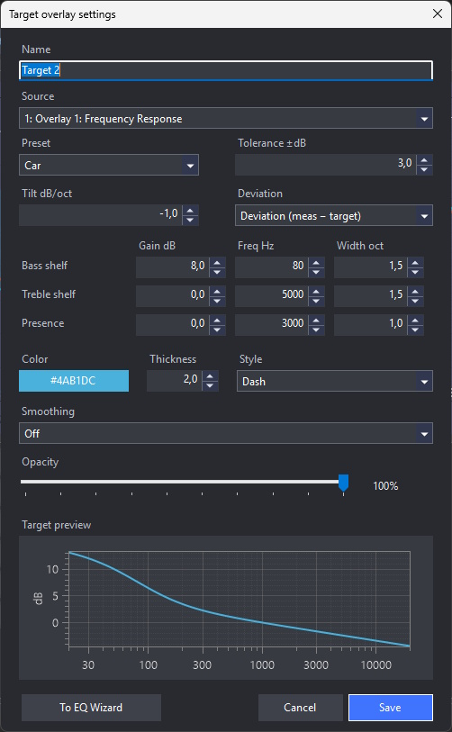

### Import and export

**Import from text** loads a captured overlay from a plain-text file of `X Y`
pairs (for example, `123.4 -5.5`), one per line. Parsing is lenient: values may
be separated by spaces, tabs, commas, or semicolons; extra columns are ignored;
and any line that is not a valid number pair (comments, headers, blanks) is
skipped. **Export to text** writes the slot's current curve in the same format.
For a Target slot, **Export deviation** writes the deviation or EQ-correction
curve, which is handy for transferring corrections into an equalizer or another
tool.

Captured overlay settings include:

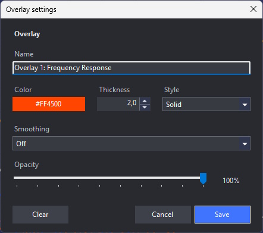
- a user-defined name
- line color, thickness, style, and opacity
- optional `1/48`, `1/24`, `1/12`, `1/6`, or `1/3` octave smoothing in
  frequency-based views
- a **Clear** action that removes only that slot in the current analysis mode

Calculated overlay settings additionally include:


- two operands (Curve A and Curve B), each selected from the live plot curves or
  the captured overlay slots
- operations `A - B`, `B - A`, `A + B`, `(A + B) / 2`, and `|A - B|`
- a blend operation with a user-defined crossover frequency and transition width
- a **complex (vector) sum** (`Main ⊕ Compare`), available in Frequency Response
  when a Compare measurement is set and both records have a transfer IR (see
  below)
- a **sum loss** curve (`complex − magnitude`), the companion to the complex sum,
  showing how many dB the real phase-aware sum falls short of a phase-blind
  magnitude addition (see below)
- optional amplitude-space math for dB-based views, which converts both curves to
  linear amplitude before the operation and back to dB afterward
- independent octave smoothing applied after the selected operation

In **Phase Response**, the difference operations (`A - B`, `B - A`, `|A - B|`) are
phase-aware. Each phase curve — captured or live — remembers whether it is an
unwrapped (continuous) or wrapped (-180..180) representation: measured phase follows the
**Unwrap** option in effect when it was captured, while minimum and excess phase are
always continuous. When either operand is wrapped, the difference uses the shortest
angular distance (`atan2(sin Δ, cos Δ)`) so it never jumps by ±360° across the
branch cut. When both are unwrapped it stays a plain subtraction, preserving the
accumulated slope (and therefore the delay) of the two curves. Imported text curves
have no wrap hint and are treated as unwrapped.

Octave smoothing is available only for Frequency Response, Phase Response, Group
Delay, and paused Live Spectrum. Impulse Response and Autocorrelation keep their
original time-domain samples. Overlay JSON always stores the unsmoothed source
points, so changing or disabling smoothing is lossless.

Calculated results use the same axes, units, zoom, and vertical pan as the
ordinary overlays. Operations are applied to the displayed Y values after source
offsets. As a result, addition and averaging on a decibel plot are arithmetic
operations on dB coordinates, not physical summation of acoustic power.

### Complex (vector) sum

In Frequency Response, a calculated overlay can compute the **complex (vector)
sum** of the Main and Compare transfer impulse responses (`Main ⊕ Compare`).
Both transfer IRs share the same sample-0 time reference, so summing them
sample-by-sample and taking the magnitude gives the *physically correct* summed
response of two sources — it accounts for their relative delay, polarity, and
phase, unlike arithmetic on dB magnitudes. This predicts how two drivers, or the
two sides of a crossover, actually combine.

Two Compare-side controls make it a DSP-style alignment tool:

- **Time offset** — a fractional-sample delay applied to the Compare IR
  (interpolated between samples), mirroring a delay you would dial into a DSP
  channel.
- **Invert polarity** — flips the Compare IR, to check a polarity swap at the
  crossover.

Both update the summed curve live as you turn the field or toggle the checkbox.
The operation needs a Compare measurement with a transfer IR at the same sample
rate; it stays armed and redraws automatically once that data is available.

A companion **sum loss** operation (`complex − magnitude`) plots the difference
between the complex sum and a phase-blind magnitude addition (`|Main| +
|Compare|`). By the triangle inequality it is always **≤ 0 dB**: it shows how
many decibels the real, phase-aware sum falls short of what naive dB/amplitude
addition would predict — zero where the two sources are perfectly in phase, and
dropping into deep negatives toward cancellation. Because the magnitude sum
ignores delay and polarity, only the complex side moves as you tune **Time
offset** and **Invert polarity**, so the curve rises back toward 0 dB as you
bring the sources into phase — a direct read-out of the summation loss you are
dialing out. It shares the same requirements and live behavior as the complex
sum.

### Live overlay preview

The captured, calculated, and target overlay settings dialogs preview their
result on the plot while you edit. Every control change — name, color, style,
opacity, smoothing, operands, the complex-sum delay/polarity, and the whole
target shape, tolerance band, and deviation curve — redraws the candidate curve
immediately, using the same rendering path as the committed overlay, so you see
exactly what **Save** will keep. Closing with **Cancel** (or `Esc`) restores the
previous state.

Overlay files are separated by analysis mode and restored automatically when the
application starts or the active view changes. Changes to any source overlay
immediately update the visible calculated overlays.

All overlay slots use a single file format, `resonalyze-overlay`, version `5`,
with a `kind` field selecting captured / operation / target. Older overlay
schema versions are intentionally not loaded.

Overlays are available in the Impulse Response, Frequency Response, Phase
Response, Group Delay, paused Live Spectrum, and Autocorrelation views. A
**Show all** / **Hide all** pair above the overlay panel toggles every active
overlay for the current mode at once, without deleting any saved JSON file.

## EQ Wizard

The **EQ Wizard** (under the **Tools** tab) designs a parametric equalizer — up
to 32 peaking (PK) bands plus a preamp — that moves a measured response toward a
target. It builds directly on Target overlays: you can open it from **Tools > EQ
Wizard** and pick a target, or jump straight in with the **To EQ Wizard** button
in a Target overlay's settings. Because the wizard needs a real curve to tune
against, its target must use a captured source (not the live current measurement).


The plot shows, on shared frequency/dB axes:

- **Source** — the captured reference measurement (with optional extra smoothing)
- **Target** — the parametric target shape (always drawn in a fixed blue)
- **Source + EQ** — the source with the current EQ applied
- **EQ** — the filter response itself (all bands, without the preamp) in white
- a shaded **error fill** between Source + EQ and Target, so the remaining
  deviation is visible at a glance

Click a band card (or any of its fields) to overlay that band's individual
contribution as a dashed curve relative to the target; click empty space to clear
it. Each band card carries its **frequency**, **Q**, and **gain**, and the panel
adds a **Target Level** (target offset), a **Gain** (preamp), a **Bands** count,
source **Smoothing** (`1/N` octave), and a **Bypass** toggle that draws the curves
without the EQ. An overlay-settings shortcut reopens the underlying target.

### Auto Tune

**Auto Tune** fits the whole EQ automatically. It works on the error between the
target and the (smoothed) source, sets a preamp for the broadband level, then adds
peaking bands greedily where the residual error is largest — choosing each band's
frequency, gain, and the Q that reduces the error the most. It **chooses the band
count itself**, up to the **Max Filters** limit (4–32). A cumulative-boost cap and
minimum band spacing keep it from stacking many maxed-out bands where the response
simply cannot be corrected (for example a deep-bass roll-off).

A **From / To** frequency window limits where bands are placed; it is drawn on the
plot as a shaded band between dashed guides, and the same window bounds the error
metrics in the results panel.

### Results

Replacing the overlay panel in this mode, a colour-coded **Tuning results** panel
reports the fit quality and the EQ's own extents:

- **RMS error** and **Max error** between Source + EQ and Target, measured inside
  the From / To window
- **Filters used**, the number of active bands
- **Peak boost** and **Peak cut** of the combined EQ
- **Headroom** — the margin to 0 dB (red when the EQ nets a boost that could clip)

### Import, export, and tuning sheet

The wizard imports and exports PEQ profiles in several formats, so tunings move
between tools and DSPs:

- **Import + export:** Equalizer APO, REW filter settings, Generic CSV,
  EasyEffects (JSON), CamillaDSP (YAML)
- **Export only:** miniDSP biquads (RBJ coefficients, at 44.1 / 48 / 96 kHz to
  match the DSP's internal rate), GraphicEQ (Wavelet / JamesDSP)

Import is deliberately lenient: comments, blank lines, disabled (`OFF`) filters,
non-peaking filter types, and malformed entries are skipped rather than rejected.

**Export as tuning sheet** produces a phone-friendly PDF for reading next to the
car or speaker: the product banner, a title from the file name, the date and fit
range, a small EQ preview graph with the fit window shaded, the tuning statistics,
the preamp, and one large card per filter.

## Signal Generator

The **Signal Generator** (under the **Tools** tab) plays a continuous test signal
through the current playback device, independent of any measurement. It is handy
for setting output levels, checking channel routing and polarity, exercising a
loudspeaker, or feeding an external analyzer.

**Signal type** offers the same excitation options as Live Spectrum plus a tone:

- **Pink noise (periodic)** — the default; one period of exactly pink noise
  looped seamlessly.
- **Pink noise** — continuous random pink noise, −3 dB/octave.
- **Brown / red noise** — −6 dB/octave, weighted toward low frequencies.
- **White noise** — flat energy per hertz.
- **Sine** — a pure tone; the **Frequency, Hz** field is only enabled for this
  type.

**Duration, s** sets how long the signal plays, and **Level, %** scales its
amplitude. **Play** starts playback and **Stop** ends it; a status line reports
whether the generator is `Ready`, `Playing`, or shows any playback error.

The generator reuses the audio configuration from **Record Settings** — backend
(Wave or ASIO), sample rate, bit depth, playback channel, and output device or
ASIO output channel pair — and displays the resolved settings so you can confirm
where the signal is going before pressing **Play**.

## Virtual DSP

The **Virtual DSP** (under the **Tools** tab) is the summation-prediction
workflow taken to its conclusion: measure each driver once, then design the
whole DSP setup virtually. Channels (A, B, C, …) are stereo **L/R pairs**: each
side picks its own measurement — from a file or from History — and runs its own
virtual DSP chain. Tight **L / R** selector radios switch which side the block's
controls edit (the plots follow), **L→R** / **R→L** buttons copy chain settings
across sides for the channels you tick in a small dialog, and a **Mono**
checkbox turns a pair into a single shared driver — the typical one-subwoofer
car layout — that feeds both sides' sums. **Add channel** / **Remove channel**
grow the setup from two up to eight pairs; the blocks live in a scrolling list,
so a many-way system stays in one window without crowding the plots.

Each channel runs through:

- **Gain** (dB) — relative levels are only honest when the measurements share
  one playback chain; compensate any difference here
- **Delay** (ms) with a live **mm** read-out — the ruler check against the
  physical driver offset (343 m/s)
- **Invert** — the DSP polarity switch
- **Crossover** — Off, low-pass, high-pass, or band-pass; each edge picks
  **Butterworth** (6–48 dB/oct), **Linkwitz-Riley** (12/24/48 dB/oct), or
  **Bessel** (6–48 dB/oct, near-constant group delay) with its own corner
  frequency
- **PEQ** — load a parametric EQ profile (any format the EQ Wizard imports) into
  the chain
- **Mute** — temporarily remove a channel from the plots, sum, loss metric,
  overlay capture, and Auto delay without clearing its source or settings
- **Bypass** — feed the channel's raw measured signal into the sum with the
  whole chain skipped (no gain, delay, polarity, crossover, or PEQ), for an A/B
  against the processed result; unlike Mute, the channel stays in the sum.
  Auto delay refuses to run while any participating channel is bypassed — the
  proposed delay and polarity could not act on the raw signal, yet the channel
  would still steer every other channel's alignment
- **IR polarity** — a measured Normal / Inverted / Unknown indicator read from
  the transfer IR, independent of the virtual polarity switch

Because every stage is linear and the measurements are loopback-referenced
transfer IRs, multiplying each measurement by its chain and summing the results
as complex responses predicts the **linear** response the microphone would
capture after dialing those settings into the hardware — the same math used by
crossover design tools, applied to your own in-room measurements.

The filters are evaluated as the **digital biquad cascades a real DSP runs**
(bilinear transform at the measurement sample rate), so the prediction matches
miniDSP-class hardware up to Nyquist, not just an analog textbook curve.

The acoustic plot shows raw and processed curves per channel for the active
side, the complex **Sum**, the **opposite side's Sum** as a dashed translucent
curve (so the two sides' tunes compare at a glance without flipping back and
forth), and the **Sum loss** curve (blanked where every channel is filtered
more than 40 dB below the loudest point — out there the "loss" would be the
phase arithmetic of noise floors, not audible summation), with a **Phase view**
toggle to check that
the channels track each other through the crossover region. The Phase view has a
manual **Gate...** dialog with an IR preview, Tukey left / plateau / right
window controls, gate offset, and a shared τ detrend so reflections can be cut
out without breaking relative phase. A second plot shows each DSP chain's own
magnitude and phase (without the driver). A **Sum loss** read-out (avg / dip
per junction plus a total) turns tuning into numbers you can minimize, and a
**Δ L−R** block below it reports each stereo pair's final inter-side state:
the two sides' band-limited envelope arrivals in the pair's shared band
(fully processed chains included) with their difference — positive means the
right side leads, the same sign convention as the scene offset, so after a
stereo Auto delay every row should read the offset — and, below the timing, a
**Level Δ L−R** row per pair: the gated band-level asymmetry of the two sides
(positive: left louder). Timing (ITD) and level (ILD) steer the image
together, so this is the read-out for the by-ear gain trim that finishes the
centering; note a single microphone underestimates the binaural difference
(no head shadow), so expect to trim a little more than it shows. A side whose
arrival cannot be measured reliably (a silent band, or a near-noise record)
shows an honest dash instead of a precise-looking number.

Editing a chain recomputes the prediction on a background task, so dragging a
gain, delay, or crossover value stays responsive even with several channels
loaded; a burst of rapid edits is coalesced into a single trailing redraw that
always lands on the latest settings, and the previous curves stay on screen
until the new frame is ready.

A **calibration** selector (Off / 0° / 90°) applies your microphone correction to
the magnitude curves, drawing on the same profiles configured in Record Settings;
it defaults to Off because the measurements are loopback-referenced.

- **Auto crossover...** estimates each channel's usable band and driver type
  (subwoofer, woofer, midbass, midrange, or tweeter) — the band read is the most
  prominent contiguous segment of the response, and when the measurement carries
  coherence (γ²), a frequency the measurement did not trust cannot anchor a band
  edge, so a noisy or non-linear resonance can't stretch the band. It then asks
  which filter
  families to allow (Butterworth / Linkwitz-Riley / Bessel), the
  crossover-frequency window, and whether the two sides of a junction may take
  independent slopes (on by default: a driver's high-pass and low-pass may
  differ, so a woofer can low-pass steeply to the midrange while high-passing
  gently from the sub; turn it off to tie each driver's two shoulders to one
  slope). Different drivers always stay free to take different slopes.
  It searches the crossover frequency, family, and slope to flatten the summed
  magnitude (a plain amplitude sum — the assumption that Auto delay will bring
  each junction to its best alignment), penalizing wide band overlap and
  keeping a practical minimum slope, so it lands on a tight, engineer-sensible
  split rather than shallow filters that only look flat by overlapping widely.
  The gains, though, follow a car target curve rather than a flat sum: the
  midrange and tweeter are levelled to each other (the louder attenuated), and
  the subwoofer anchors the bass at a chosen elevation over that reference —
  the **Sub level over mid/treble** field defaults to (and is capped at) the
  measured elevation, so out of the box the sub keeps its own level and you
  only trim the field down if you want less bass. The remaining drivers are fit
  onto the resulting slope cut-only (a driver already below the target keeps
  its level — no measured dip is boosted), and every gain is a cut, so the
  result is headroom-safe. Handovers stay within the sensible
  range for the two driver types (so a woofer is not crossed up in its
  roll-off), land on human-friendly frequencies (5 Hz steps below 100 Hz,
  10 Hz below 1 kHz, 50 Hz above), and a slope is allowed only while the
  filter's peak group delay stays within 10 ms — a bound on the delay itself,
  not the frequency, so the same steep slope is fine at a 250 Hz woofer/mid
  handover (~5 ms) but excluded at a 75 Hz sub/woofer one (~17 ms), and a
  low-group-delay family (Bessel) can go steeper down low than a Linkwitz-Riley
  can. The budget caps how much steeper than the 24 dB/oct floor the search may
  go; the floor itself is always kept, since a gentler crossover would break the
  overlap rule, so at a very low junction the floor's larger group delay is
  inherent to crossing there. Group delay is identical for the low-pass and
  high-pass sides, so with matched slopes a driver is held to the gentler of its
  two junctions; a steep woofer low-pass paired with a gentle high-pass needs
  independent slopes on.
  A shallow filter that lets a driver bleed into a non-adjacent driver's band is
  still heavily penalized (a woofer should not be audible up at the tweeter). Placement heuristics steer the
  handovers further: a junction landing in the ear's most sensitive band
  (2–4 kHz) is penalized, and two drivers that share a wide band are crossed
  low — letting the upper (smaller) driver take over as early as it cleanly
  can, for better dispersion and less excursion on the lower driver — except
  the subwoofer, which is nudged UP toward the ~80 Hz localization limit rather
  than pulled low. So a capable tweeter is crossed down toward its 1.7 kHz
  sensible floor (out of the ear band) when its measured band supports it, and
  a low tweeter handover is held to at least 24 dB/oct so the tweeter is not
  driven too far down. The same low-handover logic applies below: a midrange
  with headroom down to its 200 Hz sensible floor lets the woofer/midbass hand
  over early, before its cone-breakup region, so the wide woofer/mid overlap
  does not linger up where it interferes badly. In a stereo system both sides of a driver get the same
  crossover — a crossover is one electrical filter, so only delay and level
  differ per side. Narrowing the window past an outer driver adds a subsonic /
  brickwall band-limit on that channel.
  Apply does more than take the flattest magnitude candidate: the wizard
  expands ~50 near-optimal variants (always including the conventional
  all-LR24 setup) and re-ranks them by the junction loss actually achievable
  after the best per-junction delay, measured on your impulse responses with
  the same alignment search Auto delay runs — so a candidate whose slopes
  cannot phase-align at the handover loses to one that can, before you ever
  run Auto delay. Ties go to the conventional 24 dB/oct proposal.
- **Auto delay** aligns in two stages: band-limited first arrivals — refined by a
  GCC-PHAT cross-correlation where it carries a reliable, unambiguous peak (a
  junction whose corners leave a spectral gap degenerates the correlation into
  near-equal lobes, and a near-tie between its peak and trough sends the seed
  back to the arrival estimate) — set the coarse offsets, then a
  fractional-delay search minimizes the sum-loss metric at each junction,
  reading the same direct-sound gate as the displayed metric so late room
  reflections the alignment cannot change do not steer it. Each candidate is
  scored by its in-band average loss *and* how far
  its deepest smoothed notch falls below that average, so a solution that only
  looks good on average while hiding a sharp cancellation at the crossover
  loses to a slightly lossier but flat one. It weighs every near-optimal
  candidate against an arrival-based prior and a physical tie-break, so it does
  not add delay or flip polarity without a real improvement — sidestepping the
  flip-plus-half-period impostor a steep crossover can otherwise hide. Each
  polarity seeds its own candidates, so the non-inverted optimum is always on
  the table for that preference even where the inverted curve edges it
  everywhere. The search runs on a background task with a busy
  indicator, so the window stays responsive during the few seconds it takes. If
  the resulting delays span more than ~10 ms — usually a sign that one channel's
  crossover has excessive group delay (a narrow or steep low-frequency band-pass)
  — a banner flags the lagging driver so you can soften its filter instead of
  dialing in an absurd bulk delay.
  With stereo pairs, Auto delay tunes **both sides in one run**: the left side
  aligns first, the top pair is bridged by band-limited envelope arrivals
  honoring the **L/R offset** field — positive makes the right side lead,
  pulling the image toward the dash center for a left-seated listener (the
  field's tooltip carries the sign cheat-sheet) — with the right top's polarity
  matched to the left's, and the right side then descends junction by junction
  from the bridged top. Pairs whose shared band reaches the localization region
  are pinned to the scene: their right channel lands exactly the offset behind
  its left counterpart (±0.05 ms of junction fine-tuning), because the stereo
  image outranks the handover there, while pure low-frequency pairs keep the
  free junction search with the cross-side timing as a gentle prior only. A
  final scene-preserving pass may then shift BOTH sides of a pair by one shared
  delta — which cannot touch the image — to recover junction summation the pin
  cost. A **Mono** channel (the shared subwoofer) is timed by the left pass
  alone; its junction against the right side is measured and reported, with a
  warning when only a manual compromise delay would serve both sides.
- **Capture to overlay** saves the predicted sum as a Captured overlay in
  Frequency Response — compare it against real measurements and target curves,
  or feed it onward to the EQ Wizard.
- **Export…** writes the whole setup as a tuning sheet (printable PDF or plain
  text): for every side of every pair (a mono pair prints once) the gain, delay
  in ms and mm, polarity, crossover filters, and PEQ bands — exactly the list
  you type into the DSP, both sides in one sheet.
- **Save session... / Load session...** exports or imports the complete session
  JSON (sources, chains, gate, and view state) for sharing or archiving.

The tool's autosaved state (sources, chains, gate, and view flags) persists in
`tools/virtual-crossover.json` and survives restarts. Accuracy holds within the
usual physics: one microphone position, the same playback chain for every
measurement, and the linear (non-clipping) regime.

## Calibration

Resonalyze applies a microphone (or measurement-chain) frequency-response
correction during logarithmic resampling. Configure up to two calibration
profiles in **Record Settings** — one for **0°** (on-axis) and one for **90°**
(grazing) measurements — by browsing to a correction file for each.

Correction files are read leniently in the common plain-text formats
(`.txt`, `.cal`, `.frd`, `.csv`): `frequency level` pairs, with comments,
headers, a decimal comma, comma / semicolon / tab delimiters, and extra columns
all handled.

In the **Frequency Response** and **Live Spectrum** settings a calibration
selector picks which profile to apply — **Off**, **0 degrees**, or
**90 degrees** — listing only the profiles that actually have a file configured.
The selected mode is saved with the measurement settings, and every plot is
routed through the matching file.

For a source checkout, a legacy `source/calibration.txt` beside the executable
is still honored as the 0° profile when no 0° file is configured; the project
copies it to the build and publish output automatically. Replace its example
data with the correction curve for your microphone, or point the 0° / 90°
profiles at your own files.

## Architecture

```text
Resonalyze/
|-- source/                 WinForms application and measurement orchestration
|   |-- Options/            Measurement and visualization settings
|   |-- Overlays/           Persistent overlay slots and calculated overlays
|   |-- Plotting/           OxyPlot model creation, annotations, and adapters
|   |-- Shell/              Main form, title bar, commands, and docked settings
|   |-- TimeAlignment/      Loopback delay measurement UI and orchestration
|   |-- Tools/              EQ Wizard, Signal Generator, Virtual DSP, PEQ import/export, tuning sheets
|   |-- Ui/                 Reusable WinForms controls and dialogs
|   `-- Resonalyze.csproj
|-- dsp/                    Reusable signal-processing library
|   `-- Resonalyze.Dsp.csproj
|-- tests/
|   |-- Resonalyze.App.Tests/  File-format and application tests
|   `-- Resonalyze.Dsp.Tests/  Synthetic DSP tests
|-- .github/workflows/      CI builds and automated tagged releases
|-- global.json             Pinned .NET SDK version
`-- README.md
```

The UI project handles audio-device interaction, the measurement lifecycle, and
plot presentation. `Resonalyze.Dsp` contains reusable DSP operations such as FFT
analysis, windowing, calibration, smoothing, logarithmic resampling, impulse
processing, phase analysis, and group-delay calculation.

## Technology

- [.NET 10](https://dotnet.microsoft.com/)
- [Windows Forms](https://learn.microsoft.com/dotnet/desktop/winforms/)
- [NAudio](https://github.com/naudio/NAudio)
- [NAudio.Asio](https://www.nuget.org/packages/NAudio.Asio)
- [Math.NET Numerics](https://numerics.mathdotnet.com/)
- [OxyPlot](https://oxyplot.github.io/)
- [YamlDotNet](https://github.com/aaubry/YamlDotNet) — CamillaDSP profile import/export
- [PDFsharp / MigraDoc](https://github.com/empira/PDFsharp) — tuning-sheet PDF export

Third-party package licenses are listed in
[THIRD-PARTY-NOTICES.md](THIRD-PARTY-NOTICES.md).

## Contributing

Bug reports, reproducible measurement cases, DSP corrections, and focused pull
requests are welcome. Known technical debt and improvement ideas are collected
in [TODO.md](TODO.md) — a good place to look for a first contribution.

When reporting a measurement issue, include:

- audio interface and driver
- sample rate and bit depth
- measurement mode
- relevant analysis settings
- expected and actual behavior
- a screenshot or exception stack trace — unexpected errors are appended to
  `crash.log` next to `Resonalyze.exe`, so check there for the full stack trace

## License

Resonalyze is available under the [MIT License](License.md).
