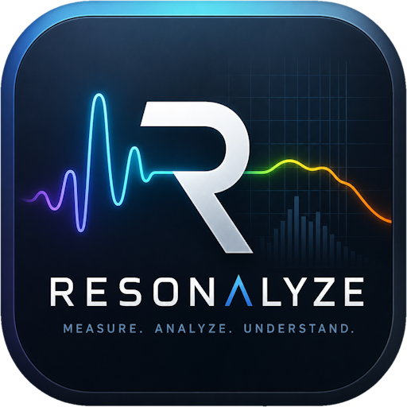

<p align="center">
  
</p>

# Resonalyze

### Acoustic Measurement & Analysis

[](https://dotnet.microsoft.com/)
[](https://www.microsoft.com/windows)
[](https://learn.microsoft.com/dotnet/desktop/winforms/)
[](License.md)
[](https://github.com/DIMOSUS/Resonalyze/actions/workflows/build.yml)
[](https://github.com/DIMOSUS/Resonalyze/releases/latest)

**Resonalyze** is an open-source desktop application for measuring and
visualizing the acoustic behavior of audio systems, rooms, loudspeakers,
headphones, microphones, and complete signal paths.

It generates test signals, records the response through a Windows audio
device, processes the captured data, and presents the result as
engineering-focused plots.

> Resonalyze is under active development. Treat its results as diagnostic
> measurements, not as certified laboratory data.

## Download

Download the latest ready-to-run build from
[GitHub Releases](https://github.com/DIMOSUS/Resonalyze/releases/latest):

- `Resonalyze-Setup-vX.Y.Z-win-x64.exe` for the recommended installed build
- `Resonalyze-vX.Y.Z-win-x64.zip` for most Windows computers
- `Resonalyze-vX.Y.Z-win-arm64.zip` for Windows on ARM

The `.zip` builds are self-contained portable packages and do not require a
separate .NET installation. The installer adds shortcuts, uninstall support,
and automatic in-app updates for the installed x64 build. SHA-256 checksum
files are provided with every release.

## Highlights

- Exponential sine sweep measurement
- Impulse response with JSON save/load
- Measurement History with in-memory snapshots, saved-file recall, and FR previews
- Windows Wave and ASIO audio backends
- Playback/recording device selection with backend-specific channel routing
- Device-aware sample-rate selection from supported rates
- Optional loopback-referenced sweep processing through a transfer function
- Wave or ASIO loopback Time Alignment with sub-sample delay estimation
- Compact Mic/Loop input level meter with Peak, RMS, and Peak Hold
- Installed-build auto-update support through a signed NetSparkle appcast
- Live Spectrum with switchable `Transfer Function` and `Input Spectrum` modes
- Frequency response
- Harmonic distortion and THD+N
- Phase response
- Group delay
- Fourier waterfall
- Burst Decay
- Autocorrelation
- Microphone calibration correction
- Persistent, styled plot overlays with on-plot labels and curve arithmetic
- Docked, non-modal mode settings with Apply flow and IR/window previews
- Configurable FFT windows, smoothing, offsets, sweep timing, and playback
  channel

## Gallery

<table>
  <tr>
    <td align="center"><strong>Frequency response</strong></td>
    <td align="center"><strong>Impulse response</strong></td>
  </tr>
  <tr>
    <td></td>
    <td></td>
  </tr>
  <tr>
    <td align="center"><strong>Waterfall</strong></td>
    <td align="center"><strong>Burst Decay</strong></td>
  </tr>
  <tr>
    <td></td>
    <td></td>
  </tr>
</table>

<details>
<summary><strong>More plots</strong></summary>

### Phase response


### Group delay


### Live Spectrum


### Time Alignment


</details>

## Requirements

To run a release build:

- Windows 10 or later
- Working Windows playback and recording devices
- Optional ASIO driver for low-latency audio interfaces
- A suitable loopback, microphone, or other measurement connection

The self-contained release archives include the required .NET runtime.

To build Resonalyze from source:

- Windows 10 or later
- [.NET 10 SDK](https://dotnet.microsoft.com/download/dotnet/10.0)
- Visual Studio 2026 with the **.NET desktop development** workload, or the
  .NET CLI

Use conservative playback levels when connecting physical equipment. Begin
with the output level turned down and verify the signal path before starting a
measurement.

## Quick Start

Clone the repository and open:

```text
source/Resonalyze.sln
```

Or build and run it from the command line:

```powershell
dotnet restore source/Resonalyze.sln
dotnet build source/Resonalyze.sln --configuration Release
dotnet run --project source/Resonalyze.csproj
```

Run all application and deterministic DSP tests with:

```powershell
dotnet test source/Resonalyze.sln -c Release
```

The Release executable is generated at:

```text
source/bin/Release/net10.0-windows/Resonalyze.exe
```

Tagged GitHub releases also produce:

- portable self-contained `.zip` packages for `win-x64` and `win-arm64`
- an x64 `Setup.exe` installer with uninstall support
- NetSparkle appcast files used by the installed build for automatic updates

The `build.yml` workflow runs both the application test project and the DSP
test project on every push to `main` and on pull requests.

## Measurement Workflow

1. Connect the output of the device under test to the selected input, directly
   or through a microphone and appropriate interface.
2. Start Resonalyze and open the measurement settings.
3. Select the audio backend, sample rate, devices or backend-specific input
   and loopback channels, sweep duration, playback channel, and analysis
   parameters.
4. Start a recording to generate and capture the exponential sine sweep.
5. Watch the compact input level meter to confirm microphone level, loopback
   presence, and headroom before trusting the measurement.
6. Select the required analysis view.
7. Adjust smoothing, windows, offsets, and display options as needed.
   Mode settings open as a docked, non-modal panel attached to the plot, so
   the main window stays usable while settings are visible. Press **Apply
   settings** to update the active graph without closing the panel or resetting
   the current zoom/pan.
8. Use **Save** to preserve the captured impulse response for later analysis
   or comparison.
9. Use **History** to review recent measurements, preview their frequency
   response, reload an older snapshot, or save an in-memory capture to disk.

For acoustic measurements, microphone placement and room conditions strongly
affect the result. For electrical loopback measurements, make sure signal
levels and impedances are safe for both devices.

## Mode Settings

The **Mode Settings...** button opens settings for the current analysis mode
as a docked panel aligned to the plot area. The panel has no title bar, can stay
open while the main window has focus, and automatically switches to the matching
settings panel when you change modes.

Settings are applied with **Apply settings**. Applying changes redraws the
current analysis but preserves the visible plot range, which makes it easier to
tune smoothing, FFT windows, Tukey fades, offsets, and display options without
losing the area you were inspecting.

Frequency Response, Phase, Group Delay, Waterfall, and Burst settings include a
compact impulse-window preview where applicable. The preview shows the impulse
response used by that mode and the selected Tukey window. When loopback transfer
processing is available, Group Delay previews and analyzes the transfer IR from
the start of the impulse response; otherwise it falls back to the sweep
deconvolution IR.

Live Spectrum has its own docked settings panel. It lets you choose between
`Transfer Function` and `Input Spectrum`, enable or disable calibration, and
select **Sequence Length** from a power-of-two list. That sequence length is
the FFT block size used by the live analyzer and is stored between sessions.

## Audio Backends

Resonalyze can run measurements through the standard Windows Wave backend or
through an ASIO driver.


The microphone input is the primary measurement channel. The loopback input is
optional for ordinary sweep measurements and required for Time Alignment. When
loopback is enabled for a sweep measurement, Resonalyze records both channels
at the same time and computes the main impulse response as a transfer function
from loopback reference to microphone response. This removes the playback path
from the primary response plots. Harmonic distortion curves still use the
ordinary sweep deconvolution response, because the harmonic separation belongs
to the sweep analysis itself.

Group Delay follows the same rule: when loopback transfer processing is active,
it is calculated from the loopback-referenced transfer impulse response. In
that mode the group-delay reference is the start of the transfer IR rather than
the peak of the ordinary sweep-deconvolution response.

Without loopback, sweep measurements use the classic single-channel
deconvolution path.

### Wave

Use **Wave** for ordinary Windows playback and recording devices. The
measurement settings dialog lets you choose:

- playback device
- recording device
- sample rate from the values supported by the current configuration
- playback channel
- microphone input channel (`Left` or `Right`)
- optional loopback input channel (`Left` or `Right`) when the recording
  device exposes a stereo input

If the selected Wave recording device does not expose a stereo input, loopback
capture is unavailable and Resonalyze falls back to ordinary single-channel
measurement behavior.

### ASIO

Use **ASIO** for audio interfaces that provide a native ASIO driver. The
measurement settings dialog lets you choose:

- ASIO driver
- sample rate from the values supported by the selected driver
- ASIO input channel used for the microphone
- optional ASIO loopback input channel
- ASIO output channel pair used for playback
- Playback routing inside the selected output pair

ASIO output routing works as follows:

- `Mono` sends the same signal to both channels of the selected output pair
- `Left` sends the signal only to the first channel of the pair
- `Right` sends the signal only to the second channel of the pair
- `Stereo` sends the signal to both channels of the pair

Before applying ASIO settings, Resonalyze checks whether the selected driver
supports the current sample rate. The dialog also shows available driver
diagnostics such as playback latency and, when exposed by the driver, frames
per buffer.

Click **ASIO Control Panel** to open the driver's native control panel. Use it
to configure driver-level settings such as buffer size, clock source, or sample
rate when the driver requires those settings outside the application.

Click **Test ASIO Inputs** to capture a short diagnostic snapshot of the
available ASIO inputs. This helps verify that the microphone and loopback
channels are truly separate and are not being mono-summed by the driver or the
audio-interface control software.

ASIO support depends on the installed driver. If a driver is already in use by
another application or refuses the selected sample rate, Resonalyze reports the
driver error before starting the measurement.

## Input Level Meter

The right-side control column includes a compact two-channel input meter for
`Mic` and `Loop`. It is designed to stay useful without opening extra dialogs
while routing, checking loopback, or validating a completed measurement.

- the bar shows a filtered RMS level
- the bright vertical marker shows Peak Hold
- the text shows `Peak / RMS` in `dBFS`
- after a sweep or time-alignment measurement completes, the meter keeps the
  final levels from the last valid capture instead of dropping back to idle

This makes it easy to spot missing loopback, weak microphone level, overload,
or an unexpectedly hot reference path before you start analyzing the curves.

## Live Spectrum

The **Live Spectrum** mode supports two operating modes:

- **Transfer Function**
  Uses the configured loopback channel as a reference and shows the live
  frequency-domain relationship from loopback to microphone. Because the
  estimate is referenced to loopback rather than to the microphone alone, it
  also helps suppress noise and other input-side content that is not correlated
  with the playback signal.
- **Input Spectrum**
  Shows the classic live spectrum of the selected microphone input without a
  loopback reference.

In Transfer Function mode Resonalyze also draws a **coherence** curve (γ²) on a
secondary right-hand axis scaled from 0 to 1. Coherence shows how much of the
measured response is linearly correlated with the loopback reference: values
near 1 mark frequencies where the transfer-function estimate is trustworthy,
while low values flag bands dominated by noise, reflections, or non-linear
behavior.

The live estimate averages in the power domain (and the input spectrum is
power-averaged with a Hann window), which avoids the downward bias of magnitude
averaging on noise-like signals. The level is calibrated for tones rather than
as a power spectral density. The on-screen smoothing is referenced to
wall-clock time, so
the response stays consistent regardless of the chosen overlap and sequence
length, and the display refreshes at roughly 30 frames per second.

Transfer Function mode requires a configured loopback input in **Record
Settings**. It works with either Wave or ASIO as long as microphone and
loopback are routed to separate channels. If loopback is not configured,
Resonalyze blocks Transfer Function start and explains what must be fixed.

In practice, this makes the Transfer Function mode more stable than raw input
spectrum viewing when the room or measurement chain contains unrelated noise.
It is still not a magic denoiser, but it is the better choice when you want to
focus on the driven response instead of whatever the microphone happens to hear.

The Live Spectrum settings panel also exposes **Sequence Length**, which is the
FFT block size used by the live analyzer. Only power-of-two values are offered
to keep the live FFT path efficient and predictable.

It also exposes **Overlap** (`Off`, `50%`, or `75%`), which slides the analysis
window by a fraction of its size instead of advancing in non-overlapping blocks.
Both Live Spectrum modes apply a Hann window before the FFT, so overlap reclaims
the samples the window tapers at the block edges. Higher overlap gives faster,
smoother averaging and a more responsive display at the cost of more FFTs per
second.

**Smoothing** applies fractional-octave smoothing (`Off`, `1/1` … `1/48`) to
the displayed curve, the same presets used by the Frequency Response mode.

**Window** selects the analysis window applied before the FFT: `Hann` (a good
general default), `Flat Top` (maximum amplitude accuracy for tones),
`Blackman-Harris` (strong spectral-leakage suppression), or `Rectangular`
(unwindowed, for special cases).

**Averaging** sets how quickly the trace responds: `Fast`, `Medium`, and `Slow`
choose exponential time constants (referenced to wall-clock time, so they are
independent of overlap and sequence length), while `Infinite` integrates a
cumulative average indefinitely. **Reset Average** clears the running average and
peak-hold envelope without restarting the measurement.

**Peak Hold** overlays a second curve that retains the maximum level seen on the
trace until it is reset. **Coherence** (on by default) toggles the γ² curve shown
on a secondary 0-to-1 axis in Transfer Function mode.

**Coherence Limit** marks unreliable parts of the transfer-function curve: any
frequency whose coherence falls below the chosen percentage (default `25%`) is
drawn dimmed and dashed, so it is immediately clear which portions of the trace
should not be trusted. Set it to `Off` to draw the whole curve uniformly.

If the CPU cannot keep up with the chosen settings, captured blocks are dropped
rather than allowed to stall the measurement, and a **processing overload**
warning appears at the top of the plot so the cause of a stuttering display is
clear.

Switching to another analysis mode and back restores the last Live Spectrum
curve, its peak-hold envelope, and any active overlays, so a captured trace is
not lost when you step away to inspect a different view. Press **Start** to
resume live capture, or **Clear Curves** to discard the remembered trace.

## Measurement History

The **History** button opens a docked measurement-history panel with:

- a list of recent measurement snapshots
- a compact frequency-response preview for the selected row
- row tooltips with capture metadata such as time, mode, sample rate,
  duration, channel, peak index, and stored mic/loopback meter levels

History entries are split into two kinds:

- `RAM` for in-memory snapshots from the current session
- `FILE` for saved IR files remembered across launches when the files still
  exist on disk

Newest entries appear at the top of the list. Column-header sorting is
intentionally disabled so the history keeps a stable chronological order and
row actions always match the visible item.

The currently active loaded snapshot stays highlighted in the list, even if you
click another row only to inspect its preview. That makes it easier to compare
entries without losing track of which measurement is actually driving the main
plots.

Double-click a row to load it into the main workspace. Use:

- **Save** to turn an in-memory snapshot into a regular IR JSON file
- **Delete** to remove an item from history without deleting the underlying
  file from disk

Saving an in-memory snapshot turns that row into a file-backed history entry
and updates the visible name to the chosen file name. Loaded IR files appear in
the same list as fresh captures, so History works as a practical short-term
measurement shelf rather than as a separate file browser.

To keep memory use predictable, Resonalyze keeps only a small rolling set of
unsaved in-memory snapshots. Saved file-backed entries are persisted
separately.

## Time Alignment

The **Time Alignment** mode analyzes acoustic delay from the currently active
measurement record. It is designed for practical loudspeaker, microphone, and
channel alignment work where the result has to be more precise than a single
audio sample.


Time Alignment no longer runs its own separate capture path. Instead, it reads
the active **transfer impulse response** already stored in the current record.
That means it works immediately after:

- a new sweep measurement captured with loopback enabled
- loading an IR JSON file that contains transfer-response data

If the active record does not contain a transfer IR, the mode clearly reports
that the measurement was captured without loopback and does not attempt to
estimate delay from the ordinary sweep-deconvolution response.

The transfer IR itself comes from the same loopback-based sweep measurement
pipeline used elsewhere in the app: Resonalyze plays the exponential sweep,
records microphone and loopback at the same time, and computes the microphone
response relative to the loopback reference path. This removes unknown playback
latency from the response used for timing analysis. With ASIO, both recorded
channels also remain locked to the same hardware clock, which gives the most
repeatable result.

The delay estimator uses a deliberately robust chain:

- active transfer impulse response from the current record
- optional raised-cosine bandpass window around the frequency range of interest
- analytic-signal envelope of that impulse response
- fractional peak interpolation around the envelope maximum

That last step is the important bit: Resonalyze does not stop at the nearest
sample. It refines the peak position between samples, which enables
sub-sample delay estimates such as `87.0 samples` or `1.972 ms` instead of a
coarse integer-sample result. For time alignment, that is a serious practical
upgrade: smaller timing adjustments become visible, repeatable, and easier to
trust.

The mode recalculates immediately when you switch into **Time Alignment** and
also updates live as soon as you change the bandpass settings.

It reports signal quality using the stored meter snapshot from the same
measurement record:

- Color-coded `Excellent`, `Good`, `Fair`, or `Poor` confidence based on
  peak-to-background envelope ratio
- microphone peak and RMS levels in dBFS
- loopback peak and RMS levels in dBFS
- `CLIP` warning for overloaded microphone input
- `FULL SCALE` marker for a digital loopback reference running at 0 dBFS

The compact input level meter remains useful here as well: it preserves the
final captured levels from the last valid sweep measurement or loaded file, so
the Time Alignment readout still has the signal context that produced the
current transfer IR.

The measured time, distance, and sample count are clickable. Click one of
those result lines to copy just the numeric value to the clipboard, which is
convenient when pasting delay values into another tool or a spreadsheet.

When the bandpass window is enabled, Resonalyze shows a small frequency-domain
preview of the selected pass band. It also shows the envelope around the
detected peak, making it easy to see whether the reported delay comes from a
clean dominant arrival or from a noisy or ambiguous response.

Time Alignment therefore depends on how the underlying sweep record was
captured. To produce a usable transfer IR, the sweep measurement itself must be
run with a configured loopback input channel. That loopback-enabled sweep can
be captured through:

- **ASIO**, which is the recommended path for best timing accuracy
- **Wave**, if the selected recording device exposes a stereo input and one
  side can be dedicated to loopback

Wave loopback is supported for convenience, but ASIO remains the preferred path
for serious timing work because the capture chain is more tightly controlled.

## Installer and Updates

Resonalyze supports two release styles:

- **Portable `.zip` builds**
  Extract and run `Resonalyze.exe` directly. This is convenient for quick
  testing or keeping multiple versions side by side.
- **Installed `Setup.exe` build**
  Installs to the current user's local Programs folder, creates shortcuts, and
  registers an uninstaller.

When the application detects a newer GitHub release, the version label in the
custom title bar changes to **Update available**. Clicking it opens a focused
update dialog:

- installed builds can either start an **Automatic Update** or open the GitHub
  releases page for manual download
- portable builds offer manual download only, because they are not tied to a
  managed install location

Automatic update currently targets the installed x64 build distributed through
`Setup.exe`. Portable `.zip` builds remain fully supported, but they are
updated manually by downloading a newer archive.

## Saving and Loading Impulse Responses

After a sweep measurement completes, click **Save** to store the measured
impulse-response data. Resonalyze proposes a timestamped file name such as:

```text
Resonalyze-IR-2026-06-15_14-30-00.json
```

Files are saved as indented, human-readable JSON. Each file contains:

- Format and schema version
- Save time in UTC
- Sample rate and bit depth
- Sweep octave count and duration
- Playback channel
- Measurement mode (`SweepDeconvolution` or `LoopbackTransfer`)
- Sweep-deconvolution impulse response samples and peak index
- Optional loopback transfer-function impulse response samples and peak index
  when loopback was enabled
- Stored microphone and loopback Peak/RMS meter values from the measurement
- Embedded preview frequency-response data for the Measurement History panel

Click **Load** to open a previously saved response. Resonalyze validates the
file before using it, rejects files below `44100 Hz`, restores the associated
measurement metadata into the active record, stays in the current analysis
view, and redraws it from the loaded data. Loading an IR does **not** rewrite
the current audio-device configuration in Record Settings. All analyses derived
from an impulse response, including frequency response, phase, group delay,
waterfall, Burst Decay, autocorrelation, and loopback-based Time Alignment,
can then be generated without repeating the measurement.

Saving and loading are disabled while a measurement is running. The current
file format identifier is `resonalyze-impulse-response`, version `4`. Files are
intended to remain readable by people, but editing sample arrays manually may
make a file invalid or produce misleading analysis results. Files that do not
yet contain the embedded preview-frequency-response section can still be
loaded; Resonalyze rebuilds the preview when needed.

## Plot Overlays

Each supported overlay view provides ten ordinary overlay slots and two
calculated overlay slots. Click a numbered button in slots 1-10 to capture one
of the curves currently shown on the plot. Overlay slots are stored
automatically as human-readable JSON beside the executable:

```text
overlays/<AnalysisMode>/overlay-01.json
```

For slots 1-10, the checkbox shows or hides the saved curve, the numeric
control applies a vertical offset, and `...` opens the settings dialog. A slot
without a saved file remains disabled.

Visible overlay names are drawn directly over the plot as a compact legend.
Each entry uses the same color and line style as the curve itself, so exported
screenshots and day-to-day comparisons remain readable even when many curves
are active.

Slots 11 and 12 are reserved for calculations between any two ordinary
overlays from slots 1-10. They do not have capture or clear buttons. Instead,
the row displays the currently selected operation, such as `A-B`, `A+B`,
`AVG`, or `|A-B|`. Use `...` to select source overlays A and B, choose the
operation, and configure the result appearance.

Ordinary overlay settings include:


- A user-defined name
- Line color, thickness, style, and opacity
- Optional `1/48`, `1/24`, `1/12`, `1/6`, or `1/3` octave smoothing in
  frequency-based views
- A **Clear** action that removes only that slot in the current analysis mode

Calculated overlay settings additionally include:


- Two source slots selected from overlays 1-10
- Operations `A - B`, `B - A`, `A + B`, `(A + B) / 2`, and `|A - B|`
- Blend operation with a user-defined crossover frequency and transition width
- Optional amplitude-space math for dB-based views, which converts both
  curves to linear amplitude before the operation and back to dB afterward
- Independent octave smoothing applied after the selected operation

Octave smoothing is available only for Frequency Response, Phase Response,
Group Delay, and paused Live Spectrum. Impulse Response and Autocorrelation
keep their original time-domain samples. Overlay JSON always stores the
unsmoothed source points, so changing or disabling smoothing is lossless.

Calculated results use the same axes, units, zoom, and vertical pan as the
ordinary overlays. Operations are applied to displayed Y values after source
offsets. Consequently, addition and averaging on a decibel plot are
arithmetic operations on dB coordinates, not physical summation of acoustic
power.

Overlay files are separated by analysis mode and restored automatically when
the application starts or the active view changes. Changes to any source
overlay immediately update visible calculated overlays.

Ordinary overlay files use format `resonalyze-overlay`, version `4`.
Calculated overlay files use format `resonalyze-overlay-operation`, version
`4`. Older overlay schema versions are intentionally not loaded.

Overlays are available in the Impulse Response, Frequency Response, Phase
Response, Group Delay, paused Live Spectrum, and Autocorrelation views. The
Clear button removes all plotted curves and hides every active overlay without
deleting its saved JSON file. When Live Spectrum is running, Clear pauses it
before clearing the plot.

## Calibration

Frequency-response correction is loaded from `calibration.txt` beside
`Resonalyze.exe`. In a source checkout, edit:

```text
source/calibration.txt
```

The project copies this file to build and publish output automatically. The
calibration data is applied during logarithmic resampling when **Use
Calibration** is enabled in the frequency-response options. Replace the
example data with the correction curve supplied for your microphone or
measurement chain.

## Architecture

```text
Resonalyze/
|-- source/                 WinForms application and measurement orchestration
|   |-- Options/            Measurement and visualization settings
|   |-- Overlays/           Persistent overlay slots and calculated overlays
|   |-- Plotting/           OxyPlot model creation, annotations, and adapters
|   |-- Shell/              Main form, title bar, commands, and docked settings
|   |-- TimeAlignment/      Loopback delay measurement UI and orchestration
|   |-- Ui/                 Reusable WinForms controls and dialogs
|   `-- Resonalyze.csproj
|-- dsp/                    Reusable signal-processing library
|   `-- Resonalyze.Dsp.csproj
|-- tests/
|   |-- Resonalyze.App.Tests/  File-format and application tests
|   `-- Resonalyze.Dsp.Tests/  Synthetic DSP tests
|-- .github/workflows/      CI builds and automated tagged releases
|-- global.json             Pinned .NET SDK version
`-- README.md
```

The UI project handles audio-device interaction, measurement lifecycle, and
plot presentation. `Resonalyze.Dsp` contains reusable DSP operations such as
FFT analysis, windowing, calibration, smoothing, logarithmic resampling,
impulse processing, phase analysis, and group-delay calculation.

## Technology

- [.NET 10](https://dotnet.microsoft.com/)
- [Windows Forms](https://learn.microsoft.com/dotnet/desktop/winforms/)
- [NAudio](https://github.com/naudio/NAudio)
- [NAudio.Asio](https://www.nuget.org/packages/NAudio.Asio)
- [Math.NET Numerics](https://numerics.mathdotnet.com/)
- [OxyPlot](https://oxyplot.github.io/)

## Roadmap

- Complete measurement-session save/load
- Plot and raw-data export
- Improved calibration workflow
- Export/share improvements for annotated plots and overlays

## Contributing

Bug reports, reproducible measurement cases, DSP corrections, and focused pull
requests are welcome. When reporting a measurement issue, include:

- Audio interface and driver
- Sample rate and bit depth
- Measurement mode
- Relevant analysis settings
- Expected and actual behavior
- Screenshot or exception stack trace

## License

Resonalyze is available under the [MIT License](License.md).
