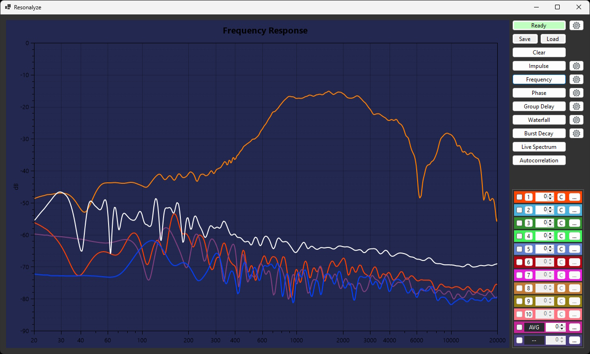
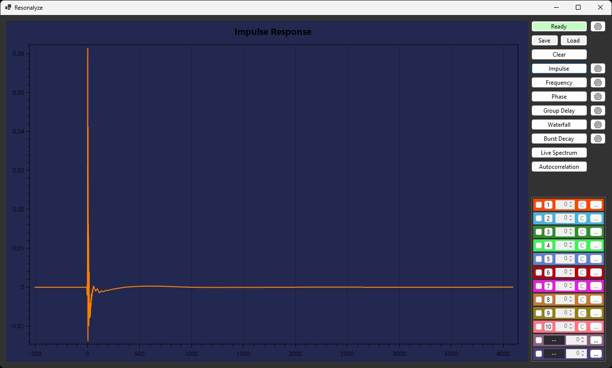
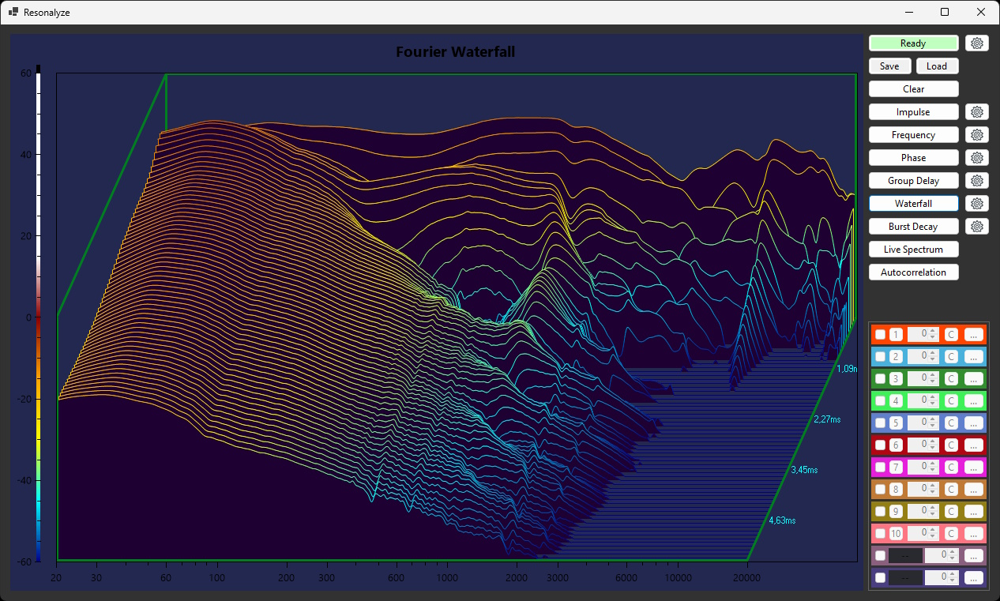
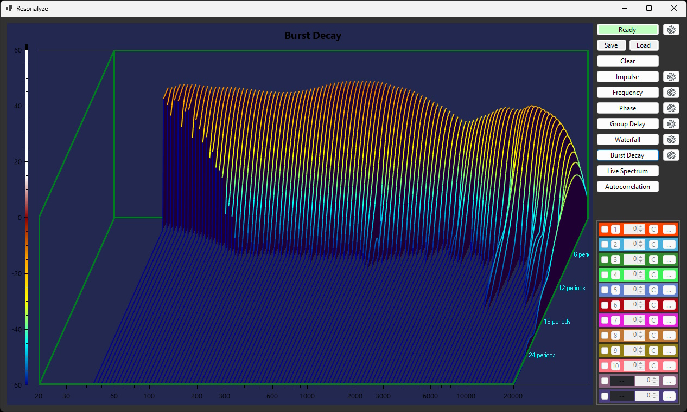
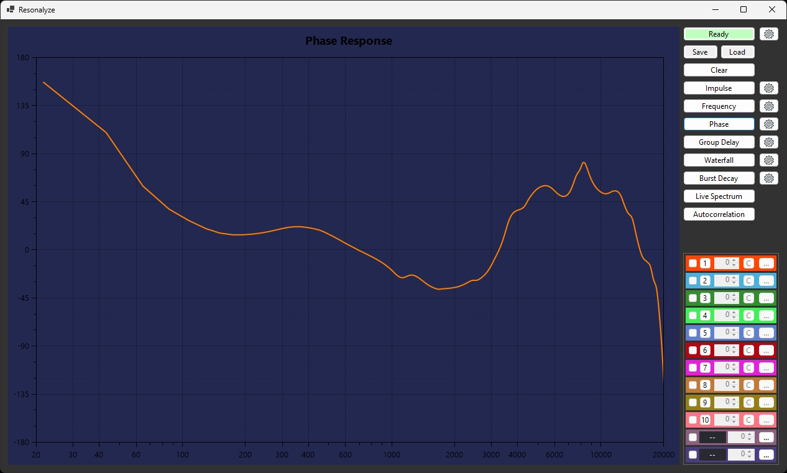
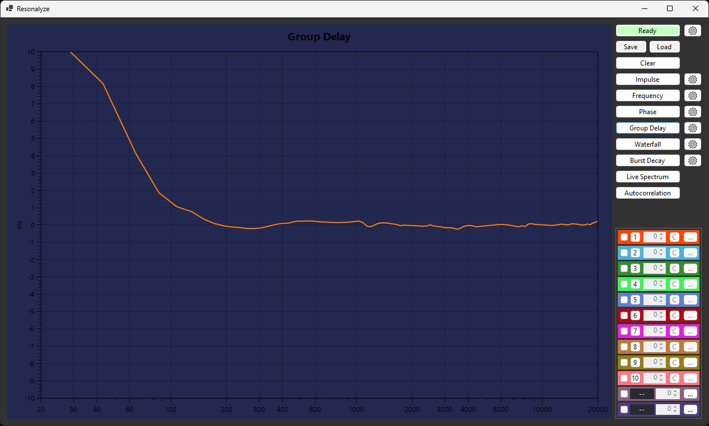
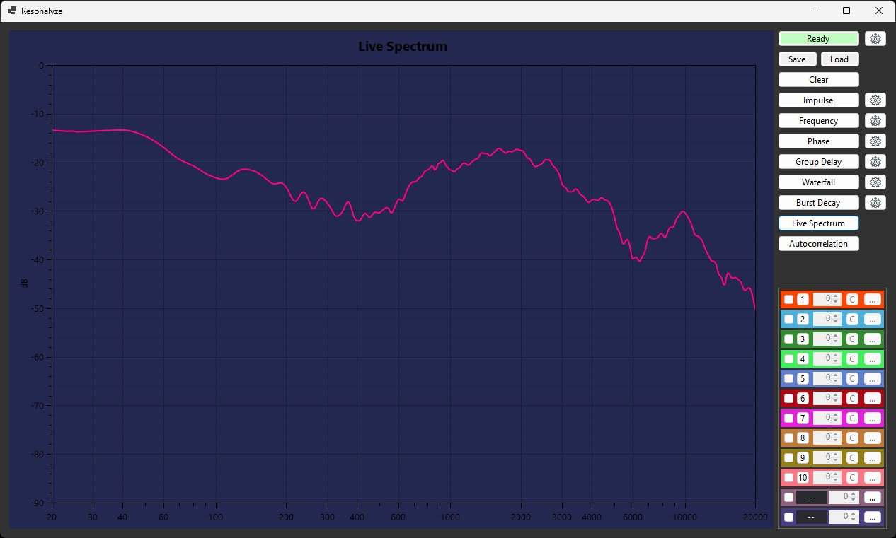

# Resonalyze

### Acoustic Measurement & Analysis

[](https://dotnet.microsoft.com/)
[](https://www.microsoft.com/windows)
[](https://learn.microsoft.com/dotnet/desktop/winforms/)
[](License.md)
[](https://github.com/DIMOSUS/Resonalyze/actions/workflows/build.yml)
[](https://github.com/DIMOSUS/Resonalyze/releases/latest)

**Resonalyze** is an open-source desktop application for measuring and
visualizing the acoustic behavior of audio systems, rooms, loudspeakers,
headphones, microphones, and complete signal paths.

It generates test signals, records the response through a Windows audio
device, processes the captured data, and presents the result as
engineering-focused plots.

> Resonalyze is under active development. Treat its results as diagnostic
> measurements, not as certified laboratory data.

## Download

Download the latest ready-to-run build from
[GitHub Releases](https://github.com/DIMOSUS/Resonalyze/releases/latest):

- `Resonalyze-vX.Y.Z-win-x64.zip` for most Windows computers
- `Resonalyze-vX.Y.Z-win-arm64.zip` for Windows on ARM

The release archives are self-contained and do not require a separate .NET
installation. SHA-256 checksum files are provided with every release.

## Highlights

- Exponential sine sweep measurement
- Impulse response
- Frequency response
- Harmonic distortion and THD+N
- Phase response
- Group delay
- Fourier waterfall
- Burst Decay
- Real-time noise response
- Autocorrelation
- Microphone calibration correction
- Multiple plot overlays for visual comparison
- Configurable FFT windows, smoothing, offsets, timing, and sample parameters

## Gallery

<table>
  <tr>
    <td align="center"><strong>Frequency response</strong></td>
    <td align="center"><strong>Impulse response</strong></td>
  </tr>
  <tr>
    <td></td>
    <td></td>
  </tr>
  <tr>
    <td align="center"><strong>Waterfall</strong></td>
    <td align="center"><strong>Burst Decay</strong></td>
  </tr>
  <tr>
    <td></td>
    <td></td>
  </tr>
</table>

<details>
<summary><strong>More plots</strong></summary>

### Phase response



### Group delay



### Real-time noise response



</details>

## Requirements

- Windows 10 or later
- [.NET 10 SDK](https://dotnet.microsoft.com/download/dotnet/10.0)
- Visual Studio 2026 with the **.NET desktop development** workload, or the
  .NET CLI
- A working playback and recording device
- A suitable loopback, microphone, or other measurement connection

Use conservative playback levels when connecting physical equipment. Begin
with the output level turned down and verify the signal path before starting a
measurement.

## Quick Start

Clone the repository and open:

```text
source/Resonalyze.sln
```

Or build and run it from the command line:

```powershell
dotnet restore source/Resonalyze.sln
dotnet build source/Resonalyze.sln --configuration Release
dotnet run --project source/Resonalyze.csproj
```

The Release executable is generated at:

```text
source/bin/Release/net10.0-windows/Resonalyze.exe
```

## Measurement Workflow

1. Connect the output of the device under test to the selected input, directly
   or through a microphone and appropriate interface.
2. Start Resonalyze and open the measurement settings.
3. Confirm sample rate, bit depth, sweep duration, and analysis parameters.
4. Start a recording to generate and capture the exponential sine sweep.
5. Select the required analysis view.
6. Adjust smoothing, windows, offsets, and display options as needed.

For acoustic measurements, microphone placement and room conditions strongly
affect the result. For electrical loopback measurements, make sure signal
levels and impedances are safe for both devices.

## Calibration

Frequency-response correction can be loaded from:

```text
source/calibration.txt
```

The calibration data is applied during logarithmic resampling when
**Use Calibration** is enabled in the frequency-response options. Replace the
example data with the correction curve supplied for your microphone or
measurement chain.

## Architecture

```text
Resonalyze/
|-- source/                 WinForms application and measurement orchestration
|   |-- Options/            Measurement and visualization settings
|   `-- Resonalyze.csproj
|-- dsp/                    Reusable signal-processing library
|   `-- Resonalyze.Dsp.csproj
|-- global.json             Pinned .NET SDK version
`-- README.md
```

The UI project handles audio-device interaction, measurement lifecycle, and
plot presentation. `Resonalyze.Dsp` contains reusable DSP operations such as
FFT analysis, windowing, calibration, smoothing, logarithmic resampling,
impulse processing, phase analysis, and group-delay calculation.

## Technology

- [.NET 10](https://dotnet.microsoft.com/)
- [Windows Forms](https://learn.microsoft.com/dotnet/desktop/winforms/)
- [NAudio](https://github.com/naudio/NAudio)
- [Math.NET Numerics](https://numerics.mathdotnet.com/)
- [OxyPlot](https://oxyplot.github.io/)

## Roadmap

- Automated tests for the DSP library
- Cleaner nullable-reference annotations
- Audio-device selection and diagnostics
- Measurement session save/load
- Plot and raw-data export
- Improved calibration workflow
- Packaged releases with versioned installers

## Contributing

Bug reports, reproducible measurement cases, DSP corrections, and focused pull
requests are welcome. When reporting a measurement issue, include:

- Audio interface and driver
- Sample rate and bit depth
- Measurement mode
- Relevant analysis settings
- Expected and actual behavior
- Screenshot or exception stack trace

## License

Resonalyze is available under the [MIT License](License.md).
