<p align="center">
  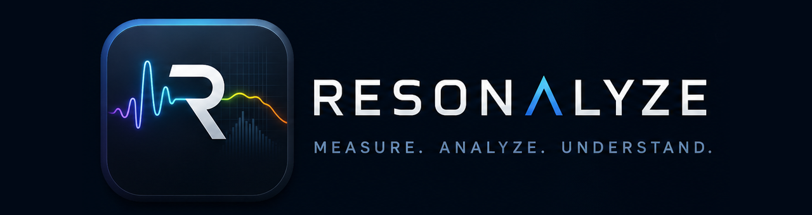
</p>

<h1 align="center">Resonalyze</h1>

<p align="center">
  <strong>Measurement-Driven Tuning for Car Audio and Multi-Way Loudspeaker Systems</strong>
</p>

<p align="center">
  Automatic time alignment with honest verdicts, a virtual DSP crossover
  designer, and engineering-grade acoustic analysis — impulse response,
  frequency response, phase, loopback-referenced timing, and live transfer
  functions — on Windows.
</p>

<p align="center">
  <em><strong>Measure each driver once, then leave the car: align, combine, and optimize
  the whole system from your desk — and only then type the result into the DSP.</strong></em>
</p>

<p align="center">
  <a href="https://github.com/DIMOSUS/Resonalyze/releases/latest"><strong>Download latest release</strong></a>
  ·
  <a href="MANUAL.md"><strong>Tuning manual</strong></a>
  ·
  <a href="REFERENCE.md"><strong>Reference</strong></a>
  ·
  <a href="#your-first-measurement"><strong>Your first measurement</strong></a>
  ·
  <a href="#building-from-source"><strong>Build from source</strong></a>
</p>

[](https://dotnet.microsoft.com/)
[](https://www.microsoft.com/windows)
[](https://learn.microsoft.com/dotnet/desktop/winforms/)
[](License.md)
[](https://github.com/DIMOSUS/Resonalyze/actions/workflows/build.yml)
[](https://github.com/DIMOSUS/Resonalyze/releases/latest)

**Resonalyze** is an open-source desktop application for measuring and tuning
multi-way loudspeaker systems — with a special focus on the hardest room of all:
the **car cabin**. It generates test signals, records the response through a
Windows audio device, and turns the captured data into engineering-focused plots
and concrete DSP settings: crossover corners, per-driver delays, polarity, and
PEQ. The same toolset measures rooms, home loudspeakers, headphones, microphones,
and complete signal paths.

Its center of gravity is the step most measurement workflows leave to you:
turning a set of per-driver measurements into one coherent system. **Auto delay**
and **Auto crossover** search the actual settings against the phase-aware
predicted sum, and every automatic result comes with an honest verdict — the
engine reports *why* it trusts an arrival, and refuses loudly instead of
fabricating a number when the measurement cannot support one.

> Resonalyze is under active development. Treat its results as diagnostic
> measurements, not as certified laboratory data.

## Project Showcase

<p align="center">
  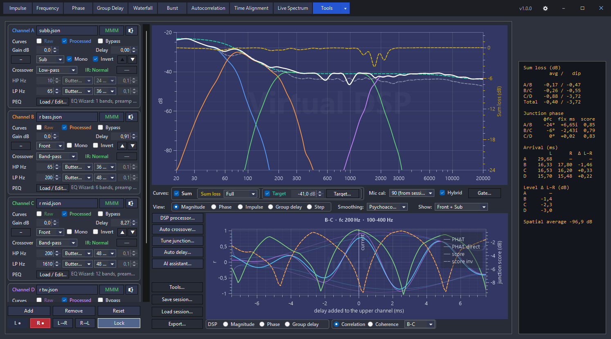
</p>

<p align="center">
  <strong>Virtual DSP</strong> — combine measured drivers through gain, delay,
  polarity, crossover filters, and PEQ (bells, shelves and all-pass alike)
  before touching the hardware DSP.
</p>

<p align="center">
  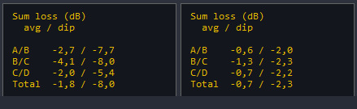
</p>

<p align="center">
  <strong>Does the automation actually help?</strong> Sum loss — how many dB the
  real phase-aware sum falls short of a phase-blind magnitude addition at each
  junction (average / worst dip). Left: a three-way system tuned by ear over
  years. Right: the same system after one <strong>Auto&nbsp;crossover</strong> +
  <strong>Auto&nbsp;delay</strong> pass — the worst dip shrinks from −8.0 to
  −2.3&nbsp;dB.
</p>

<table>
  <tr>
    <td width="50%">
      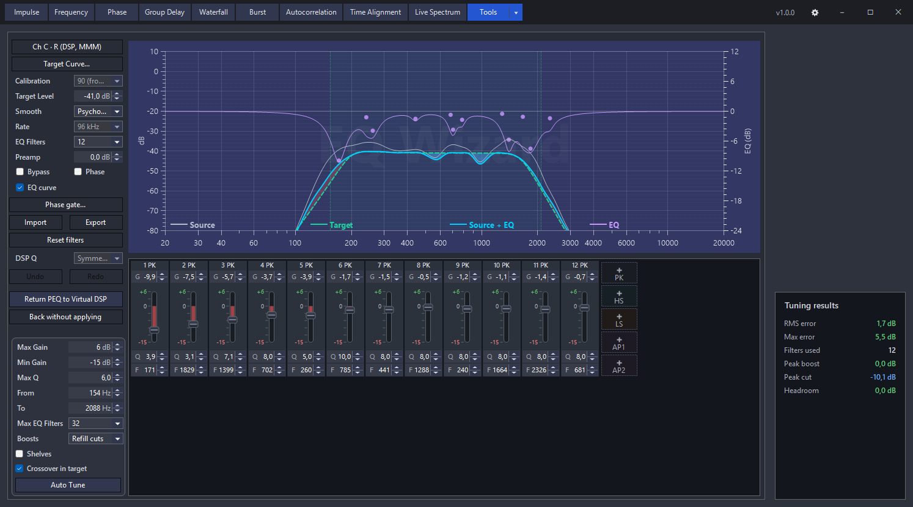
      <p><strong>EQ Wizard</strong> equalizes any measured response — an impulse
      response, a captured overlay curve, or a spatial average from a moving
      microphone or a microphone array — toward its own target curve.</p>
    </td>
    <td width="50%">
      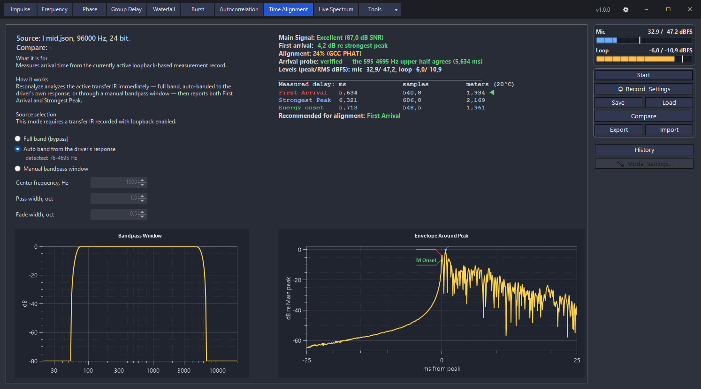
      <p><strong>Time Alignment</strong> estimates loopback-referenced delay from
      the transfer impulse response, with confidence, levels, distance, and the
      arrival envelope.</p>
    </td>
  </tr>
</table>

## Why Resonalyze?

If you already use REW, OpenSoundMeter, or Smaart: those are broad measurement
toolboxes; Resonalyze is a focused, end-to-end tuning workflow for **active
multi-way systems**. REW's alignment tool sums a pair of measurements and its EQ
module corrects a response; Resonalyze operates one level up — separate
per-driver measurements on one absolute time base, complete virtual DSP chains, a
phase-aware sum of the whole system, and optimizers that work every crossover
junction and both stereo sides at once. Its home turf is the car, and its output
is not just a plot but the DSP settings themselves:

- **Built for multi-way active systems** — measure each driver separately, then
  design the whole system virtually: crossover corners, slopes and families,
  per-driver delay and polarity, and PEQ down to all-pass bands, tuned against the
  phase-aware predicted sum. **Auto crossover** and **Auto delay** search these
  settings automatically, across both stereo sides in one run.
- **Honest automation** — an automatic tuner that guesses is worse than none.
  Arrival estimates carry confidence and verdicts, modal build-up latches and
  playback crosstalk are detected instead of aligned to, and when a measurement
  cannot support a decision the engine says so.
- **Loopback-referenced timing** — a recorded loopback channel is the time
  reference, so delay and transfer-function analysis are tied to the actual
  playback path, and separate measurements share one absolute time base.
- **Repeatable, calibrated measurements** — average up to 64 sweeps into one
  cross-spectrum transfer estimate with a per-frequency **coherence** (γ²) curve,
  and put the response in real **dB SPL** from an acoustic 1 kHz calibrator.
- **Crossover summation prediction** — the true **complex (vector) sum** of two
  measurements accounts for relative delay, polarity and phase the way dB-curve
  arithmetic cannot, with a companion **sum-loss** curve; Virtual DSP takes this
  to its conclusion with complete virtual chains per driver.
- **Fast compare-and-adjust work** — persistent and calculated overlays, target
  curves, on-plot labels, and a measurement history that keeps each entry's whole
  working state.

Resonalyze does not try to be every acoustic tool at once. For room EQ at home,
REW remains excellent; when the question is *"what delays, crossovers, and
polarities do I put into this six-channel DSP"*, that is what Resonalyze is for.

## Demo

A one-minute tour of the main features:

<p align="center">
  
</p>

## Download

Download the latest ready-to-run build from
[GitHub Releases](https://github.com/DIMOSUS/Resonalyze/releases/latest):

- `Resonalyze-Setup-vX.Y.Z-win-x64.exe` — the recommended installed build
- `Resonalyze-vX.Y.Z-win-x64.zip` — for most Windows computers
- `Resonalyze-vX.Y.Z-win-arm64.zip` — for Windows on ARM

The `.zip` builds are self-contained and do not require a separate .NET
installation; the installer adds shortcuts, uninstall support, and automatic
in-app updates for the installed x64 build, and a SHA-256 checksum file is
provided with every release. "Self-contained" refers to the runtime, not to your
data: by default every build keeps settings, history, overlays, Virtual DSP state
and logs in `%LocalAppData%\Resonalyze`. To make a `.zip` build fully portable,
create an empty file named `portable.flag` next to `Resonalyze.exe`. When a newer
release is detected, the version label in the title bar changes to **Update
available** and breathes slowly between grey and blue so it is noticed on a bar
nobody looks at: installed builds can start an **Automatic Update**, portable
builds offer a manual download. The pulse pauses while the window is in the
background, stops once you follow the link, and never starts at all when Windows
is set to show no animations (Settings → Accessibility → Visual effects).

> **Windows SmartScreen note:** the builds are not code-signed (certificates are
> expensive for a free open-source project), so the first launch may show a
> *"Windows protected your PC"* dialog. Click **More info → Run anyway**, or
> verify the download against the published SHA-256 checksum.

## Highlights

- **Band-defined exponential sweep** — the low and high frequency it must cover
  (20 Hz – 20 kHz) plus a per-octave pace, with the transfer estimate gated to
  the excited band, and impulse-response JSON save/load
- **Mandatory loopback for sweep/IR analysis** — every IR-based view is derived
  from the transfer function (harmonics and THD+N stay on the sweep
  deconvolution); Live Spectrum can additionally run as a reference-free RTA
- **Multi-sweep averaging** (1–64 runs) as a cross-spectrum estimate with a
  per-frequency **coherence** (γ²) curve, the runs playing back to back
- **Analysis views** — frequency response, phase, group delay, waterfall, Burst
  Decay, autocorrelation, harmonic distortion, THD and THD+N, with
  reliability-anchored phase unwrapping, Fixed/**FDW** phase windowing, and
  minimum/excess-phase decomposition
- **Calibration** — the microphone's 0° profile from `.txt` / `.cal` / `.frd` /
  `.csv` files, any number of further named profiles, curves **estimated for an
  off-axis angle** from the microphone's geometry (with the uncertainty of that
  estimate shown), and **absolute dB SPL** from an acoustic 1 kHz calibrator
- **Time Alignment** — sub-sample delay from the transfer IR, refined by a
  GCC-PHAT cross-correlation
- **Crossover summation prediction** — in Frequency Response, the true **complex
  (vector) sum** of two measurements (`Main ⊕ Compare`) with Compare
  delay/polarity controls, plus a **sum-loss** curve
- **Virtual DSP** — up to eight L/R driver pairs (plus mono channels) through
  virtual chains: gain, delay, polarity, Butterworth / Linkwitz-Riley / Bessel /
  Chebyshev crossovers and PEQ (all-pass bands included), with the complex sum,
  sum loss, phase tracking, junction read-outs, Δ L−R timing, **Auto crossover**,
  a stereo-aware **Auto delay**, a headphone audition, sessions and tuning-sheet
  export
- **Live Spectrum** — a real-time loopback transfer function with coherence, or a
  reference-free RTA in relative dB or dB SPL, with selectable excitation
  (leakage-free periodic pink, pink, brown/red, white, or Silent for the ambient
  room) and compensation of the noise's own spectral slope; plus a dedicated
  **MMM** mode that pins the recipe a moving-microphone average is valid under and
  saves the capture — raw bins and full recipe — as its own file
- **Microphone array** — further microphones on spare inputs of the same
  interface, each with its own calibration, averaged over the listening volume in
  the same sweep that produces the impulse response; the measurement stores every
  position's curve and the spread between them, and Virtual DSP and the EQ Wizard
  read the average in place of the one point the response was measured at
- **Compare** a second measurement (file or History) across Time Alignment,
  Phase, Group Delay, Frequency Response and Impulse Response, and **overlays** —
  captured, calculated and target curves with styling, curve math,
  import/export, saved per-mode state, and a live editing preview
- **EQ Wizard** — up to 32 PEQ bands toward its own target, from an IR, an
  overlay slot, a text curve or a Virtual DSP channel handed over for editing
  (and returned with one click), with Auto Tune, cross-tool import/export and a
  printable tuning-sheet PDF
- **Signal Generator**, **Measurement History** with per-entry working state, a
  compact Mic/Loop level meter, and four audio backends (MME Compatibility, ASIO,
  WASAPI Shared and Exclusive) with backend-specific channel routing

## Gallery

Virtual DSP, the EQ Wizard, and Time Alignment are shown in the
[showcase](#project-showcase) above; the analysis views:

<table>
  <tr>
    <td width="50%">
      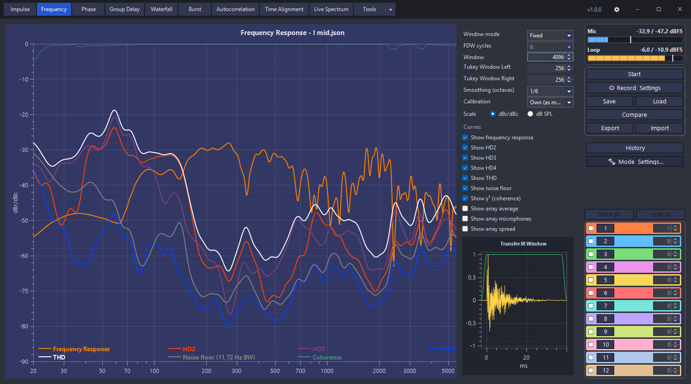
      <p><strong>Frequency Response</strong> — smoothing, calibration, an optional
      dB SPL scale, distortion curves, overlays, targets, and coherence.</p>
    </td>
    <td width="50%">
      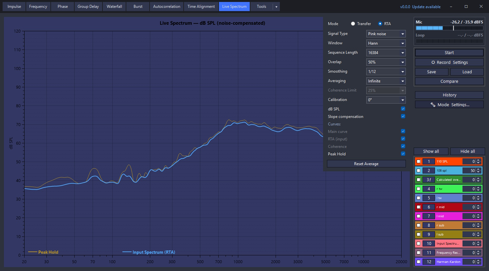
      <p><strong>Live Spectrum</strong> — a loopback transfer function with
      coherence and peak hold, or a reference-free RTA in dB SPL, on selectable
      excitation noise.</p>
    </td>
  </tr>
  <tr>
    <td width="50%">
      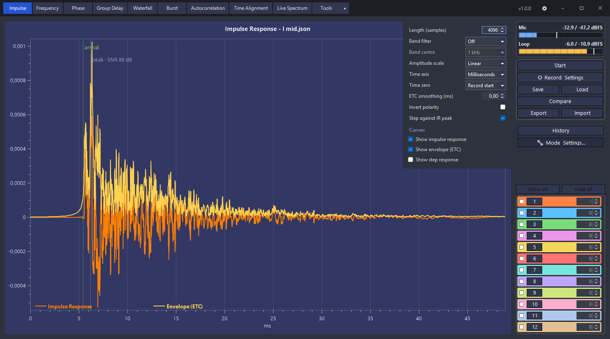
      <p><strong>Impulse Response</strong> — impulse, envelope (ETC) and step on
      one timeline, save it as readable JSON, and reuse it across analysis modes
      without re-measuring.</p>
    </td>
    <td width="50%">
      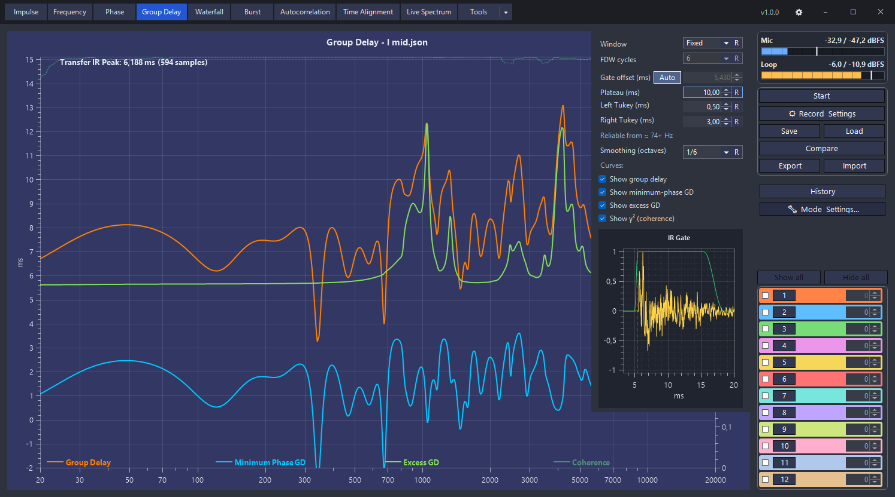
      <p><strong>Group Delay</strong> — timing from the transfer IR, with a
      millisecond gate, gate offset, and a live impulse-window preview.</p>
    </td>
  </tr>
</table>

<details>
<summary><strong>More plots</strong> — waterfall, phase, Burst Decay, overlays</summary>

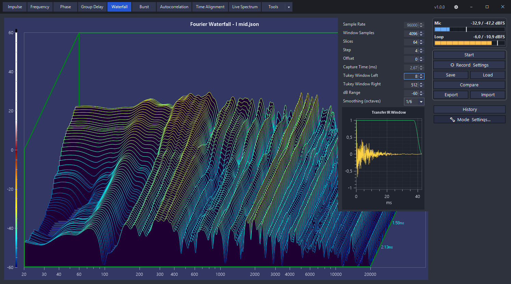
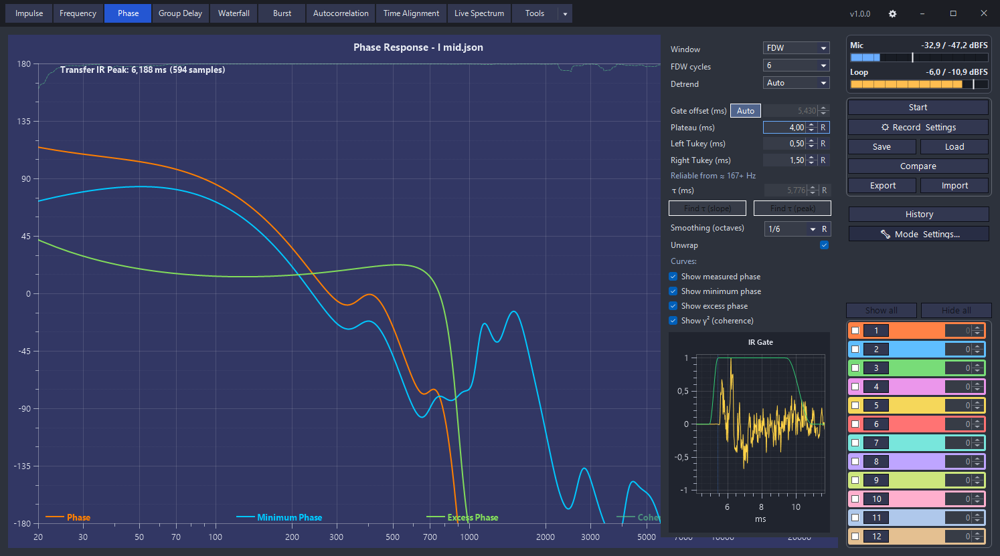
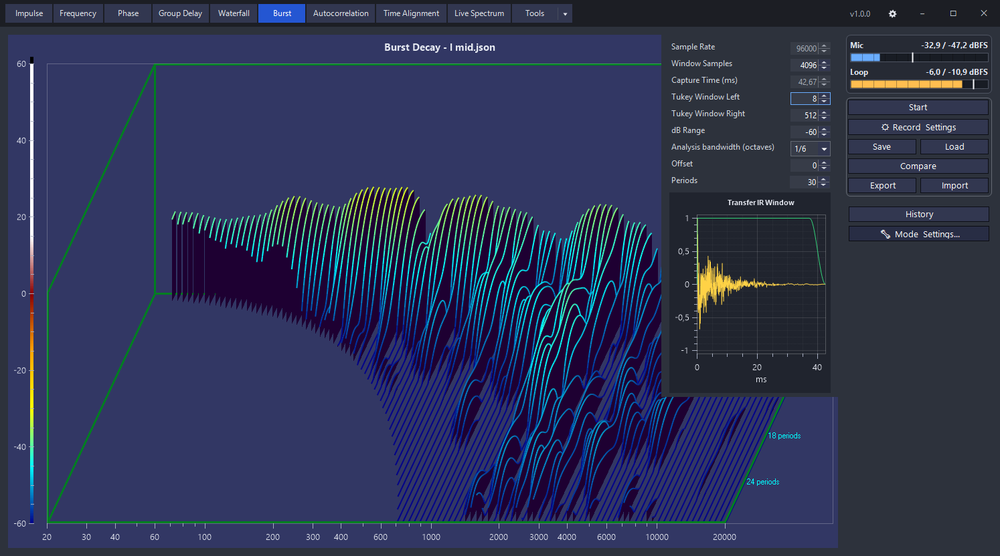
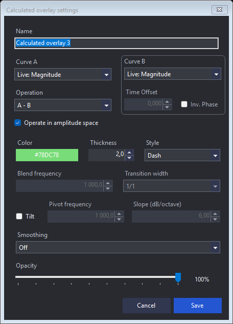

</details>

## Requirements

To run a release build: Windows 10 or later, working playback and recording
devices, a suitable loopback and microphone connection, and optionally an ASIO
driver. The self-contained release archives include the .NET runtime.

To build from source: Windows 10 or later, the
[.NET 10 SDK](https://dotnet.microsoft.com/download/dotnet/10.0) — `global.json`
pins the exact version (`rollForward: latestPatch`), so an older feature band
fails restore even though it is also .NET 10 — and Visual Studio 2026 with the
**.NET desktop development** workload, or the .NET CLI.

Use conservative playback levels when connecting physical equipment: start with
the output turned down and verify the signal path before measuring.

## Your First Measurement

If you are starting from zero, this is the minimal hardware path — roughly
€100–200 total:

- **A USB audio interface that can capture two channels at once** (any
  entry-level two-channel interface with phantom power works). The second
  channel matters because every measurement records a **loopback reference**
  alongside the microphone — that is what makes the timing analysis absolute.
  Many interfaces provide that loopback internally, as extra input channels the
  driver exposes; on one that does not, a spare physical input serves instead.
  Community-verified so far: **Focusrite Scarlett Solo 4th Gen** (the developer's
  own rig), whose loopback is internal.
- **An analog measurement microphone** (an inexpensive electret measurement mic
  with an individual calibration file is ideal). A USB measurement mic such as
  the UMIK-1 will **not** work — see the [FAQ](#faq) for why.
- **One cable**, to feed the system under test from an interface output — plus a
  second short one only if your interface has no internal loopback, run from
  another output straight back into a spare input.

Then, in about ten minutes, take one measurement and convince yourself the rig
works:

1. Wire it up: microphone → the mic input, and one output → the system's input
   (in a car: the DSP's aux/optical input, with only the driver under test
   unmuted). The loopback is a channel selection rather than a cable where the
   interface provides it internally; otherwise run a second output back into a
   spare input.
2. Start Resonalyze, open the measurement settings, select the interface, and
   assign the **input** and **loopback** channels. The measurement will not start
   without a loopback — that is by design. Set **Measurements** to at least `4`:
   the averaged sweeps lift the response out of the cabin's noise floor and
   produce the coherence curve that tells you which bands to trust.
3. Turn the playback level well down, place the mic where your head is, and run
   the sweeps while watching the [input level meter](REFERENCE.md#input-level-meter). Then
   look at Frequency Response, Impulse and Time Alignment, and press **Save** —
   saved impulse responses are the raw material for everything else.

Two things are worth knowing from the start. Averaging is not only noise
reduction: the runs are combined into one transfer IR **and** a coherence (γ²)
curve, debiased by the number of runs — the raw estimate over K averages reads
1/K even for pure noise, so the stored figure maps that null expectation to 0 and
stays comparable across run counts. And this path is impulse-response analysis;
for continuous, real-time work without capturing an IR — including the
moving-microphone captures used for EQ — use [Live Spectrum](REFERENCE.md#live-spectrum).

From there, capture and compare with [overlays](REFERENCE.md#plot-overlays), pin a second
measurement with [**Compare**](REFERENCE.md#compare), and revisit older captures in
[History](REFERENCE.md#measurement-history).

None of this is car-specific: the same two-inputs-plus-loopback rig measures
rooms, home loudspeakers, headphones, and complete electrical signal paths. For
acoustic work the microphone position and the room dominate the result; for an
electrical loopback measurement, check that the levels and impedances are safe
for both devices first.

If a device will not open, or the sample rate is refused, the backend is usually
the reason — see [Audio Backends](REFERENCE.md#audio-backends).

## Documentation

This page is the introduction. The rest is split in two, by the question you are
asking:

- **[MANUAL.md](MANUAL.md) — Professional Car Audio Tuning with Resonalyze.**
  The workflow, in order: measuring every driver, building the virtual car,
  designing the crossovers, equalizing each channel, aligning time and phase,
  exporting the tuning sheet, and verifying it back in the car. Start here if you
  have a car to tune.
- **[REFERENCE.md](REFERENCE.md) — every mode, panel and setting.** What each
  control does and why it behaves as it does. Start here if you want to know what
  a particular graph, read-out or option means.

## FAQ

**Can I use a UMIK-1 or another USB microphone?**

No — and it is physics, not stubbornness. Every measurement records a loopback
reference next to the microphone signal, and the two streams must share **one
hardware clock** to stay sample-accurate. A USB microphone is its own audio
device with its own free-running clock; pairing it with a separate
playback/loopback device gives two streams with an unknown run-to-run start
offset plus continuous drift, which silently corrupts every timing-sensitive
result. This is also why the settings do not offer a separate loopback device.

**Why is the loopback mandatory? REW works without one.**

The loopback records what actually left the playback chain and exactly when, so
every analysis is derived from the mic-vs-loopback **transfer function** — timing
becomes absolute rather than relative to an arbitrary trigger. That absolute time
base is what allows separate measurements, taken minutes apart, to be combined
later: it is the foundation of the measure-once-tune-at-your-desk workflow, of
the complex (vector) sum prediction, and of automatic delay alignment.

**Is one microphone position enough to tune a whole car?**

At that one point, yes, and exactly: sound pressure sums linearly, so the
predicted combination of individually measured drivers is the physics of what the
microphone would record — not an approximation. The honest boundaries are the
ones any single-point method has: the prediction holds at the microphone position
(put it where your head is), in the linear non-clipping regime, with the same
playback chain and mic position for every measurement, and at a roughly stable
cabin temperature. For frequency-response work you can go further with spatial
averaging. And the final judge of a tune is still your ears.

## Building from Source

```powershell
git clone https://github.com/DIMOSUS/Resonalyze.git
```

Then open `source/Resonalyze.sln`, or build and run from the command line:

```powershell
dotnet restore source/Resonalyze.sln
dotnet build source/Resonalyze.sln --configuration Release
dotnet run --project source/Resonalyze.csproj
```

Run all application and deterministic DSP tests with:

```powershell
dotnet test source/Resonalyze.sln -c Release --filter "Category!=Hardware"
```

That covers `Resonalyze.Dsp.Tests` (deterministic and synthetic),
`Resonalyze.App.Tests` (file formats and non-UI application logic against a fake
audio factory) and `Resonalyze.Audio.Tests` (PCM decoding, capture sessions,
WASAPI configuration). The filter drops the hardware smoke tests, which need real
WASAPI endpoints named through the `RESONALYZE_WASAPI_CAPTURE_ENDPOINT_ID` and
`RESONALYZE_WASAPI_RENDER_ENDPOINT_ID` environment variables.

For local performance profiling, build the dedicated Tracy configuration
(`dotnet run --project source/Resonalyze.csproj -c Tracy`), which defines
`TRACY_ENABLE` and references `Tracy-CSharp`. Add instrumentation through
`AppProfiler.Zone(...)`, `AppProfiler.FrameMark(...)` and
`AppProfiler.SetThreadName(...)`; zones are thread-bound and strictly LIFO, so
never let one span an `await`.

The Release executable is produced at
`source/bin/Release/net10.0-windows/Resonalyze.exe`; tagged releases also produce
portable `.zip` packages for `win-x64` and `win-arm64`, an x64 `Setup.exe`
installer, and NetSparkle appcast files. The `build.yml` workflow runs on every
push to `main` and every pull request: it builds the solution, runs all three
test projects, then proves the release path still works by producing the
single-file publish and compiling `installer/Resonalyze.iss`. Warnings are
errors.

## Architecture

```text
Resonalyze/
|-- source/                 WinForms application: composition root, measurement
|   |                       lifecycle, and plot presentation
|   |-- History/            Measurement history snapshots and persistence
|   |-- LiveSpectrum/       Live analyzer orchestration
|   |-- Measurements/       Sweep/noise orchestration, signal generation, IR files
|   |-- ModeSwitching/      The analysis-mode catalogue and tab controller
|   |-- Options/            Measurement and visualization settings panels
|   |-- Overlays/           Persistent overlay slots and calculated overlays
|   |-- Plotting/           OxyPlot model creation, annotations, and adapters
|   |-- Settings/           Settings file, schema migrations, update checking
|   |-- Shell/              Main form, title bar, commands, and docked settings
|   |-- TimeAlignment/      Loopback delay measurement UI and orchestration
|   |-- Tools/              EQ Wizard, Signal Generator, Virtual DSP, PEQ import/export
|   `-- Ui/                 Reusable WinForms controls and dialogs
|-- dsp/                    Reusable signal-processing library (no UI, no audio)
|-- audio/                  Audio drivers and device access (NAudio lives here)
|-- tests/                  App, audio, and synthetic DSP test projects
|-- installer/              Inno Setup script for the Windows installer
|-- assets/                 Images used by the README and the application
|-- .github/workflows/      CI builds and automated tagged releases
|-- global.json             Pinned .NET SDK version
`-- README.md
```

The three projects have deliberate boundaries. `Resonalyze.Audio` owns every
audio driver — MME, ASIO and both WASAPI modes — along with device enumeration,
format negotiation and capture lifecycle; NAudio is confined to it and is not
even referenceable from the application at compile time. `Resonalyze.Dsp` is pure
signal processing with no UI and no audio dependency: FFT analysis, windowing,
calibration, smoothing, impulse processing, phase analysis, group delay,
crossover and EQ design. The application project wires the two together.

## Technology

- [.NET 10](https://dotnet.microsoft.com/), [Windows
  Forms](https://learn.microsoft.com/dotnet/desktop/winforms/),
  [OxyPlot](https://oxyplot.github.io/)
- [NAudio](https://github.com/naudio/NAudio) and
  [NAudio.Asio](https://www.nuget.org/packages/NAudio.Asio)
- [Math.NET Numerics](https://numerics.mathdotnet.com/)
- [NetSparkle](https://github.com/NetSparkleUpdater/NetSparkle) — in-app updates
- [YamlDotNet](https://github.com/aaubry/YamlDotNet) — CamillaDSP profiles
- [PDFsharp / MigraDoc](https://github.com/empira/PDFsharp) — tuning-sheet PDFs

Third-party package licenses are listed in
[THIRD-PARTY-NOTICES.md](THIRD-PARTY-NOTICES.md).

## Contributing

Bug reports, reproducible measurement cases, DSP corrections, and focused pull
requests are welcome. Known technical debt and improvement ideas are collected in
[TODO.md](TODO.md) — a good place to look for a first contribution. When
reporting a measurement issue, include the audio interface and driver, the sample
rate and bit depth, the measurement mode, the relevant analysis settings, the
expected and actual behavior, and a screenshot or exception stack trace —
unexpected errors are appended to `crash.log` in the application data directory.

## License

Resonalyze is available under the [MIT License](License.md).
