<p align="center">
  
</p>

<h1 align="center">Resonalyze</h1>

<p align="center">
  <strong>Measurement-Driven Tuning for Car Audio and Multi-Way Loudspeaker Systems</strong>
</p>

<p align="center">
  Automatic time alignment with honest verdicts, a virtual DSP crossover
  designer, and engineering-grade acoustic analysis — impulse response,
  frequency response, phase, loopback-referenced timing, and live transfer
  functions — on Windows.
</p>

<p align="center">
  <em><strong>Measure each driver once, then leave the car: align, combine, and optimize
  the whole system from your desk — and only then type the result into the DSP.</strong></em>
</p>

<p align="center">
  <a href="https://github.com/DIMOSUS/Resonalyze/releases/latest"><strong>Download latest release</strong></a>
  ·
  <a href="#your-first-measurement"><strong>Your first measurement</strong></a>
  ·
  <a href="#building-from-source"><strong>Build from source</strong></a>
</p>

[](https://dotnet.microsoft.com/)
[](https://www.microsoft.com/windows)
[](https://learn.microsoft.com/dotnet/desktop/winforms/)
[](License.md)
[](https://github.com/DIMOSUS/Resonalyze/actions/workflows/build.yml)
[](https://github.com/DIMOSUS/Resonalyze/releases/latest)

**Resonalyze** is an open-source desktop application for measuring and tuning
multi-way loudspeaker systems — with a special focus on the hardest room of all:
the **car cabin**. It generates test signals, records the response through a
Windows audio device, and turns the captured data into engineering-focused plots
and concrete DSP settings: crossover corners, per-driver delays, polarity, and
PEQ. The same toolset measures rooms, home loudspeakers, headphones, microphones,
and complete signal paths.

Its center of gravity is the step most measurement workflows leave to you:
turning a set of per-driver measurements into one coherent system. **Auto delay**
and **Auto crossover** search the actual settings against the phase-aware
predicted sum, and every automatic result comes with an honest verdict — the
engine reports *why* it trusts an arrival, and refuses loudly instead of
fabricating a number when the measurement cannot support one.

> Resonalyze is under active development. Treat its results as diagnostic
> measurements, not as certified laboratory data.

## Project Showcase

<p align="center">
  
</p>

<p align="center">
  <strong>Virtual DSP</strong> — combine measured drivers through gain, delay,
  polarity, crossover filters, an all-pass stage, and PEQ before touching the
  hardware DSP.
</p>

<p align="center">
  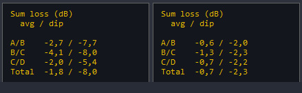
</p>

<p align="center">
  <strong>Does the automation actually help?</strong> Sum loss — how many dB the
  real phase-aware sum falls short of a phase-blind magnitude addition at each
  junction (average / worst dip). Left: a three-way system tuned by ear over
  years. Right: the same system after one <strong>Auto&nbsp;crossover</strong> +
  <strong>Auto&nbsp;delay</strong> pass — the worst dip shrinks from −8.0 to
  −2.3&nbsp;dB.
</p>

<table>
  <tr>
    <td width="50%">
      
      <p><strong>EQ Wizard</strong> equalizes any measured response — an impulse
      response, a captured overlay curve, or a moving-microphone RTA in dB SPL —
      toward its own target curve.</p>
    </td>
    <td width="50%">
      
      <p><strong>Time Alignment</strong> estimates loopback-referenced delay from
      the transfer impulse response, with confidence, levels, distance, and the
      arrival envelope.</p>
    </td>
  </tr>
</table>

## Why Resonalyze?

If you already use REW, OpenSoundMeter, or Smaart: those are broad measurement
toolboxes; Resonalyze is a focused, end-to-end tuning workflow for **active
multi-way systems**. REW's alignment tool sums a pair of measurements and its EQ
module corrects a response; Resonalyze operates one level up — separate
per-driver measurements on one absolute time base, complete virtual DSP chains, a
phase-aware sum of the whole system, and optimizers that work every crossover
junction and both stereo sides at once. Its home turf is the car, and its output
is not just a plot but the DSP settings themselves:

- **Built for multi-way active systems** — measure each driver separately, then
  design the whole system virtually: crossover corners, slopes and families,
  per-driver delay and polarity, all-pass stages, and PEQ, tuned against the
  phase-aware predicted sum. **Auto crossover** and **Auto delay** search these
  settings automatically, across both stereo sides in one run.
- **Honest automation** — an automatic tuner that guesses is worse than none.
  Arrival estimates carry confidence and verdicts, modal build-up latches and
  playback crosstalk are detected instead of aligned to, and when a measurement
  cannot support a decision the engine says so.
- **Loopback-referenced timing** — a recorded loopback channel is the time
  reference, so delay and transfer-function analysis are tied to the actual
  playback path, and separate measurements share one absolute time base.
- **Repeatable, calibrated measurements** — average up to 64 sweeps into one
  cross-spectrum transfer estimate with a per-frequency **coherence** (γ²) curve,
  and put the response in real **dB SPL** from an acoustic 1 kHz calibrator.
- **Crossover summation prediction** — the true **complex (vector) sum** of two
  measurements accounts for relative delay, polarity and phase the way dB-curve
  arithmetic cannot, with a companion **sum-loss** curve; Virtual DSP takes this
  to its conclusion with complete virtual chains per driver.
- **Fast compare-and-adjust work** — persistent and calculated overlays, target
  curves, on-plot labels, and a measurement history that keeps each entry's whole
  working state.

Resonalyze does not try to be every acoustic tool at once. For room EQ at home,
REW remains excellent; when the question is *"what delays, crossovers, and
polarities do I put into this six-channel DSP"*, that is what Resonalyze is for.

## Demo

A one-minute tour of the main features:

<p align="center">
  
</p>

## Download

Download the latest ready-to-run build from
[GitHub Releases](https://github.com/DIMOSUS/Resonalyze/releases/latest):

- `Resonalyze-Setup-vX.Y.Z-win-x64.exe` — the recommended installed build
- `Resonalyze-vX.Y.Z-win-x64.zip` — for most Windows computers
- `Resonalyze-vX.Y.Z-win-arm64.zip` — for Windows on ARM

The `.zip` builds are self-contained and do not require a separate .NET
installation; the installer adds shortcuts, uninstall support, and automatic
in-app updates for the installed x64 build, and a SHA-256 checksum file is
provided with every release. "Self-contained" refers to the runtime, not to your
data: by default every build keeps settings, history, overlays, Virtual DSP state
and logs in `%LocalAppData%\Resonalyze`. To make a `.zip` build fully portable,
create an empty file named `portable.flag` next to `Resonalyze.exe`. When a newer
release is detected, the version label in the title bar changes to **Update
available**: installed builds can start an **Automatic Update**, portable builds
offer a manual download.

> **Windows SmartScreen note:** the builds are not code-signed (certificates are
> expensive for a free open-source project), so the first launch may show a
> *"Windows protected your PC"* dialog. Click **More info → Run anyway**, or
> verify the download against the published SHA-256 checksum.

## Highlights

- **Band-defined exponential sweep** — the low and high frequency it must cover
  (20 Hz – 20 kHz) plus a per-octave pace, with the transfer estimate gated to
  the excited band, and impulse-response JSON save/load
- **Mandatory loopback for sweep/IR analysis** — every IR-based view is derived
  from the transfer function (harmonics and THD+N stay on the sweep
  deconvolution); Live Spectrum can additionally run as a reference-free RTA
- **Multi-sweep averaging** (1–64 runs) as a cross-spectrum estimate with a
  per-frequency **coherence** (γ²) curve, and an optional confirm-between-runs
  pause for spatial averaging
- **Analysis views** — frequency response, phase, group delay, waterfall, Burst
  Decay, autocorrelation, harmonic distortion, THD and THD+N, with
  reliability-anchored phase unwrapping, Fixed/**FDW** phase windowing, and
  minimum/excess-phase decomposition
- **Calibration** — the microphone's 0° profile from `.txt` / `.cal` / `.frd` /
  `.csv` files, any number of further named profiles, curves **estimated for an
  off-axis angle** from the microphone's geometry (with the uncertainty of that
  estimate shown), and **absolute dB SPL** from an acoustic 1 kHz calibrator
- **Time Alignment** — sub-sample delay from the transfer IR, refined by a
  GCC-PHAT cross-correlation
- **Crossover summation prediction** — in Frequency Response, the true **complex
  (vector) sum** of two measurements (`Main ⊕ Compare`) with Compare
  delay/polarity controls, plus a **sum-loss** curve
- **Virtual DSP** — up to eight L/R driver pairs (plus mono channels) through
  virtual chains: gain, delay, polarity, Butterworth / Linkwitz-Riley / Bessel /
  Chebyshev crossovers, all-pass and PEQ, with the complex sum, sum loss, phase
  tracking, junction read-outs, Δ L−R timing, **Auto crossover**, a stereo-aware
  **Auto delay**, a headphone audition, sessions and tuning-sheet export
- **Live Spectrum** — a real-time loopback transfer function with coherence, or a
  reference-free RTA in relative dB or dB SPL, with selectable excitation
  (leakage-free periodic pink, pink, brown/red, white, or Silent for the ambient
  room) and compensation of the noise's own spectral slope
- **Compare** a second measurement (file or History) across Time Alignment,
  Phase, Group Delay, Frequency Response and Impulse Response, and **overlays** —
  captured, calculated and target curves with styling, curve math,
  import/export, saved per-mode state, and a live editing preview
- **EQ Wizard** — up to 32 PEQ bands toward its own target, from an IR, an
  overlay slot or a text curve, with Auto Tune, cross-tool import/export and a
  printable tuning-sheet PDF
- **Signal Generator**, **Measurement History** with per-entry working state, a
  compact Mic/Loop level meter, and four audio backends (MME Compatibility, ASIO,
  WASAPI Shared and Exclusive) with backend-specific channel routing

## Gallery

Virtual DSP, the EQ Wizard, and Time Alignment are shown in the
[showcase](#project-showcase) above; the analysis views:

<table>
  <tr>
    <td width="50%">
      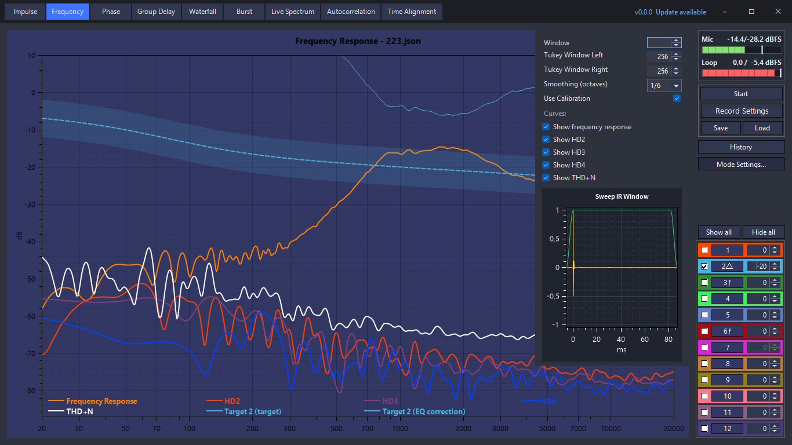
      <p><strong>Frequency Response</strong> — smoothing, calibration, an optional
      dB SPL scale, distortion curves, overlays, targets, and coherence.</p>
    </td>
    <td width="50%">
      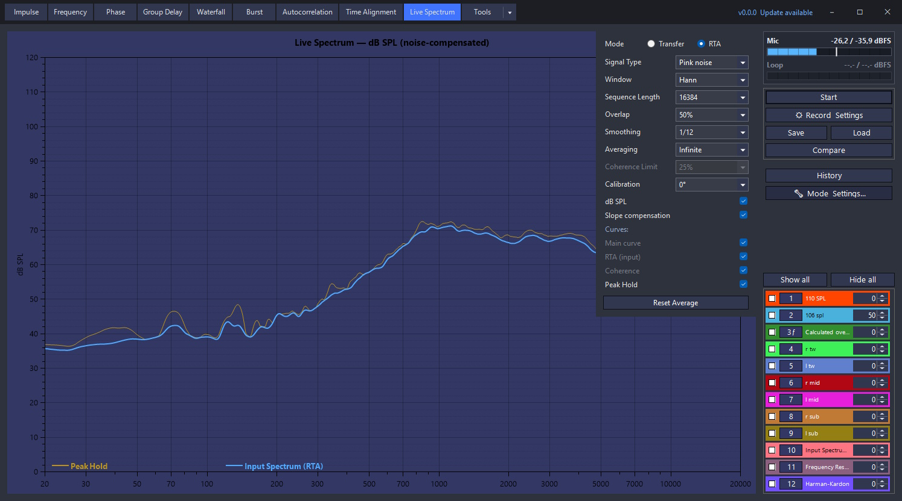
      <p><strong>Live Spectrum</strong> — a loopback transfer function with
      coherence and peak hold, or a reference-free RTA in dB SPL, on selectable
      excitation noise.</p>
    </td>
  </tr>
  <tr>
    <td width="50%">
      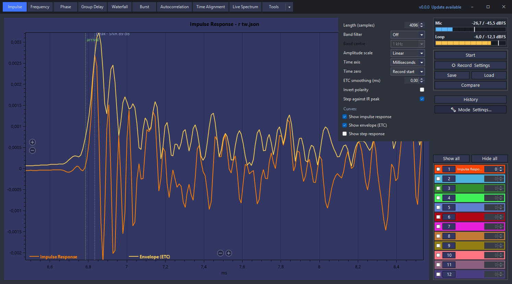
      <p><strong>Impulse Response</strong> — impulse, envelope (ETC) and step on
      one timeline, save it as readable JSON, and reuse it across analysis modes
      without re-measuring.</p>
    </td>
    <td width="50%">
      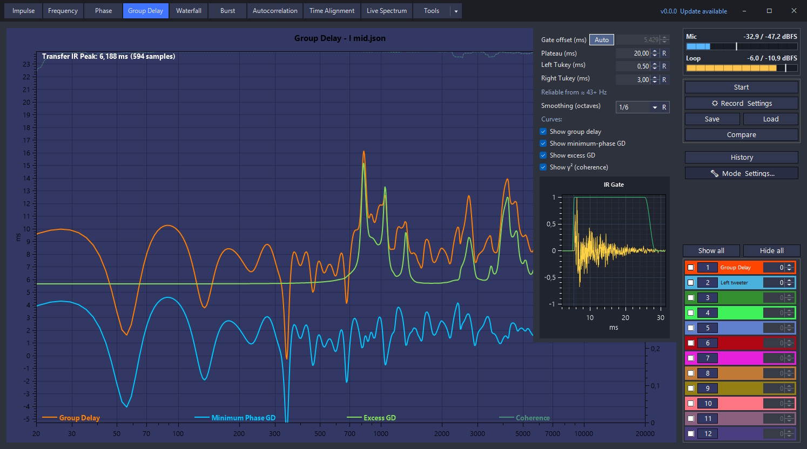
      <p><strong>Group Delay</strong> — timing from the transfer IR, with a
      millisecond gate, gate offset, and a live impulse-window preview.</p>
    </td>
  </tr>
</table>

<details>
<summary><strong>More plots</strong> — waterfall, phase, Burst Decay, overlays</summary>

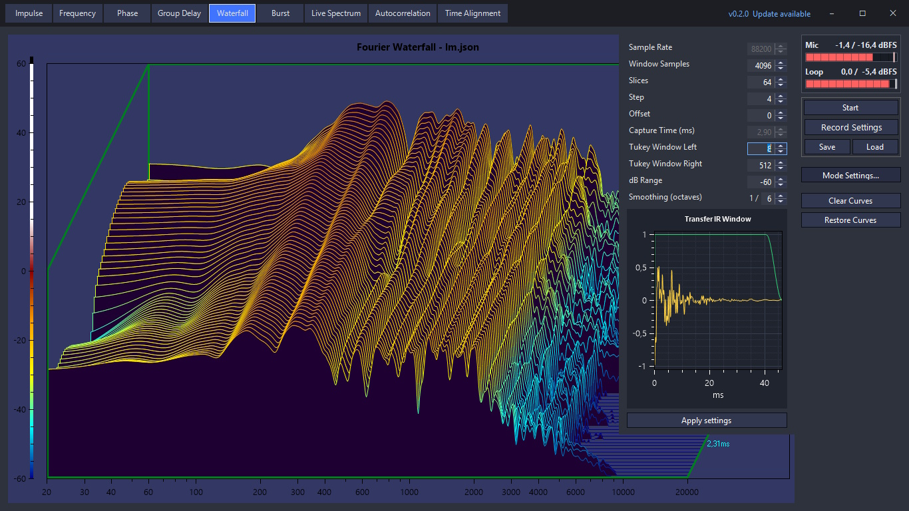
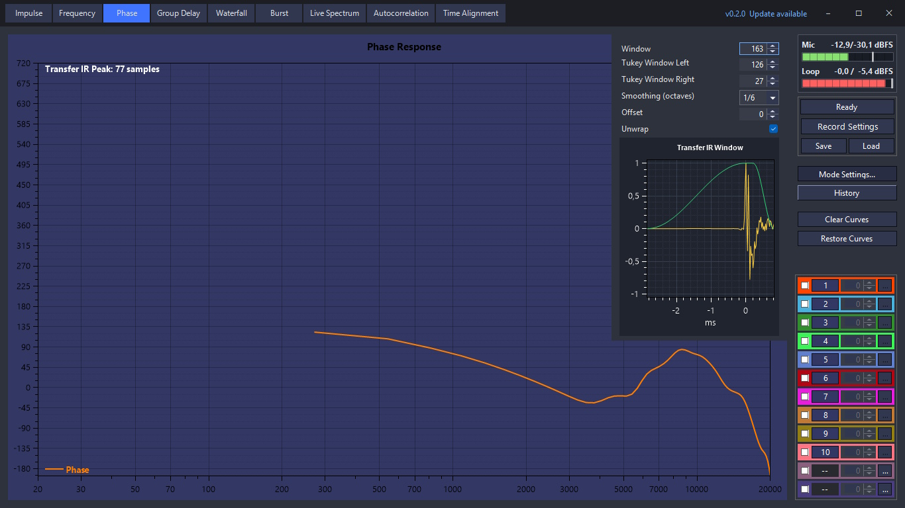
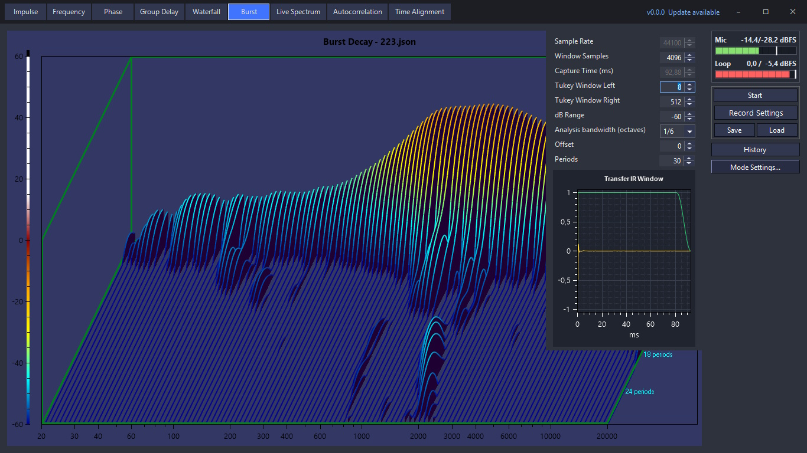
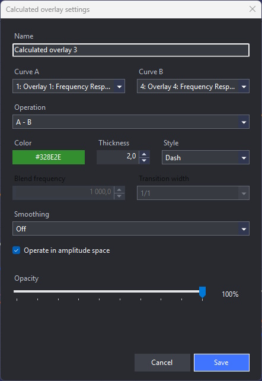

</details>

## Requirements

To run a release build: Windows 10 or later, working playback and recording
devices, a suitable loopback and microphone connection, and optionally an ASIO
driver. The self-contained release archives include the .NET runtime.

To build from source: Windows 10 or later, the
[.NET 10 SDK](https://dotnet.microsoft.com/download/dotnet/10.0) — `global.json`
pins the exact version (`rollForward: latestPatch`), so an older feature band
fails restore even though it is also .NET 10 — and Visual Studio 2026 with the
**.NET desktop development** workload, or the .NET CLI.

Use conservative playback levels when connecting physical equipment: start with
the output turned down and verify the signal path before measuring.

## Your First Measurement

If you are starting from zero, this is the minimal hardware path — roughly
€100–200 total:

- **A USB audio interface with at least two inputs** (any entry-level
  two-channel interface with phantom power works). Two inputs matter because
  every measurement records a **loopback reference** alongside the microphone —
  that is what makes the timing analysis absolute. Community-verified so far:
  **Focusrite Scarlett Solo** (the developer's own rig).
- **An analog measurement microphone** (an inexpensive electret measurement mic
  with an individual calibration file is ideal). A USB measurement mic such as
  the UMIK-1 will **not** work — see the [FAQ](#faq) for why.
- **Two cables**: one to feed the system under test from the interface's
  output 1, and one short cable from output 2 straight back into input 2 —
  that is the loopback.

Then, in about ten minutes:

1. Wire it up: mic → input 1, output 2 → input 2 (loopback), output 1 → the
   system's input (in a car: the DSP's aux/optical input, with only the driver
   under test unmuted).
2. Start Resonalyze, open the measurement settings, select the interface, and
   assign the **input** and **loopback** channels. The measurement will not start
   without a loopback — that is by design. Set **Measurements** to at least `4`:
   the averaged sweeps lift the response out of the cabin's noise floor and
   produce the coherence curve that tells you which bands to trust.
3. Turn the playback level well down, place the mic at the listening position,
   and run the sweeps, watching the input level meter.
4. Explore the views: Frequency Response, Time Alignment, Phase, Impulse.
   **Save** the impulse response — saved measurements are the raw material for
   everything else.
5. Measure each driver the same way, then open [Virtual DSP](#virtual-dsp) and
   let **Auto crossover** and **Auto delay** design the tune against the
   phase-aware predicted sum before you touch the hardware.

The full path with averaging, coherence, spatial averaging, and comparison is
described in [Measurement Workflow](#measurement-workflow).

## FAQ

**Can I use a UMIK-1 or another USB microphone?**

No — and it is physics, not stubbornness. Every measurement records a loopback
reference next to the microphone signal, and the two streams must share **one
hardware clock** to stay sample-accurate. A USB microphone is its own audio
device with its own free-running clock; pairing it with a separate
playback/loopback device gives two streams with an unknown run-to-run start
offset plus continuous drift, which silently corrupts every timing-sensitive
result. This is also why the settings do not offer a separate loopback device.

**Why is the loopback mandatory? REW works without one.**

The loopback records what actually left the playback chain and exactly when, so
every analysis is derived from the mic-vs-loopback **transfer function** — timing
becomes absolute rather than relative to an arbitrary trigger. That absolute time
base is what allows separate measurements, taken minutes apart, to be combined
later: it is the foundation of the measure-once-tune-at-your-desk workflow, of
the complex (vector) sum prediction, and of automatic delay alignment.

**Is one microphone position enough to tune a whole car?**

At that one point, yes, and exactly: sound pressure sums linearly, so the
predicted combination of individually measured drivers is the physics of what the
microphone would record — not an approximation. The honest boundaries are the
ones any single-point method has: the prediction holds at the microphone position
(put it where your head is), in the linear non-clipping regime, with the same
playback chain and mic position for every measurement, and at a roughly stable
cabin temperature. For frequency-response work you can go further with spatial
averaging. And the final judge of a tune is still your ears.

## Building from Source

```powershell
git clone https://github.com/DIMOSUS/Resonalyze.git
```

Then open `source/Resonalyze.sln`, or build and run from the command line:

```powershell
dotnet restore source/Resonalyze.sln
dotnet build source/Resonalyze.sln --configuration Release
dotnet run --project source/Resonalyze.csproj
```

Run all application and deterministic DSP tests with:

```powershell
dotnet test source/Resonalyze.sln -c Release --filter "Category!=Hardware"
```

That covers `Resonalyze.Dsp.Tests` (deterministic and synthetic),
`Resonalyze.App.Tests` (file formats and non-UI application logic against a fake
audio factory) and `Resonalyze.Audio.Tests` (PCM decoding, capture sessions,
WASAPI configuration). The filter drops the hardware smoke tests, which need real
WASAPI endpoints named through the `RESONALYZE_WASAPI_CAPTURE_ENDPOINT_ID` and
`RESONALYZE_WASAPI_RENDER_ENDPOINT_ID` environment variables.

For local performance profiling, build the dedicated Tracy configuration
(`dotnet run --project source/Resonalyze.csproj -c Tracy`), which defines
`TRACY_ENABLE` and references `Tracy-CSharp`. Add instrumentation through
`AppProfiler.Zone(...)`, `AppProfiler.FrameMark(...)` and
`AppProfiler.SetThreadName(...)`; zones are thread-bound and strictly LIFO, so
never let one span an `await`.

The Release executable is produced at
`source/bin/Release/net10.0-windows/Resonalyze.exe`; tagged releases also produce
portable `.zip` packages for `win-x64` and `win-arm64`, an x64 `Setup.exe`
installer, and NetSparkle appcast files. The `build.yml` workflow runs on every
push to `main` and every pull request: it builds the solution, runs all three
test projects, then proves the release path still works by producing the
single-file publish and compiling `installer/Resonalyze.iss`. Warnings are
errors.

## Measurement Workflow

This workflow covers impulse-response (IR) based analysis: a swept-sine
measurement is captured once and then inspected across the frequency-response,
phase, group-delay, impulse, waterfall, and burst-decay views. For continuous,
real-time analysis without capturing an IR, use [Live Spectrum](#live-spectrum).

1. Connect the output of the device under test to the selected input, either
   directly or through a microphone and a suitable interface.
2. Start Resonalyze, open the measurement settings, and select the audio backend,
   sample rate, devices or backend-specific input and loopback channels, the
   [sweep band and pace](#sweep-band-and-duration), playback channel, and
   analysis parameters. A **loopback reference channel is required**. To average
   several sweeps, set **Measurements** above `1`; enable **Confirm each run** to
   pause before each sweep so you can reposition the microphone.
3. Start a recording to capture the sweep. With averaging the runs are combined
   into one transfer IR and a coherence (γ²) curve, debiased by the number of
   runs: the raw estimate over K averages reads 1/K even for pure noise, so the
   stored figure maps that null expectation to 0 and stays comparable across run
   counts.
4. Watch the input level meter to confirm microphone level, loopback presence,
   and headroom before trusting the measurement.
5. Select the analysis view you need and adjust smoothing, windows, offsets and
   display options.
6. Capture and compare with [overlays](#plot-overlays): store the current curve
   in a slot, import a reference from text, or combine slots with curve math. Add
   a **target curve** overlay and switch its deviation readout to **EQ
   correction** to see how much to dial into an equalizer.
7. Pin a second measurement with [**Compare**](#compare), use **Save** to keep
   the captured impulse response, and **History** to review recent measurements
   or reload an older snapshot.

For acoustic measurements, microphone placement and room conditions strongly
affect the result. For electrical loopback measurements, make sure the signal
levels and impedances are safe for both devices.

## Graph Zoom and Limits

The analysis plot, the Time Alignment previews, the EQ Wizard and the Virtual DSP
graphs all take the same mouse and keyboard controls, laid out to match REW's
graph panel so there is nothing to relearn when you move between the two. (The
small previews inside settings panels and dialogs — the impulse window, the gate
preview, the history list — are fixed-scale by design and take none of this.)

| Gesture | What it does |
| --- | --- |
| Wheel | Zooms both axes around the pointer |
| **Alt** + wheel | The same, in fine steps |
| **Shift** + wheel | Horizontal axis only |
| **Ctrl** + wheel | Vertical axis only |
| Wheel over an axis | Zooms that axis alone |
| Wheel over the **end** of an axis | Moves that one limit, leaving the opposite end where it is |
| `x` / **Shift**+`X` | Zooms the horizontal axis out / in by about two, around the pointer |
| `y` / **Shift**+`Y` | The same for the vertical axis |
| Middle-button drag | Variable zoom: right and left work the horizontal axis, up and down the vertical one |
| **Ctrl** + right-button drag | Draws a zoom rectangle |
| Right-button drag | Pans |
| The **+** / **&minus;** buttons on the graph | Zoom the axis they sit against by about two, click after click; they appear while the pointer is over the plot, and hovering one names the axis it moves |
| Double click | Opens the graph limits dialog |
| **Ctrl+Z** | Steps back through the zoom-to-area, variable-zoom, zoom-button and fit-to-data moves (a wheel notch is its own undo — scroll it back) |
| **Ctrl+Alt+F** / **Ctrl+Alt+Y** | Fit to data / fit the vertical axis to data |
| **Home** or `A` | Back to the view's own default scale (also the **Defaults** button in the limits dialog) |

The **graph limits** dialog types the same ranges exactly — top, bottom, left and
right as numbers, plus **Fit to data**, **Fit Y to data** and **Defaults**, which
hands the axes back to the scale the mode chose for them. Use it when two
measurements have to be framed identically, for a screenshot or a before/after.

A zoom survives a redraw: changing a setting, running a new measurement or
toggling an overlay keeps the range you are looking at. The analysis plot
remembers one range per mode, so Frequency Response and Impulse Response do not
fight over a scale; the Time Alignment previews keep theirs across a
reconfiguration, and the EQ Wizard and Virtual DSP graphs hold theirs until
something changes what the axis means (loading a new wizard source, switching
the Virtual DSP view between magnitude, phase and impulse).

Axes you have **not** touched still scale themselves — the dB axis lifts its
ceiling for a padded loopback, group delay fits its data — so the automatic
framing steps aside only where you took over, and **Home** hands an axis back to
it. Frequency axes pan within 20 Hz – 20 kHz, the band the curves are computed
over.

Two Virtual DSP axes answer to their own rule on purpose. Its **Phase** view
spans ±180°, the entire range a wrapped phase can occupy, so the height is
locked: there is nothing above or below to travel to, and the limits dialog
leaves that axis out rather than offering a range that would only push curves
off screen. Its **Impulse** view zooms and pans in time — the millisecond around
each arrival is the part worth reading, and the gate window it opens on is far
wider — within that window, which stays the hard limit because the traces hold
nothing outside it. Editing the gate re-frames the axis, since that is a new
timeline; an ordinary redraw leaves your zoom alone.

## Mode Settings

The **Mode Settings...** button opens the current mode's settings in a docked,
title-bar-less panel aligned to the plot area, which stays open while the main
window has focus and switches automatically when you change modes. Settings apply
on the fly, redrawing the analysis while preserving the visible plot range. Each
curve-based view groups its plotted curves under a **Curves:** heading with one
checkbox per curve — Primary / HD2–HD4 / THD+N in Frequency Response, or
measured / minimum / excess in Phase. Numeric and dropdown settings carry a small
**R** button that resets them to the built-in default, the plot keeps the range
you zoomed to (see [Graph Zoom and Limits](#graph-zoom-and-limits)), and the
Frequency Response, Phase, Group Delay, Waterfall and Burst panels include a
compact impulse-window preview.

The **Tools** modes (EQ Wizard, Signal Generator, Virtual DSP) do not measure and
do not draw the shell's curves: they bring their own sources and controls, so the
measurement block on the right — input meters, **Start**, **Record Settings**,
**Save** / **Load** / **Compare**, **History** and **Mode Settings...** — is
hidden while one of them is open, and any docked Record Settings or History panel
closes with it.

## Phase and Group Delay

Phase and group-delay analysis run on the **loopback transfer impulse
response**, so they are only drawn when the active record contains one. Both use
a millisecond-based fixed gate built from a left Tukey fade, a flat plateau, and
a right Tukey fade. A **Gate offset** positions the end of the left fade inside
the analysis frame, and the **Auto** checkbox (on by default) keeps that offset
snapped to the detected start of the impulse response — the band-limited
first-arrival front, not the peak — falling back to the transfer-IR peak when the
detector cannot get a trustworthy reading. A read-only readout shows the gate's
lowest reliable frequency (≈ 1 / gate length).

Phase additionally offers **Window: Fixed / FDW**. Fixed is the single Tukey gate
across the whole spectrum; **FDW** builds a bank of time-aligned spectra whose
effective right-side duration follows `cycles / frequency`, so low frequencies
retain the long window while mid and high frequencies progressively reject the
late reflection tail. **FDW cycles** selects 4 (strongest suppression), 6 (the
recommended balance), or 8 (more late detail).

The Phase view shows four independently toggled curves: **measured phase**,
**minimum phase** (the part tied to the magnitude and correctable with EQ),
**excess phase** (measured minus minimum — the all-pass part an equalizer cannot
fix), and **coherence (γ²)** from averaged runs. **Detrend** removes one constant
delay before unwrapping: **Auto** estimates the slope-based excess delay from the
displayed spectrum and shows it in **τ (ms)**, **Manual** uses the editable
value, **Off** keeps the absolute slope. With Main and Compare together, Auto is
resolved once from Main and applied to both, so their real relative delay stays
visible as a linear phase difference.

Unwrapped phase uses a **reliability-anchored** algorithm instead of naive
bin-to-bin accumulation: each bin takes the 360° branch closest to a phase
predicted from the last trustworthy bin and the running slope. Bins well below
the local magnitude envelope — or with low coherence — are still displayed but
never trusted as anchors, so deep nulls and masked bands are bridged cleanly,
while a stretch too long to bridge honestly is blanked instead of guessed.

Group Delay reads absolute delay referenced to the start of the transfer IR, so a
peak well into the impulse response reports its true arrival time, and the curve
is computed energy-weighted so near-null bins follow the dominant energy instead
of the singularity. FDW is deliberately not applied here: an FDW phase curve is
direct-sound-oriented and is not the exact integral of the displayed fixed-gate
Group Delay, so selecting Fixed phase restores the compatible pair.

## Audio Backends

Resonalyze can run measurements through four backends, chosen in the measurement
settings dialog:

| Backend | Use it for |
|---------|------------|
| **MME Compatibility** | Ordinary Windows playback and recording devices. The most compatible option and the fallback when nothing else works. |
| **ASIO** | Audio interfaces with a native ASIO driver: lowest latency and arbitrary multi-channel routing. |
| **WASAPI Shared** | Windows endpoints without an ASIO driver, while other applications keep using the device. The endpoint's own mix format applies, so Windows may resample. |
| **WASAPI Exclusive** | The same endpoints taken exclusively: no Windows mixer in the path, and the requested sample rate and bit depth reach the hardware unresampled. |

Both WASAPI modes address devices by endpoint id rather than by index, so a
chosen device survives reboots and device reordering, and they use the same
microphone and loopback channel selection as MME.

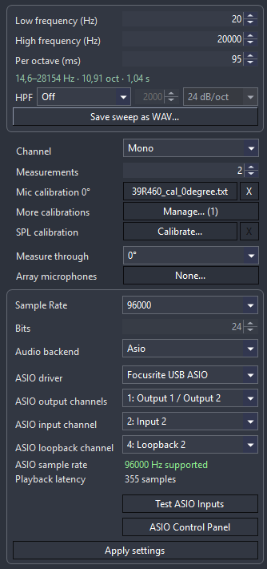

The microphone input is the primary measurement channel, and a loopback reference
channel is **required** for every measurement. Both are recorded simultaneously
and the main impulse response is derived as a transfer function from the loopback
reference to the microphone response, which removes the playback path (DAC,
amplifier, output routing) from the analysis. All IR-based views come from this
transfer IR; harmonic distortion, THD and THD+N use the ordinary
sweep-deconvolution response instead, drawing HD2–HD4 at the **excitation**
frequency (a second-harmonic hump from a 1 kHz drive appears at 1 kHz, not at
2 kHz) so each ends at Nyquist/n. Because those curves sit on the
sweep-deconvolution scale while the primary curve is loopback-normalized, their
vertical distance is not yet a calibrated distortion percentage.

### Sweep band and duration

The exponential sweep is described by the band it must cover: a **Low frequency
(Hz)** and a **High frequency (Hz)** anywhere between 20 Hz and 20 kHz, plus a
**Per octave (ms)** pace that sets the duration. Measuring a tweeter through a
2 kHz crossover no longer means sweeping from 20 Hz and pinning the top to
Nyquist — sweep the band the driver actually plays. Phase alignment is preserved
by rounding the band outward to whole start and end cycles, so the achieved range
always encloses the one you asked for and the fades live in guard bands outside
it; the **Actual range** line reports what the settings really deliver instead of
quietly shortening the sweep at run time, and the transfer estimate is gated to
the excited band, because outside it the transfer function is only microphone
noise divided by the reference's leakage skirt.

The excitation plays at a fixed **−6 dBFS**, and there is no control for it. That
is the level the [Signal Generator](#signal-generator) at its default **Level, %**
of `50` and the [Live Spectrum](#live-spectrum) noise already play at, so an
output level dialled in with either still holds when the sweep runs; a full-scale
sine sweep is also the worst case for the converter, which can clip on
reconstruction even when no sample exceeds full scale. The headroom costs 6 dB of
signal-to-noise ratio and nothing else, since the inverse filter carries the
reciprocal scale and the transfer function is scale-invariant.

**Save sweep as WAV...** writes the sweep the panel currently describes to a
24-bit WAV file — the same band, pace, sample rate, playback channel and level a
measurement would play, with a second of silence before and after — for measuring
from a source that is not this computer, such as a phone, a head unit or a USB
stick in the car. Measurement options otherwise apply as you edit them and touch
the audio session only when its identity changed; the audio backend, the device
format and its device panel commit together with **Apply settings**.

### Protective high-pass

Most installs keep a **protective high-pass** in the external DSP so that nothing
— a sweep included — reaches a tweeter or a small midrange below its safe band.
That filter is part of what the microphone hears, while the loopback reference is
captured *before* the DSP, so the measured transfer response carries the
protection as if it were the driver's own roll-off.

The **HPF** row tells Resonalyze which filter is in the way: `Butterworth` (6 dB
steps up to 48 dB/oct) or `Linkwitz-Riley` (12 / 24 / 48 dB/oct), plus its corner
frequency. The measurement then divides that known magnitude **and phase** out of
the loopback-referenced transfer impulse response — the equivalent of filtering
the clean reference through the same high-pass before dividing, while the
full-band loopback stays available to the H1 estimator and its coherence.

Inversion has a limit. The compensation is capped at **40 dB** of boost, because
deeper into the stop band the protection has buried the driver under the noise
floor and no arithmetic brings it back. Confidence is full until 6 dB before that
ceiling and fades to zero along a raised cosine at it; the same fade multiplies
the coherence curve, so a frequency the compensation could not recover reads as
untrustworthy instead of as a confident number. Analyses that choose a band to
work in read that masked coherence and stay out of the unrecoverable region —
[Time Alignment](#time-alignment)'s dominant band above all, which would otherwise
happily time a driver on boosted noise.

Leave it `Off` when there is no protection in the chain, or when the loopback is
taken *after* the DSP — the reference already contains the filter then, and the
division has removed it before this setting could.

### MME Compatibility

Use **MME Compatibility** for ordinary Windows playback and recording devices.
(Older releases and the settings file call this backend `Wave`.) You choose the
playback device, the recording device, the sample rate, the playback channel, and
the microphone and loopback input channels (`Left` / `Right`, loopback required).

The loopback is captured from a second channel of the **same** recording device
as the microphone, so both signals share one hardware clock and stay
sample-accurate; a second input device would put the two streams on independent
clocks with an unknown offset plus drift, so Resonalyze does not offer a separate
loopback device at all.

### ASIO

Use **ASIO** for audio interfaces with a native ASIO driver. You choose the
driver, the sample rate, the microphone and loopback input channels (loopback
required), the output channel pair, and the routing within it: `Mono` sends the
signal to both channels of the pair, `Left` and `Right` to one of them, `Stereo`
to both. Before applying, Resonalyze checks whether the driver supports the
current sample rate, showing its playback latency and a
"supported / not supported" line; a driver already in use by another application
is reported before the measurement starts.

**ASIO Control Panel** opens the driver's own panel for buffer size or clock
source; **Test ASIO Inputs** captures a short diagnostic snapshot that verifies
the microphone and loopback channels are truly separate and not mono-summed by
the driver or the interface's control software.

## Input Level Meter

The right-side control column includes a compact two-channel input meter for
`Mic` and `Loop`: the bar shows a filtered RMS level, the bright vertical marker
Peak Hold, and the text `Peak / RMS` in `dBFS`. After a measurement completes it
retains the final levels from the last valid capture, which makes it easy to spot
missing loopback, a weak microphone level, or overload.

What a level meter **cannot** show is analog distortion: an input stage driven
past its limit distorts long before its digital level reaches full scale, so a
loopback reading a comfortable −15 dBFS can still deliver a badly misshapen copy
of the sweep. That matters most for the reference, because every analysis is the
microphone divided by it — a nonlinear reference produces a wrong answer, not a
noisy one, and coherence stays high while it happens. Resonalyze therefore reads
each channel's own harmonic content and names the offender when it refuses a
measurement:

> The LOOPBACK REFERENCE is distorting: its harmonic packets read −8.1 dB
> relative to the direct one, where the microphone reads −40.6 dB, and it peaked
> at only −18.1 dBFS, so the input meter had nothing to show.

The fix is to attenuate what reaches the loopback **input** — a line input
instead of an instrument one, a pad in the cable, or a lower playback level — but
only as far as it takes to leave the input's linear region, since a pad
attenuates the signal and not the input's own noise and a reference driven toward
the noise floor pays for it in coherence.

## Live Spectrum

The **Live Spectrum** mode runs in one of two explicitly chosen **Mode**s.

**Transfer** is a live, dual-FFT **transfer-function** analyzer. It plays a
continuous excitation signal, uses the configured loopback channel as a reference,
and shows the real-time relationship from loopback to microphone, which suppresses
input-side content not correlated with the playback signal. Alongside it a
**coherence** curve (γ²) is drawn on a secondary 0-to-1 axis: values near 1 mark
trustworthy frequencies, low values flag bands dominated by noise, reflections, or
non-linear behavior. The estimate averages in the power domain, and on-screen
smoothing is referenced to wall-clock time, so the response stays consistent
regardless of overlap and sequence length. The mode needs a loopback reference:
without one the choice turns amber and the analyzer runs reference-free anyway,
because there is nothing to divide by.

**RTA** is that reference-free analyzer as a deliberate choice — the microphone's
own magnitude spectrum, no transfer function and no coherence. It is what the car
workflow actually wants: a moving-microphone average, where there is no reference
to divide by. It captures the microphone alone even when a loopback is configured,
so the sound card is asked for exactly the channel that is used.

Two checkboxes belong to RTA and are muted in Transfer:

- **dB SPL** puts the RTA on a true absolute axis (mic level plus the
  [SPL anchor](#sound-pressure-level-db-spl) offset), integrated as power per
  fractional-octave band. A transfer function is a dimensionless ratio with no
  scalar level under noise excitation, which is why the scale exists here only.
- **Slope compensation** removes the tilt the *excitation itself* prints on the
  curve, so a flat system reads flat whatever the noise colour: pink otherwise
  falls 3 dB per octave on the per-bin dB axis, and on the banded dB SPL display
  even flat white noise climbs 3 dB per octave, since a band's power grows with
  its width. What is subtracted is the shape the chosen noise really has —
  modelled from the generator's own filters, not from a nominal slope, so brown's
  leaky integrator and pink's filter bank are compensated to their true response
  and not to a straight line their bass does not follow. The curve is pinned at
  1 kHz, the plot title says it is compensated, and an overlay captured from it
  keeps the compensation. `Silent` has no known excitation spectrum, so the
  checkbox is unavailable there.

**Signal Type** selects the excitation: **Pink noise (periodic)** (the default —
one FFT-length period of exactly pink noise, looped; being periodic with the
analysis block it is measured **leakage-free** with a rectangular window and
converges almost instantly, so **Window** is forced to `Rectangular` and
**Overlap** to `Off`), **Pink noise** (continuous random, −3 dB/octave), **Brown
/ red noise** (−6 dB/octave, for subwoofer and room-mode work), **White noise**
(flat energy per hertz), or — in RTA only — **Silent**, which plays nothing and
measures whatever the microphone hears: the ambient room, or an external source
playing its own material.

Further settings: **Sequence Length** (the FFT block size), **Overlap** (`Off` /
`50%` / `75%`, reclaiming the samples a tapering window attenuates at the block
edges), **Smoothing**, **Window** (`Hann`, `Flat Top` for amplitude accuracy on
tones, `Blackman-Harris` for leakage suppression, or `Rectangular`), and
**Averaging** (`Fast` / `Medium` / `Slow` time constants, or `Infinite`, with
**Reset Average**). The drawn curves are the **Main curve**, **Peak Hold**,
**Coherence**, and **RTA (input)** — the plain magnitude spectrum of the
microphone alone, drawn beside the transfer function while you are in Transfer
mode, and the whole plot in RTA mode, where it can be captured into an overlay
slot and equalized in the [EQ Wizard](#choosing-what-to-equalize).
**Coherence Limit** draws any frequency below the chosen percentage (default
`25%`) dimmed and dashed, and a **processing overload** warning appears if the CPU
cannot keep up. Changing anything the capture itself depends on — the mode, the
signal, the window, the FFT length, the overlap — clears the accumulated average
rather than redrawing the previous run's data under the new settings.

Every magnitude-smoothing selector (Frequency Response, Live Spectrum, Fourier
Waterfall, Virtual DSP, EQ Wizard, magnitude overlays) also offers
**Psychoacoustic**: smoothing whose width follows frequency — 1/3 octave at and
below 100 Hz, narrowing smoothly to 1/6 octave from 1 kHz upward. It shapes
magnitude curves only; phase, group-delay and coherence traces fall back to the
plain 1/6-octave width, and the Auto delay engine never reads display smoothing.

## Measurement History

The **History** button opens a docked panel with a list of recent snapshots, a
compact frequency-response preview for the selected row, and row tooltips
carrying capture metadata (time, mode, sample rate, duration, channel, peak
index, stored meter levels). Entries come in two kinds: `RAM` for in-memory
snapshots from the current session, and `FILE` for saved IR files remembered
across launches; the newest appear at the top, in a stable chronological order.

Double-click a row to load it. Use **Save** to turn an in-memory snapshot into a
regular IR JSON file, **Delete** to remove an item from history without deleting
the file from disk, and **New session (reset to defaults)** to start clean — all
per-mode settings return to their defaults and the current measurement and
overlays are cleared, while audio device and routing settings, the history list
and saved files are left intact.

Each entry also remembers the working state it was last used with: the active
mode, every per-mode setting, and which overlay slots were shown — so switching
to another entry and back restores the whole working context, not just the
impulse response. Only a small rolling set of unsaved in-memory snapshots is
retained.

## Compare

The **Compare** button overlays a second measurement on top of the current one,
so two responses can be read side by side with the *same* analysis settings.
Choose the reference from a file (**Choose file…**) or from a **History** entry;
the button then shows its name, and **Clear** removes it. Compare is applied
everywhere it is meaningful, always recomputed with the current mode's settings:

- **Time Alignment** — the reference envelope is overlaid on the peak preview
  with its own markers, and the delay table gains a second block whose every
  value shows the delta against the source (for example `1.006 (+0.010)`). In
  **Auto** band mode the analysis band is then the one the two records SHARE —
  the overlap of their own dominant bands, labelled `shared with Compare` —
  because two arrivals are only comparable where both drivers play, and a band
  taken from the source alone would make the delta depend on which of the pair
  was loaded first. Records that barely overlap (a subwoofer against a tweeter)
  keep the source's own band.
- **Phase** and **Group Delay** — the reference curves use the identical
  gate/window and smoothing, drawn dashed and dimmed; Phase Auto detrend is
  resolved once from Main and reused, preserving their relative delay.
- **Frequency Response** and **Impulse Response** — the reference magnitude and
  impulse are drawn alongside the source (harmonics stay source-only), and with a
  transfer IR an absolute sample timeline lets the two arrivals be compared.

A reference is only drawn when its sample rate matches the current measurement.
The source and Compare curves are also selectable as live operands in a
[calculated overlay](#plot-overlays), so their difference can be watched live
while you tune the analysis window.

## Impulse Response

The **Impulse Response** mode draws the **loopback transfer IR** from the record
start through the peak and on into the tail, so the arrival, the reflections and
the decay are one picture — and so two records can be read against one clock.

The traces are built over the whole record, so navigating it is a gesture and not
a trip to the settings panel: zoom out to the end of the tail, in to a single
sample, with the usual [graph controls](#graph-zoom-and-limits). **Length** only
frames the view the mode OPENS on — that much tail past the peak — because a
deconvolved record is mostly silence and opening on all of it would draw the
response as one vertical line.

Three traces share that timeline, each switched on under **Curves:**

- the **impulse response** itself;
- the **envelope (ETC)** — the analytic-signal envelope, where reflections read
  as separate arrivals instead of as interference in the waveform. **ETC
  smoothing** averages it over a chosen duration, centred so nothing moves in
  time;
- the **step response** — the running integral of the impulse: what the system
  would do if the input jumped to a level and stayed there. It is always drawn
  normalized on an axis of its own (against the impulse peak, or against its own
  peak when **Step against IR peak** is cleared), because a record with any
  low-frequency content integrates into a step many times the impulse peak.

**Band filter** reads all three traces through a zero-phase band — a full octave or
a third of one, centred on any ISO preferred frequency. This is how you see *when*
a band arrives: a full-range impulse buries every band's arrival in one waveform,
and the filter is the same raised-cosine bandpass the
[Time Alignment](#time-alignment) probe uses, so the view and the delay estimator
read the record through the same instrument. Zero phase means the filter delays
nothing — at the price of a symmetric ring around each arrival, which is visible
in the trace and is why an unfiltered arrival marker stays on the plot beside it.
With a band selected the plot title names it and the peak marker becomes the **band
peak**, captioned with how long after the record's arrival that band peaks — the
figure the filter exists to produce, since a driver's low band does not arrive when
its broadband front does. The caption appears only where the record actually carries
the driver's energy at that centre: on the archived cabins a tweeter measured at
63 Hz still had a "band peak", and it landed seconds after the arrival because what
peaked there was leakage. It is stated as time and not as a distance on purpose —
this delay is the driver's own build-up, not a path through air.

**Amplitude scale** selects raw **Linear** sample values — absolute, and
therefore comparable between records — or a normalization against the peak, in
**% of peak** or in **dB re peak**. With a [Compare](#compare) reference loaded,
both curves are normalized against the *same* peak, the main record's: how far
one sits below the other is the point of the comparison, and normalizing each to
itself would erase exactly that.

**Time axis** switches the unit between milliseconds and samples; the tracker
reads both either way. **Time zero** chooses where the axis puts its origin — the
record start, the estimated **first arrival**, or the **peak**. This is a view
setting: the measurement is never rewritten, because Time Alignment, the Virtual
DSP gate pins and every saved offset are statements about the record's own
absolute timeline. When zero sits on an arrival, the tracker also reads the path
length that time corresponds to in air. **Invert polarity** flips the displayed
impulse and step the same view-only way.

An [overlay](#plot-overlays) captured here stores the record's own coordinates —
absolute sample indices and raw levels — and is redrawn under whatever framing the
view has later, so it follows the time unit, the time zero, the amplitude scale and
the polarity flip instead of staying frozen in the ones it was taken under. Levels
are re-normalized against the LIVE record's peak, so how far the snapshot sits below
what is being measured now stays readable. Two things cannot be undone that way and
travel baked in: the band filter and the ETC smoothing are part of the values. A very
long record is stored thinned to its extremes, so zooming an overlay to sample level
shows the thinned outline where the live trace shows samples.

Two markers name the instants the rest of the app acts on: the estimated
**arrival** — the same shared figure the Auto gate offsets are anchored on — and
the strongest **peak**, labelled with the record's signal-to-noise ratio whenever
the envelope is on screen to measure it against — the same figure
[Time Alignment](#time-alignment) reads off that record, because it is computed the
same way from the same envelope.

## Time Alignment

The **Time Alignment** mode analyzes acoustic delay from the currently active
measurement record, for practical loudspeaker, microphone, and channel alignment
work where the result has to be more precise than a single audio sample.


It reads the **transfer impulse response** already stored in the current record,
so it works immediately after a sweep captured with loopback or after loading an
IR JSON file with transfer-response data. The delay estimator uses a robust
two-stage chain: the transfer IR, through an optional raised-cosine bandpass
window, gives an analytic-signal envelope whose first arrival and strongest peak
are the coarse, polarity-blind anchors; a **GCC-PHAT** (phase-transform)
correlation from the same spectrum then refines each anchor to sub-sample
precision wherever its own peak is trustworthy.

The first-arrival search rejects **pre-ringing sidelobes** by testing every
candidate against the analysis kernel's own envelope — an arrival can pre-ring no
louder than that allows at a given distance, so a candidate above the ceiling is
a genuine arrival no matter how the surroundings look (which keeps weak direct
sound alive in reverberant bass), and one at or below it is confirmed as pre-ring
by its mirror twin.

It also refuses to read a **ripple on the foot of a wave packet** as that
packet's arrival. A cabin's comb interference leaves small bumps a fraction of a
millisecond ahead of a front; they are far too loud to be the transform's own
ringing, so the rule above rightly keeps them, yet they are not the front. A
candidate must reach a quarter of the strongest envelope level of its own packet
— the level the broadband onset calls the onset — or the packet's own front is
taken instead. The packet runs one millisecond forward and ends early at a null
deep enough (20 dB) to resolve two events, because destructive interference nulls
faster than an envelope rises: an earlier arrival separated from what follows by
such a null is a separate arrival and keeps its own timing, however strong and
however close the next packet is, and the rising edge of a later reflection can
never be borrowed to dwarf the direct sound in front of it. A soft direct arrival
sitting under a room mode milliseconds later still wins for the same reason,
which is what the search depth exists for. Without this two identical drivers
in opposite doors could be measured at different points of their fronts — one at
its packet peak, the other 20 dB down its own foot — and the level difference
lands in the reported delay: on a field pair, 0.31 ms of a 1.45 ms split.

The second stage is what makes the numbers trustworthy. The transfer IR's
spectrum already carries the microphone-to-loopback cross-phase, so whitening it
to unit magnitude over a soft band mask (weighted by coherence where the record
has it) collapses the correlation to a sharp peak at the true broadband delay,
independent of the driver's own magnitude shape. The search runs on peak
magnitude, so a polarity-inverted arrival is located just as reliably. Where the
whitened peak is too weak to trust, the estimate falls back to the envelope's own
interpolated peak instead — and says so: the **alignment confidence** read-out
gives the normalized height of the whitened correlation peak as `Alignment: NN%`
and names the method that placed the sub-sample position, `GCC-PHAT` or
`envelope fallback`. The payoff is delay estimates such as `87.0 samples` or
`1.972 ms` resolved to a hundredth of a sample.

When the strongest peak lands well after the first arrival — the classic
narrowband-subwoofer case — Time Alignment flags it and points you at the first
arrival, so a modal or reflected peak is not mistaken for the driver's real
timing; the flag requires a real valley (6 dB) between the two peaks, since a
low-frequency driver's direct sound can keep rising for milliseconds.

The mode recalculates when you switch into it and as you change the bandpass
settings, and reports signal quality from the analysis envelope and the stored
meter snapshot: a color-coded `Excellent` / `Good` / `Fair` / `Poor` **signal
grade** from the recording's SNR; the **first-arrival prominence** relative to
the strongest peak (a low value means the pick sits on a broad leading edge —
normal for band-limited low-frequency drivers); peak and RMS levels in dBFS; a
`CLIP` warning; and a `FULL SCALE` marker for a loopback reference at 0 dBFS.

The measured time, distance, and sample count are clickable: click a result line
to copy just the numeric value to the clipboard. With the bandpass window
enabled, a frequency-domain preview of the pass band is shown along with the
envelope around the detected peak; selecting a [Compare](#compare) reference
overlays its envelope there and adds a second delay-table block. Both envelopes
are drawn against **one** reference — the Main record's strongest peak, named in
the axis title — because how far a pick sits below its own peak is a figure of the
analysis, while the peak is a property of the record: normalizing each curve to
its own pick made two records that differ by 4 dB read 19 dB apart.

## Saving and Loading Impulse Responses

After a sweep completes, click **Save** to store the measured impulse-response
data under a timestamped name such as `Resonalyze-IR-2026-06-15_14-30-00.json`.
Files are indented, human-readable JSON containing the format and schema version,
save time, sample rate and bit depth; the requested and achieved sweep band with
its duration and sample count; the playback channel and measurement mode; the
sweep-deconvolution samples plus the optional loopback transfer-function samples;
optional coherence (γ²) data with the run counts; the stored meter values; an
optional [SPL calibration anchor](#sound-pressure-level-db-spl); and embedded
preview frequency-response data for the History panel.

Click **Load** to open a previously saved response. Resonalyze validates the file
first, rejects files below `44100 Hz`, restores the measurement metadata into the
active record, and redraws the current view from the loaded data — without
rewriting the audio-device configuration. Saving and loading are disabled while a
measurement is running. The current file format identifier is
`resonalyze-impulse-response`, version `7`.

### Importing a sweep recorded elsewhere

**Load** also accepts a `.wav` file — a recording of the sweep made outside
Resonalyze, by a phone, a handheld recorder or a DAW, while the excitation was
played from something else (typically the file written by
[Save sweep as WAV...](#sweep-band-and-duration)). The recording is deconvolved
with the inverse filter of the sweep the **current settings** describe, and the
transfer function is estimated against that same sweep standing in for the
loopback reference. If the file has more than one channel, the one whose content
actually matches the sweep is measured — not the loudest, because a dead input's
hum can easily out-measure a quiet microphone.

The recording may be far longer than the sweep. The excitation is found by
matching the sweep against the recording rather than by looking for something
loud, which reaches much further down since matching concentrates the whole
excitation into one peak (~46 dB for a two-second sweep); only the excitation
plus 0.5 s before and 2 s of decay after is then analyzed. Player and recorder
run on their own clocks, so the sweep comes back slightly stretched or squeezed:
Resonalyze finds the stretch that sharpens the arrival most and rebuilds the
reference at that rate. The settings must match the sweep the recording was made
from, and Resonalyze checks that rather than trusting it — against the wrong band
or pace a recording deconvolves into a smear instead of an arrival, and arrival
sharpness tells the two apart. A wrong sample rate, a sweep running past the end
of the recording, a clipped take, and one that does not deconvolve credibly are
all refused, leaving the measurement on screen untouched.

Two things such a measurement cannot carry: absolute time, since where the
arrival landed was decided by when the recorder was started, and a
[dB SPL](#sound-pressure-level-db-spl) anchor, since the recording chain's gain
is unknown. Because the origin means nothing it is chosen rather than inherited —
the impulse response is rigidly shifted so the arrival lands at 10 ms, preserving
every delay inside the measurement. That the timing is local travels with the
measurement into the saved `.json` and the history, so everything comparing one
arrival against another refuses it by name: [Time Alignment](#time-alignment)
declines it as a source and as a Compare partner, and
[Virtual DSP](#virtual-dsp) will not sum it with another measurement.

## Plot Overlays

Each supported overlay view provides twelve universal slots, each holding one of
three kinds: a **Captured** snapshot of a curve currently on the plot; an
**Operation** between two operands, each a live plot curve or a captured slot
(`A - B`, `B - A`, `A + B`, `(A + B) / 2`, `|A - B|`, or a frequency blend), plus
the **complex (vector) sum** described below; or a parametric **Target** compared
against a source.

Slots are stored automatically as human-readable JSON under the application data
directory, as `overlays/<AnalysisMode>/overlay-01.json`. The numbered button
opens a menu to **Capture curve**, **Import from text**, **Export to text**, or
switch the slot to a **Calculated overlay** or **Target**; the checkbox shows or
hides it, the numeric control applies a vertical offset, and **⚙ Settings…**
opens its dialog. A live-curve operand re-reads the plot on every rebuild, so a
calculation over it — for example the difference between the source and a Compare
curve — updates live as the analysis settings change.

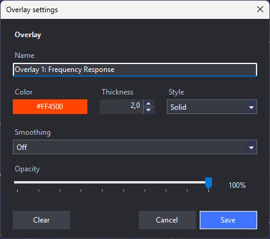


Captured overlay settings cover a name, line color, thickness, style and opacity,
optional `1/48` … `1/3` octave smoothing, and a **Clear** action for that slot
alone; calculated overlays add the operands, the operation, optional
amplitude-space math for dB views, and independent smoothing applied afterwards.
In **Phase Response** the difference operations are phase-aware: a wrapped
operand makes the difference take the shortest angular distance so it never jumps
by ±360°. Overlay JSON always stores the unsmoothed source points, so changing
smoothing is lossless, and operations are applied to the displayed Y values after
source offsets — so addition and averaging on a decibel plot are arithmetic on dB
coordinates, not physical summation of acoustic power.

### Target curves

A **Target** overlay compares a source against a parametric target shape and
draws two curves from the one slot: the **target** itself and the **deviation**
(source minus target), plus an optional shaded **tolerance band** (±dB). The
source is either a captured slot or the current measurement — the Frequency
Response curve, or the Live Spectrum trace, which target and deviation follow
frame by frame.

The shape is built from four editable terms — an overall **tilt** around a 1 kHz
pivot, a **bass shelf**, a **treble shelf**, and a **presence** bump/dip — with
editable presets: `Flat`, `Room (gentle)`, `Room (Harman-style)`, `Warm`, `Car`,
`Car (mild)`, `Car (bass)`, `House / bass boost`, `X-curve (cinema)`, `Smiley`,
`BBC dip`, `Custom`. The three car presets share one in-car shape — a bass shelf
over a flat 400 Hz…5 kHz band, then a gentle rolloff reaching ≈3 dB by 20 kHz —
and differ only in how much bass they lift (+6, +9 or +12 dB); a new target
overlay opens on `Car`. `X-curve (cinema)` follows ISO 2969 / SMPTE ST 202 —
flat to 2 kHz, then ≈-3 dB/oct. The deviation curve is **Deviation**
(`measurement − target`), **EQ correction** (`target − measurement`, the gain to
dial into an equalizer), or **None**. Target overlays are available in Frequency
Response and Live Spectrum.

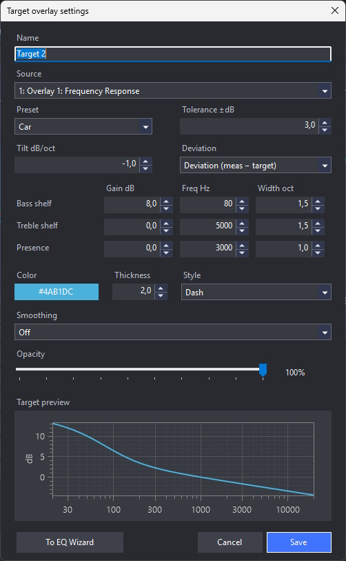

### Import and export

**Import from text** loads a captured overlay from a plain-text file of `X Y`
pairs (for example, `123.4 -5.5`), one per line, parsed leniently: any separator,
extra columns ignored, non-numeric lines skipped. **Export to text** writes the
slot's current curve in the same format; for a Target slot, **Export deviation**
writes the deviation or EQ-correction curve. Exported files open with a commented
`# resonalyze-curve` header recording what the curve is — the analysis it came
from, its role, and the sample rate where one applies. Foreign files without the
header still import as before; the header only lets Resonalyze recognize its own
curves on the way back in, so that the [EQ Wizard](#eq-wizard) can tell a
measured response from an EQ-correction curve that must never be equalized as if
it were one.

### Complex (vector) sum

In Frequency Response, a calculated overlay can compute the **complex (vector)
sum** of the Main and Compare transfer impulse responses (`Main ⊕ Compare`).
Both share the same sample-0 time reference, so summing them sample-by-sample and
taking the magnitude gives the *physically correct* summed response of two
sources — accounting for relative delay, polarity, and phase, unlike arithmetic
on dB magnitudes. Two Compare-side controls make it a DSP-style alignment tool:
**Time offset**, a fractional-sample delay applied to the Compare IR, and
**Invert polarity**, both updating the summed curve live.

A companion **sum loss** operation (`complex − magnitude`) plots the difference
against a phase-blind magnitude addition. By the triangle inequality it is always
**≤ 0 dB**: zero where the two sources are perfectly in phase, dropping into deep
negatives toward cancellation. Only the complex side moves as you tune the offset
and polarity, so the curve rises back toward 0 dB as you bring the sources into
phase — a direct read-out of the summation loss you are dialing out.

The captured, calculated, and target settings dialogs preview their result on the
plot while you edit, and **Cancel** (or `Esc`) restores the previous state.
Overlay files are separated by analysis mode and restored automatically; all
slots use one file format, `resonalyze-overlay`, version `5` (older schema
versions are intentionally not loaded). Overlays are available in the Impulse
Response, Frequency Response, Phase Response, Group Delay, paused Live Spectrum,
and Autocorrelation views, with a **Show all** / **Hide all** pair.

## EQ Wizard

The **EQ Wizard** (under the **Tools** tab) designs a parametric equalizer — up
to 32 peaking (PK) bands plus a preamp — that moves a measured response toward a
target. It owns its own target curve, edited through the same dialog the Target
overlays use but stored with the wizard's own settings, so tuning here never
disturbs your overlay slots.


### Choosing what to equalize

The **Source…** button picks the curve to tune, and it does not have to be an
impulse response: an **impulse response from file or history**, a **curve from an
overlay slot** (a snapshot, with no live link back), or a **curve from a text
file**. The case this was built for is a **moving-microphone RTA in dB SPL**:
park the Live Spectrum RTA on a car's listening area, capture it into an overlay
slot, and equalize that — such a curve has no impulse response and no coherence
behind it, and its datum is absolute rather than relative. Only measured
responses can enter: a harmonic, THD, phase, deviation, EQ-correction, target or
calculated curve is refused, and imported curves carry their own **Calibration**
choice, because a curve captured through a calibrated RTA must not be calibrated
a second time.

The plot shows, on shared frequency/dB axes: **Source** (with optional extra
smoothing), **Target**, **Source + EQ**, the **EQ** filter response itself (on
its own right-hand dB axis), and a shaded **error fill**. Click a band card to
overlay that band's contribution as a dashed curve. Each card carries its
**frequency**, **Q**, and **gain**, and the panel adds a **Target Level**, a
**Gain** (preamp), a **Bands** count, source **Smoothing**, and **Bypass**.

### Auto Tune

**Auto Tune** fits the whole EQ automatically: it works on the error between the
target and the (smoothed) source, sets a preamp for the broadband level, then
adds peaking bands greedily where the residual error is largest, choosing each
band's frequency, gain, and the Q that reduces the error the most. It **chooses
the band count itself**, up to the **Max Filters** limit (4–32), while a
cumulative-boost cap and minimum band spacing keep it from stacking maxed-out
bands where the response simply cannot be corrected.

**Cuts only** (on by default) is the safe choice for a car tune: a boost cannot
fill a reflective cabin's interference null — it just burns amplifier headroom on
a dip that shifts the moment the microphone moves. Unticking it lets Auto Tune
boost where boosting is trustworthy: high measured coherence and not inside a
narrow, deep null, still obeying the Max Gain and total-gain limits. A **From /
To** window limits where bands are placed and bounds the error metrics in the
colour-coded **Tuning results** panel, which reports **RMS error** and **Max
error** between Source + EQ and Target, **Filters used**, **Peak boost** and
**Peak cut**, and **Headroom** (red when the EQ nets a boost that could clip).

### Import, export, and tuning sheet

PEQ profiles move both ways for Equalizer APO, REW filter settings, Generic CSV,
EasyEffects (JSON), CamillaDSP (YAML) and the Audiotec-Fischer "Full EQ (30
bands)" bank the HELIX / MATCH / BRAX DSP PC-Tool imports per channel (the same
tab-separated block REW exports for that equaliser: PK plus the LS_Q / HS_Q
shelves plus REW's `Modal` rows, always 30 slots — a bank has no place for the
preamp, so it is not written and the wizard tells you which channel gain to enter
in the PC-Tool instead), and export-only for miniDSP biquads (RBJ coefficients at
44.1 / 48 / 96 kHz) and GraphicEQ (Wavelet / JamesDSP). Import is deliberately
lenient: comments, blank lines, disabled (`OFF`) filters, non-peaking types, and
malformed entries are skipped rather than rejected. The one exception is a
fixed-layout device bank: the Audiotec-Fischer file is the channel's 30-slot
table, so a truncated or renumbered one is refused outright rather than imported
as an empty bank over the EQ you have — and so is one whose enabled slot claims a
filter that cannot be read, since in a fixed table that band would simply go
missing from the tune (`None`, the all-pass slots and `Enabled False` rows remain
ordinary empty slots).
**Export as tuning sheet** produces a phone-friendly PDF for reading next to the
car: the banner, a title, the date and fit range, an EQ preview graph with the
fit window shaded, the tuning statistics, the preamp, and one card per filter.

### DSP Q convention

Processors do not agree on what the **Q** of a peaking band means, and the
disagreement is invisible until you cut deep. Every convention states the
bandwidth between the half-gain points as `BW = m · Fc / Q` and differs only in
the multiplier:

| Convention | Bandwidth at half gain | Behaviour | Seen on |
| --- | --- | --- | --- |
| **RBJ** | `Fc / Q` | Independent of gain | Equalizer APO, CamillaDSP, REW Generic/Extended, Audiotec Fischer (HELIX / MATCH / BRAX), Audison/Hertz, Mosconi, miniDSP |
| **Symmetric** (Zölzer/DAFX) | `sqrt(\|gain\|) · Fc / Q` | Widens as the band deepens, boost and cut alike | AMP Panacea, Behringer DCX2496, Rockford Fosgate 3Sixty.3, Hypex Input EQ, rePhase, Crown USM810 |
| **Classic** | `sqrt(gain) · Fc / Q` | Asymmetric — boost wider, cut *narrower* | JL Audio TwK-88 |

Resonalyze fits, plots and exports RBJ filters throughout. Hand a Q of 5.8 at
−15 dB to a Symmetric processor and it realizes a band over twice as wide. The
**DSP Q** selector states which convention the processor being tuned uses; it
moves the Q printed on the EQ Wizard's tuning sheets (which name the convention
they were written for) and nothing else — the fit, the curve on screen and the
exported profiles stay RBJ. Virtual DSP asks for the convention as it exports,
pre-selected from this selector, because a crossover sheet is often written for a
different processor than the one the wizard was last pointed at. The conventions are exactly reconcilable:

```
Q_symmetric = Q_rbj × 10^( |gain| / 40)     ±3 dB ×1.19   ±12 dB ×2.00   ±15 dB ×2.37
Q_classic   = Q_rbj × 10^(  gain  / 40)     +12 dB ×2.00   −12 dB ×0.50
```

The lists follow [REW's equaliser
reference](https://www.roomeqwizard.com/help/help_en-GB/html/equaliser.html), and
are conventions of a **model**, not of a manufacturer or a chip — JL Audio's
TwK-88 and VXi disagree behind the same tuning software. If your processor is not
listed, measure it: set one band to Fc 1 kHz and Q 4, at +12 dB and then −12 dB,
and read the bandwidth between the ±6 dB points off a sweep. RBJ gives ~250 Hz
both times, Symmetric ~499 Hz both times, Classic ~499 Hz and ~125 Hz.

## Signal Generator

The **Signal Generator** (under the **Tools** tab) plays a continuous test signal
through the current playback device, independent of any measurement — handy for
setting output levels, checking channel routing and polarity, exercising a
loudspeaker, or feeding an external analyzer.

**Signal type** offers the same excitation options as Live Spectrum plus a
**Sine** tone, **Duration, s** sets how long it plays, and **Level, %** scales
its amplitude — the default `50` is −6 dBFS, exactly the level a
[measurement sweep](#sweep-band-and-duration) plays at, so setting the output
level here transfers to the measurement. The generator reuses the audio
configuration from **Record Settings** and displays the resolved settings before
you press **Play**.

## Virtual DSP

The **Virtual DSP** (under the **Tools** tab) is the summation-prediction
workflow taken to its conclusion: measure each driver once, then design the whole
DSP setup virtually. Channels (A, B, C, …) are stereo **L/R pairs**, each side
picking its own measurement and running its own chain. **L / R** radios switch
which side the controls edit, **L→R** / **R→L** copy chain settings across sides,
and a **Mono** checkbox turns a pair into a single shared driver — the typical
one-subwoofer car layout — feeding both sides' sums. The setup grows from two up
to eight pairs, and **+/−** folds a block down to its header. Every channel in a
project must share one sample rate.

Each channel runs through:

- **Gain** (dB) — relative levels are only honest when the measurements share one
  playback chain; compensate any difference here
- **Delay** (ms) with a live **mm** read-out — the ruler check against the
  physical driver offset (343 m/s)
- **Invert** — the DSP polarity switch
- **Crossover** — Off, low-pass, high-pass, or band-pass; each edge picks
  **Butterworth** (6–48 dB/oct), **Linkwitz-Riley** (12/24/48 dB/oct),
  **Bessel** (6–48 dB/oct, near-constant group delay), or **Chebyshev**
  (6–48 dB/oct, with a selectable passband **ripple**) with its own corner
- **All-pass** — 1st order (180° of phase swing) or 2nd order (360°, with a **Q**
  setting how abruptly it turns). Only phase moves, which makes it the tool for
  lining drivers up where a delay and a polarity flip are both too blunt — a
  sub-to-midbass hand-off at 60–100 Hz is the classic case — with a live read-out
  of the group delay it adds (≈ 4Q/ω₀)
- **PEQ** — load a parametric EQ profile (any format the EQ Wizard imports)
- **Mute** and **Bypass** — Mute removes a channel from the plots, sum, loss
  metric and Auto delay; Bypass keeps it in the sum but feeds its raw measured
  signal, for an A/B against the processed result (Auto delay refuses to run
  while any participant is bypassed)
- **IR polarity** — a measured Normal / Inverted / Unknown indicator read from the
  transfer IR, independent of the virtual polarity switch

Because every stage is linear and the measurements are loopback-referenced
transfer IRs, multiplying each measurement by its chain and summing the results
as complex responses predicts the **linear** response the microphone would
capture after dialing those settings into the hardware. The filters are evaluated
as the **digital biquad cascades a real DSP runs**, so the prediction matches
miniDSP-class hardware up to Nyquist, not just an analog textbook curve.

The acoustic plot shows raw and processed curves per channel for the active side,
the complex **Sum**, the **opposite side's Sum** as a dashed translucent curve,
and the **Sum loss** curve, with a **Phase view** toggle and a **Sum loss**
read-out (avg / dip per junction plus a total). Its **Gate...** dialog exposes
**Fixed / FDW**, 4 / 6 / 8 cycles, and **Off / Auto / Manual** detrend alongside
the IR preview, Tukey controls, and gate offset. Where the gate SITS belongs to
the side you are viewing, since the two sides' drivers sit at different
distances; how the phase is READ stays project-wide, because two sides read
through different windows could not be compared.

A **Target** checkbox draws the EQ target over the prediction: the SAME target
the EQ Wizard equalizes towards, shaped from either place through the same
**Target...** dialog, so the tool that predicts the sum and the tool that
corrects it aim at one curve rather than at two that drifted apart. These curves
are transfer-function dB with no absolute reference, so the target has no level
of its own here — the dB box beside the checkbox says where it hangs. The
session stores both: that level, which belongs to this plot's dB reference and
so stays put when the shape is retuned, and the target itself — the whole custom
shape rather than a preset name, because a preset's numbers can change between
versions while a session has to open aiming at the curve it was tuned against.
Loading a session therefore sets the app's target to the one it carries, which
is the same single target the EQ Wizard shows; a session written before targets
were stored carries none, keeps yours, and starts carrying it. A target is a
magnitude shape in dB, so it is offered on the Magnitude view only — and every
curve toggle follows that rule, muted on the views that cannot draw its curve.
The **Sum** keeps a separate answer per view, since the phase plot is usually one
trace denser than you want it while the magnitude plot is where the sum is the
whole point.

A gate that opens **after** a driver has already arrived is refused rather than
worked around. The panel judges the placement against every enabled channel and,
when one falls outside the window, shows an amber note in the top right corner —
above the sum-loss read-out it invalidates — naming the side, the offset, and
which channels are cut, with the whole arithmetic (the plateau, the fade-out,
each channel's arrival and its leading-edge loss) in the tooltip. A curve gated
that way is the reverberant tail rather than the driver, and the sum-loss
read-out built from it describes nothing real, so **Auto delay** and **Auto
crossover** decline to run until the gate is moved: an alignment computed
through such a window would optimize the room's answer, not the loudspeaker.

A second plot shows each DSP chain's own magnitude and phase (without the
driver) — or, on its **Corr** mode, one adjacent pair's band-limited GCC-PHAT
whitened cross-correlation together with its **direct twin**, the same comb read
on the drivers' direct sound alone, plus the junction's **prior-free acoustic
score** for both polarities. That score is the acoustics alone, while the searches
also weigh the arrival prior and the lobe/onset/scene locks, so the gap between
the solid marker (the current alignment) and the dashed one (the envelope-arrival
estimate) is that trade, drawn. The direct twin is the engine's **polarity
witness**: where the summation score is too close to call between a lag and its
inverted rival, the wavefronts within a period or two of the front decide it,
because that is the part of the record the drivers made and the room had not yet
answered.

A **Junction phase** block reads each adjacent pair's steady-state cross-phase in
a time-sized window (~0.68 s of the processed IR) — the regime sustained program
material actually sums in, deliberately not the direct-sound phase, because the
room adds several milliseconds of apparent group delay down low. Per junction it
shows **φfc**, the lower channel's phase minus the upper at the crossover (≈0°
means phase-aligned; ±180° does not by itself call for a flip, since an inverted
channel and a half-period delay are identical at fc); **fix ms**, the extra delay
on the lower channel that would maximize the overlap-band phase score, with `i`
recommending a flip and `~` warning that a flip nearly ties; and **lobe**, how
decisively that delay beats the nearest same-polarity rival. A **Δ L−R** block
below reports each pair's inter-side state — the two sides' band-limited envelope
arrivals with their difference (positive means the right side leads, the scene
offset's convention), plus a **Level Δ L−R** row for the by-ear gain trim that
finishes the centering.

Editing a chain recomputes the prediction on a background task, so dragging a
value stays responsive with several channels loaded. The **Mic cal** selector
applies one of your configured microphone corrections to the magnitude curves; it
defaults to Off because the measurements are loopback-referenced. The session
stores WHICH calibration it was tuned with; opening it on a machine that has no
such entry says so once and draws the curves uncalibrated, because the other
machine's file describes its microphone, not yours.

- **Auto crossover...** estimates each channel's usable band and driver type
  (subwoofer, woofer, midbass, midrange, tweeter), asks which filter families to
  allow, the crossover-frequency window, and whether the two sides of a junction
  may take independent slopes, then searches frequency, family and slope to
  flatten the summed magnitude — penalizing wide band overlap and keeping a
  practical minimum slope, so it lands on a tight, engineer-sensible split rather
  than shallow filters that only look flat by overlapping widely.
  The gains follow a car target curve rather than a flat sum: midrange and
  tweeter are levelled to each other, the lowest bass driver anchors the bass at
  a chosen elevation over that reference (**Bass level over mid/treble**, capped
  at the measured elevation), and the rest are fit onto that slope cut-only, so
  the result is headroom-safe. Handovers land on human-friendly frequencies, stay
  in the sensible range for the two driver types, and may only use a slope whose
  peak group delay stays within 10 ms — fine at a 250 Hz woofer/mid handover
  (~5 ms), excluded at a 75 Hz sub/woofer one (~17 ms). Heuristics also penalize
  junctions in the ear's most sensitive band (2–4 kHz), cross two drivers sharing
  a wide band low (except the subwoofer, nudged UP toward ~80 Hz), and make a low
  tweeter handover earn its slope against the driver's resonance. Apply then
  expands ~50 near-optimal variants and re-ranks them by the junction loss
  actually achievable after the best per-junction delay.
- **Auto delay** aligns in two stages: band-limited first arrivals, refined by a
  GCC-PHAT cross-correlation whose dominant extremum of either polarity seeds the
  junction (an inverted junction — a subwoofer against its midbass is the classic
  — seeds from the trough, with the polarity decision left to the sum search);
  then a fractional-delay search minimizing the sum-loss metric at each junction,
  through a direct-sound window so late room reflections do not steer it. That
  window is the junction's own: it opens on the earliest **front** of the two
  channels being joined, read in their shared band (never later than the peak, and
  falling back to it where the band carries no measurable arrival), and it is
  sized by that band rather than by a fixed span — a 60 Hz handover needs
  milliseconds a tweeter pair does not. The displayed curves are anchored by the
  same rule and differ only in span. The window also **travels with its channel**
  as the search shifts it, because a fixed window over moving content measures the
  window instead of the sum. At mid/tweeter-class junctions the search is
  additionally **locked to the drivers' broadband IR onsets**, so the summation
  comb can fine-tune only within the physically correct lobe. Candidates are
  scored by in-band average loss *and* the depth of the deepest smoothed notch,
  and weighed against an arrival-based prior, so the search does not add delay or
  flip polarity without a real improvement. If the resulting delays span more
  than ~10 ms — usually one channel's crossover having excessive group delay — a
  banner flags the lagging driver.
  With stereo pairs, Auto delay tunes **both sides in one run**, and an
  **LHD / RHD** toggle says which seat you are tuning for. The driver's side is
  the reference: it aligns first, the top pair is bridged to it by band-limited
  envelope arrivals, and the far side descends junction by junction. The **scene
  offset** is entered as a non-negative magnitude — how far the far side leads —
  so switching LHD/RHD never means re-entering a sign, and the level tilt is
  entered the same way, as a cut on the near side. The gain balance itself is
  **off by default**: a run writes delays and polarity and leaves every level
  alone until you tick **Balance channel gains (cut-only)**. Pairs whose shared band
  reaches the localization region are pinned to the scene, because the image
  outranks the handover there; a final scene-preserving pass may then shift both
  sides of a pair by one shared delta to recover what the pin cost.
- **Capture to overlay** saves the predicted sum as a Captured overlay in
  Frequency Response — compare it against real measurements and target curves, or
  feed it onward to the EQ Wizard.
- **Audition track…** renders a music file (wav/mp3/flac/m4a and friends) through
  the tune into a stereo WAV: each program channel is convolved with the summed
  processed response of its side, with the microphone calibration optionally
  baked in and one shared normalization gain so the L/R balance survives.
  **Subtract cabin** optionally removes a typical body-style cabin transfer
  function (the pressure-zone bass rise reaching +15…+27 dB at 20 Hz),
  level-matched so an A/B differs in tone, not loudness: the raw render
  reproduces the in-car bass rise as headphone boom the in-car listener never
  perceives, while the subtracted one leaves this car's own deviation audible.
  Listen through **headphones only** — it is a stereo auralization of the two
  sides, not a binaural head simulation.
- **Export…** writes the whole setup as a tuning sheet (printable PDF or plain
  text): for every side of every pair (a mono pair prints once) the gain, delay in
  ms and mm, polarity, crossover filters, the all-pass stage, and PEQ bands. It
  asks first which [Q convention](#dsp-q-convention) the PEQ columns should be
  stated in — the processor being tuned here is not necessarily the one the EQ
  Wizard's **DSP Q** selector was set for, so that selector only pre-selects the
  answer (as does the previous export in the same session). The chooser carries a
  crib that follows the selection: what the convention does to a band's width, and
  which processors are known to read Q that way.
  **Save session... / Load session...** export and import the complete session
  JSON for sharing or archiving.

The tool's autosaved state persists in `tools/virtual-crossover.json` and
survives restarts. Accuracy holds within the usual physics: one microphone
position, the same playback chain for every measurement, and the linear
(non-clipping) regime.

## Calibration

Resonalyze applies a microphone (or measurement-chain) frequency-response
correction during logarithmic resampling. In **Record Settings**, **Mic
calibration 0°** browses to the microphone's own on-axis correction file. Files
are read leniently in the common plain-text formats (`.txt`, `.cal`, `.frd`,
`.csv`): `frequency level` pairs, with comments, headers, a decimal comma,
various delimiters, and extra columns all handled.

Beside it, **More calibrations → Manage...** holds any number of further
calibrations, each with a name of your choosing:

- a **file** — a second microphone, a different capsule, another chain;
- an **angle** — a curve *estimated* for an angle of incidence between 0° and
  90°, derived from the 0° file (or from another file entry) plus the geometry
  of your microphone: the outer diameter of its front and whether the protection
  grid is fitted. The estimate reads the published GRAS free-field corrections as
  measured diffraction of known geometries, takes only the change with angle,
  scales each reference's frequency axis by the diameter ratio (diffraction
  follows `ka = πdf/c`), and reports the median of the matching references with
  their spread as the uncertainty — which for half-inch constructions reaches
  2 dB at 20 kHz. The dialog draws that band and states it in words: an angle
  entry is an estimate from geometry, never a measurement of your microphone off
  axis. One microphone is modelled from its own measured behaviour instead — the
  Sonarworks XREF 20, whose 90° difference a generic 12.7 mm estimate misses by
  up to 2.2 dB.

An angle entry stores the recipe rather than the points, so correcting or
replacing the 0° file updates every angle derived from it. Entries are edited on
a working copy and applied when the dialog is accepted; angle entries can only
be derived from file-backed ones, so an estimate is never built on an estimate.

The views that read a magnitude — **Frequency Response**, **Live Spectrum**, the
**EQ Wizard** and **Virtual DSP** — each pick one of them (or **Off**) in their
own selector; Phase and Group Delay read timing rather than level and apply no
correction at all. A selection whose file went missing, or whose entry was
deleted, stays selected and is marked rather than being silently rewritten to
Off. For a source checkout, a legacy `source/calibration.txt` beside the
executable is still honored as the 0° calibration.

## Sound Pressure Level (dB SPL)

The microphone calibration above corrects the response *shape*; an **SPL
calibration** anchors its absolute *level*, so the Frequency Response and the
Live Spectrum RTA can be read directly in dB SPL.

In **Record Settings**, a **Calibrate** button listens to an external acoustic
calibrator (a 94 / 104 / 114 dB tone at 1 kHz) and records the microphone's
digital level at that known pressure; anything that is not a clean, dominant,
on-frequency tone is rejected rather than stored as a wrong number. What is
stored is the anchor's *ingredients* — the reference and measured levels, the
tone frequency, and the digital capture identity — not a baked "shift by N dB"
value: the Frequency Response is a loopback-referenced transfer function, so
turning the anchor into an SPL shift also uses each measurement's own loopback
level, while the Live Spectrum RTA needs only `SPL = mic level + anchor offset`.

The anchor is valid only at the gain it was captured at, so a changed digital
input is flagged (the **Calibrate** button turns gold) and the dialog warns that
the analog preamp gain must not move after calibrating.

Selecting dB SPL never depends on having an anchor, because the scale is also how
you *view* curves captured in it: without one the plot keeps the dB SPL axis and
becomes **view-only** — overlays recorded in dB SPL are drawn, the measurement's
own curves are not (raw dBFS on an absolute axis would read as absurd pressures),
and a notice on the plot says why. Starting a measurement in that state drops the
display back to relative first, so a fresh run is never born hidden. The anchor is
saved with the measurement settings and stamped onto every captured impulse
response.

## Architecture

```text
Resonalyze/
|-- source/                 WinForms application: composition root, measurement
|   |                       lifecycle, and plot presentation
|   |-- History/            Measurement history snapshots and persistence
|   |-- LiveSpectrum/       Live analyzer orchestration
|   |-- Measurements/       Sweep/noise orchestration, signal generation, IR files
|   |-- ModeSwitching/      The analysis-mode catalogue and tab controller
|   |-- Options/            Measurement and visualization settings panels
|   |-- Overlays/           Persistent overlay slots and calculated overlays
|   |-- Plotting/           OxyPlot model creation, annotations, and adapters
|   |-- Settings/           Settings file, schema migrations, update checking
|   |-- Shell/              Main form, title bar, commands, and docked settings
|   |-- TimeAlignment/      Loopback delay measurement UI and orchestration
|   |-- Tools/              EQ Wizard, Signal Generator, Virtual DSP, PEQ import/export
|   `-- Ui/                 Reusable WinForms controls and dialogs
|-- dsp/                    Reusable signal-processing library (no UI, no audio)
|-- audio/                  Audio drivers and device access (NAudio lives here)
|-- tests/                  App, audio, and synthetic DSP test projects
|-- installer/              Inno Setup script for the Windows installer
|-- assets/                 Images used by the README and the application
|-- .github/workflows/      CI builds and automated tagged releases
|-- global.json             Pinned .NET SDK version
`-- README.md
```

The three projects have deliberate boundaries. `Resonalyze.Audio` owns every
audio driver — MME, ASIO and both WASAPI modes — along with device enumeration,
format negotiation and capture lifecycle; NAudio is confined to it and is not
even referenceable from the application at compile time. `Resonalyze.Dsp` is pure
signal processing with no UI and no audio dependency: FFT analysis, windowing,
calibration, smoothing, impulse processing, phase analysis, group delay,
crossover and EQ design. The application project wires the two together.

## Technology

- [.NET 10](https://dotnet.microsoft.com/), [Windows
  Forms](https://learn.microsoft.com/dotnet/desktop/winforms/),
  [OxyPlot](https://oxyplot.github.io/)
- [NAudio](https://github.com/naudio/NAudio) and
  [NAudio.Asio](https://www.nuget.org/packages/NAudio.Asio)
- [Math.NET Numerics](https://numerics.mathdotnet.com/)
- [NetSparkle](https://github.com/NetSparkleUpdater/NetSparkle) — in-app updates
- [YamlDotNet](https://github.com/aaubry/YamlDotNet) — CamillaDSP profiles
- [PDFsharp / MigraDoc](https://github.com/empira/PDFsharp) — tuning-sheet PDFs

Third-party package licenses are listed in
[THIRD-PARTY-NOTICES.md](THIRD-PARTY-NOTICES.md).

## Contributing

Bug reports, reproducible measurement cases, DSP corrections, and focused pull
requests are welcome. Known technical debt and improvement ideas are collected in
[TODO.md](TODO.md) — a good place to look for a first contribution. When
reporting a measurement issue, include the audio interface and driver, the sample
rate and bit depth, the measurement mode, the relevant analysis settings, the
expected and actual behavior, and a screenshot or exception stack trace —
unexpected errors are appended to `crash.log` in the application data directory.

## License

Resonalyze is available under the [MIT License](License.md).
